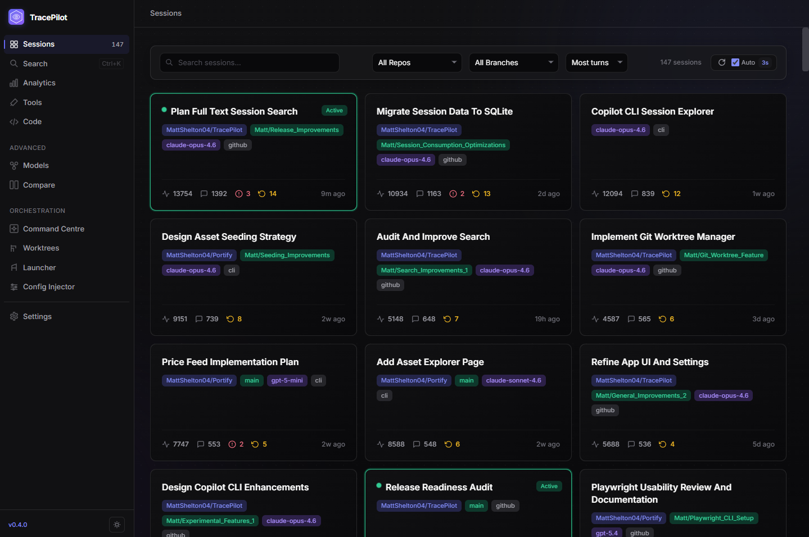
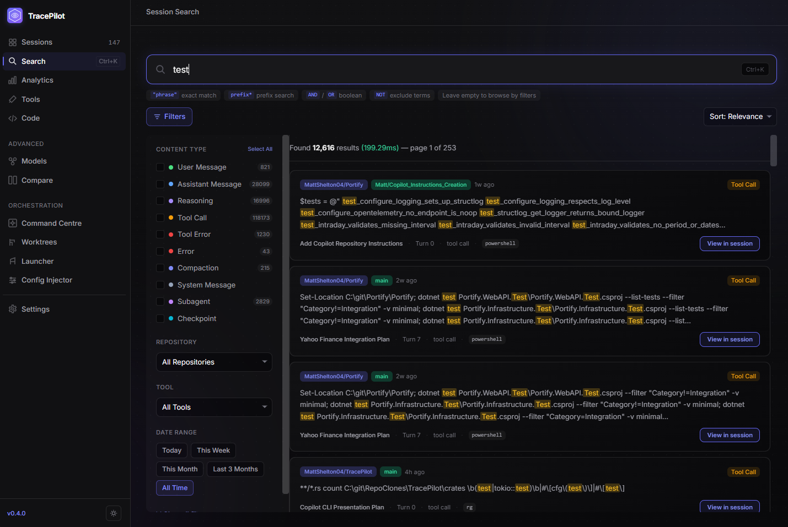
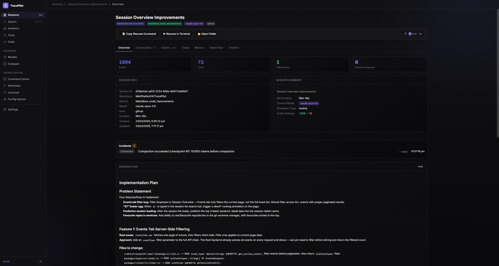
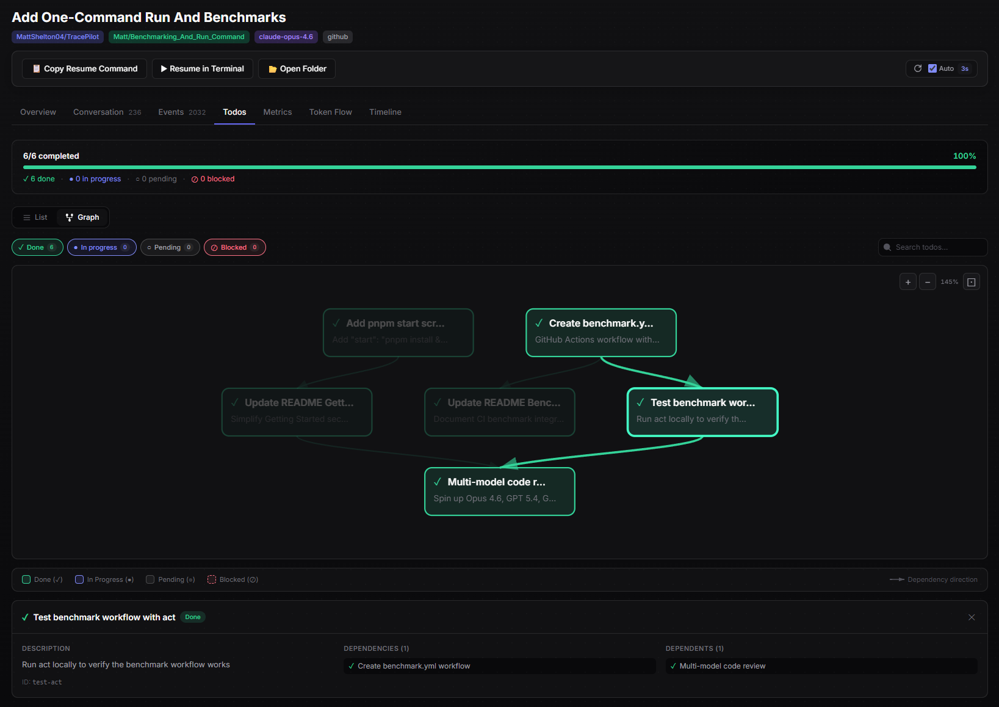
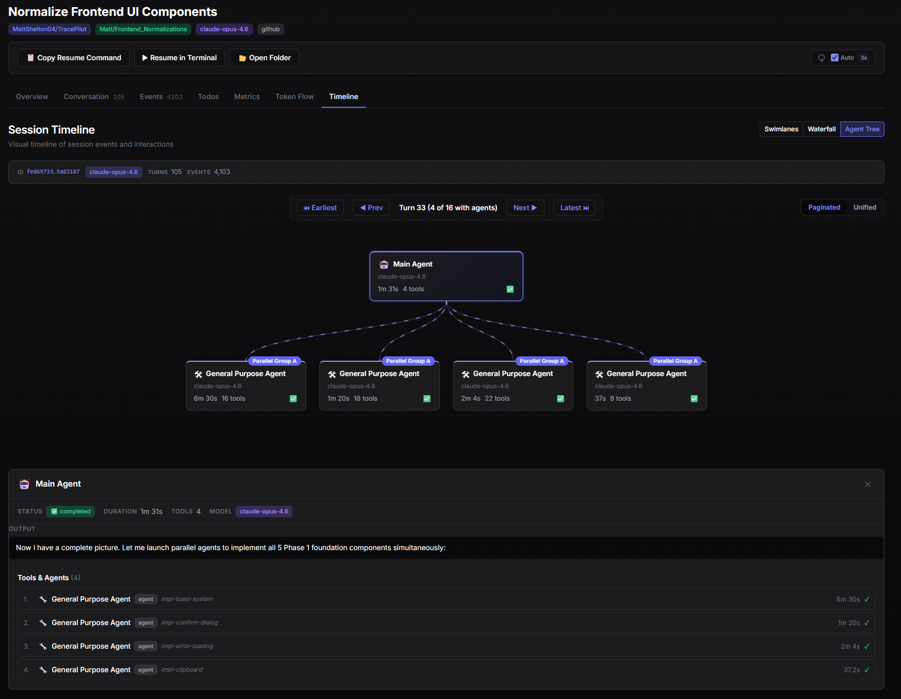
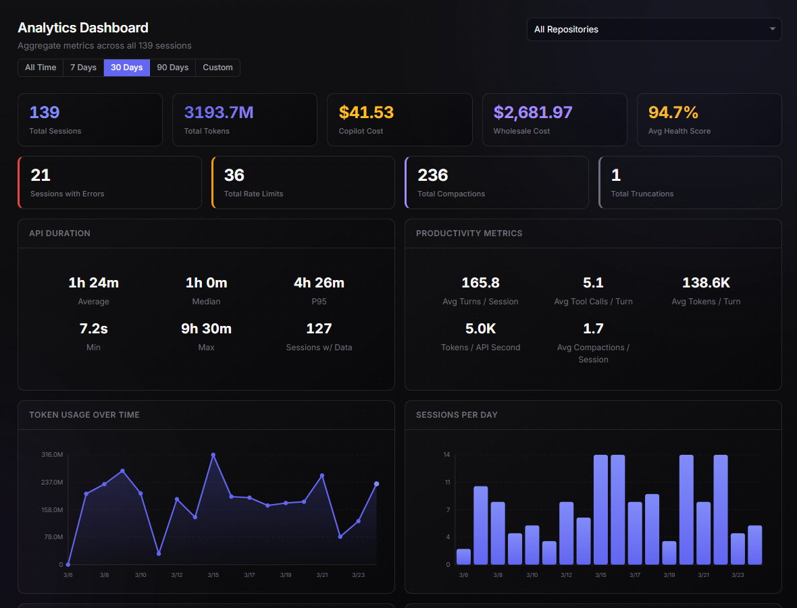

<p align="center">
  
</p>

<h1 align="center">TracePilot</h1>

<p align="center">
  <strong>Visualize, audit, orchestrate, and inspect your GitHub Copilot CLI sessions</strong>
</p>

**⚠️ Early State Disclaimer:** TracePilot is in an early stage of development. Features, user interface, and internal data structures are subject to significant change.

**💻 Platform Support:** Currently, TracePilot has only been tested on **Windows**. While built with cross-platform technologies (Tauri, Rust, Vue), support for macOS and Linux is not yet verified or officially supported.

<p align="center">
  <a href="#features">Features</a> •
  <a href="#orchestration">Orchestration</a> •
  <a href="#getting-started">Getting Started</a> •
  <a href="#architecture">Architecture</a> •
  <a href="#development">Development</a> •
  <a href="#roadmap">Roadmap</a>
</p>

---

TracePilot is a desktop application that reads the session data generated by [GitHub Copilot CLI](https://github.com/features/copilot/cli) (stored by default at `~/.copilot/session-state/`) and turns it into a rich, explorable interface — conversation views with subagent attribution, analytics dashboards, cost tracking, full-text search, and session orchestration.

Built with **Tauri 2** (Rust backend) and **Vue 3** (frontend), TracePilot parses raw JSONL event logs, SQLite databases, and YAML metadata files to reconstruct every conversation turn, tool call, and model interaction from your Copilot sessions. Beyond inspection, TracePilot can also **launch sessions**, **manage git worktrees**, and **inject agent configurations** — making it a complete command centre for Copilot CLI power users.



## Features

### Session Explorer & Full-Text Search

Browse all your Copilot CLI sessions in a searchable, filterable card grid. Sessions are indexed into **SQLite with FTS5** for fast lookup, with both session metadata and full conversation content indexed.

- **FTS5-backed indexing** — session metadata (summary, repo, branch) and full conversation content are indexed into FTS5 virtual tables for fast search and filtering
- **Incremental indexing** — only new or changed sessions are re-indexed; progress bar shown during background indexing
- **Flexible filtering** — filter by repository, branch; sort by date, event count, or turn count



### Session Deep-Dive

Each session has seven tabs for full inspection:

| Tab | What it shows |
|-----|--------------|
| **Overview** | Stat cards, session metadata, session plan, checkpoints, incidents |
| **Conversation** | Turn-by-turn exchange with tool calls and subagent sections |
| **Events** | Raw event log with type filtering and pagination |
| **Todos** | Copilot's internal task tracker with built-in dependency graph visualization |
| **Metrics** | Per-model token breakdown, cache efficiency, cost estimates |
| **Token Flow** | Token distribution across models with cost comparison |
| **Timeline** | Three visualizations: Agent Tree, Swimlanes, and Waterfall |







### Conversation Viewer

View every user ↔ assistant exchange with full tool call details. Three viewing modes: **Chat**, **Compact**, and **Timeline**.

- **Subagent attribution** — see which subagents handled which parts of a conversation, with model info and duration
- **Specialized tool renderers** — code diffs, grep results, glob trees, shell output, SQL results, web search, and more are rendered with syntax highlighting and structured layouts
- **Incident rendering** — rate limit, compaction, and truncation events are surfaced inline with context

<!-- SCREENSHOT: Conversation view in Chat mode showing a user message, assistant response with an expanded tool call (e.g., an edit diff renderer showing a code change), and a subagent section with AgentBadge -->

### Analytics & Insights

Four dashboard views provide comprehensive understanding of your Copilot usage:

- **Analytics Dashboard** — token usage over time, sessions per day, cost trends, model distribution, health distribution, incident tracking
- **Tool Analysis** — invocation frequency, success rates, average duration, and a day × hour activity heatmap
- **Code Impact** — file type breakdown, most-modified files, additions/deletions over time, churn visualization
- **Model Comparison** — per-model token stats, cache hit rates, cost breakdown (both Copilot and wholesale), side-by-side radar charts

All analytics views support time range filtering (7d / 30d / 90d / custom) and repository filtering. Charts feature interactive, pinnable tooltips.



### Session Comparison

Compare two sessions side-by-side with normalization modes (raw, per-turn, per-minute) to spot differences in token usage, model selection, cost, health scores, and tool call patterns.

### Cost Tracking

TracePilot computes two cost metrics for every session:

- **Copilot Cost** — premium request count × cost per request (configurable, default $0.04)
- **Wholesale Cost** — what the same usage would cost via direct API access, using per-model token pricing

Pre-populated prices cover **19 models** across three tiers:

| Tier | Models |
|------|--------|
| **Premium** | Claude Opus 4.6, Opus 4.6 Fast, Opus 4.5 |
| **Standard** | Claude Sonnet 4.6/4.5/4, Gemini 3 Pro, GPT-5.4, GPT-5.3/5.2 Codex, GPT-5.1 Codex Max/Codex, GPT-5.2/5.1 |
| **Fast** | Claude Haiku 4.5, GPT-5.4 Mini, GPT-5.1 Codex Mini, GPT-5 Mini, GPT-4.1 |

All prices are fully configurable in Settings → Pricing.

---

## Orchestration

TracePilot includes a **Command Centre** for launching and managing Copilot CLI sessions directly from the desktop app. Accessible from the sidebar under **Orchestration**.

### Command Centre

The orchestration home view provides a snapshot dashboard with:

- **Stats overview** — active sessions, registered repositories (with worktree and disk usage counts), and total indexed sessions
- **Recent activity feed** — scrollable stream of recent session activity derived from indexed session data
- **System health bar** — shows Copilot CLI availability and version, Git availability and version, active session count

<!-- SCREENSHOT: Orchestration Command Centre showing stat cards, quick action grid, and activity feed -->

### Session Launcher

Construct and launch Copilot CLI sessions in a new terminal window with full control over:

- **Repository** — browse via native dialog or select from registered repos
- **Model** — dropdown with 19 models organized by tier (Premium / Standard / Fast)
- **Prompt** — passed directly to the CLI, automatically executing the prompt on session start
- **Advanced options** — branch selection, auto-approve (`--allow-all`), reasoning effort (Low/Medium/High), custom environment variables

**Integrated worktree creation** — toggle "Create worktree" to spin up a new git worktree before launching, so you can work on isolated branches without affecting your main checkout.

**Templates** — save frequently-used launch configurations as templates. Save your own templates and organize them by category. Usage counts are tracked automatically.

**CLI command preview** — see the fully assembled command with tokenized flag/value chips before launching.

### Agent Config Injector

Take control of which models your Copilot CLI subagents use. By default, Copilot CLI may assign subagents to fast-tier models (e.g., Claude Haiku 4.5) — the Config Injector lets you override this so every subagent uses the best model available.

The Config Injector has four tabs:

| Tab | What it does |
|-----|-------------|
| **Agent Models** 🤖 | View and edit all agent YAML definitions — set per-agent models via dropdown grouped by tier, one-click "Upgrade All to Opus", see tools and prompt excerpts per agent |
| **Global Config** 📋 | Edit `~/.copilot/config.json` — global model, reasoning effort, trusted folders, render settings. Side-by-side diff preview of pending changes |
| **Environment** 🔧 | Browse all installed Copilot CLI versions, compare agent definitions between versions via unified diffs, migrate agent configs across version upgrades |
| **Backups** 💾 | Create/restore/preview backups of agent YAML files and config.json — timestamped backups with metadata, side-by-side restore preview, batch "Backup All Agents" |

### Git Worktree Manager

A full lifecycle manager for [git worktrees](https://git-scm.com/docs/git-worktree) across all your registered repositories.

- **Repository registry** — add repos manually or auto-discover them from your indexed session history
- **Create worktrees** — select repo, branch name, base branch (auto-populated), and optional target directory with live path preview
- **Manage worktrees** — search, sort, lock/unlock, prune stale, force delete, view disk usage with color-coded bars
- **Per-worktree details** — uncommitted changes count, ahead/behind commit tracking vs. upstream
- **Cross-app integration** — open any worktree in Explorer or a new terminal, or deep-link directly to the Session Launcher pre-filled with the worktree's repo and branch
- **Fetch remote** — one-click `git fetch origin --prune` with branch list refresh

---

### Feature Flags

TracePilot includes a feature flag system (Settings → Experimental Features) that gates preview features:

| Flag | Feature |
|------|---------|
| **Session Replay** | Step through a session's event timeline using real indexed session data. Preview feature. |
| **Health Scoring** | Per-session health score UI backed by placeholder/mock data until the backend scoring API lands. Preview feature. |
| **Export** | Export sessions as TracePilot JSON, Markdown, CSV, or raw zip archives with format/section selection and preview. |

### Settings

TracePilot offers extensive configuration through 10 settings panels:

| Panel | What it configures |
|-------|-------------------|
| **General** | CLI command path, auto-refresh interval, session display options |
| **Appearance** | Theme (dark/light/system), content max width |
| **Data & Storage** | Index location, database size, indexed session count, re-index trigger |
| **Logs & Diagnostics** | Log level, log file location, export logs for issue reports |
| **Pricing** | Cost per premium request, per-token wholesale prices for each model |
| **Tool Visualization** | Custom display settings for tool call rendering |
| **Health Scoring** | Health score thresholds and weight configuration |
| **Updates** | Check for updates on startup, manual check |
| **Experimental** | Feature flags for preview features |
| **About** | Version info, session count, database size |

---

## Getting Started

### Prerequisites

- GitHub Copilot CLI with session history (defaults to `~/.copilot/session-state/`)

### Install & Run

#### Option A: From Source (recommended)

Requires [Rust](https://rustup.rs/) (1.85+), [Node.js](https://nodejs.org/) (20+), [pnpm](https://pnpm.io/) (9+), and [Tauri prerequisites](https://v2.tauri.app/start/prerequisites/).

```bash
git clone https://github.com/MattShelton04/TracePilot.git
cd TracePilot
pnpm install
pnpm start
```

`pnpm install` installs the workspace dependencies. `pnpm start` runs `pnpm tauri dev --no-watch`, which starts the Vite frontend, builds the Rust/Tauri backend as needed, and launches the desktop app. On first launch, the setup wizard will guide you through configuration and index your sessions.

> **Note:** A Tauri desktop window will open — this is the full app with the Rust backend. The terminal will also print a localhost URL, but opening that in a browser only shows the frontend with mock data (no backend communication). Always use the desktop window for the real experience.

#### Option B: Download Installer / Exe

Pre-built Windows installers and a standalone `.exe` are available on the [GitHub Releases](https://github.com/MattShelton04/TracePilot/releases) page. Download the latest version and run — no build tools required. Install via the installer to allow for in-app one-click updates going forward.

> **⚠️ Code Signing:** TracePilot is not code-signed — it's not worth the cost at this stage. Windows SmartScreen will show a warning when you first run the installer or exe. Click **"More info"** → **"Run anyway"** to proceed. The source code is fully auditable in this repository, and Option A (build from source) is available if you prefer to avoid unsigned binaries.

---

# Dev Guide

## Architecture

TracePilot is a monorepo with a Rust backend and TypeScript/Vue frontend:

```
TracePilot/
├── apps/
│   ├── desktop/                    # Tauri 2 desktop app (Vue 3 + Tailwind CSS v4)
│   │   └── src-tauri/              # Tauri shell, config, and build scripts
│   └── cli/                        # CLI tool (TypeScript, experimental)
│
├── crates/
│   ├── tracepilot-core/            # Core parsing, turn reconstruction, analytics, health scoring
│   ├── tracepilot-indexer/         # SQLite FTS5 search index, incremental reindex, migrations
│   ├── tracepilot-orchestrator/    # Session launching, worktrees, config injection, templates, repo registry
│   ├── tracepilot-tauri-bindings/  # Tauri IPC commands + config management
│   ├── tracepilot-export/          # Export module (in progress)
│   └── tracepilot-bench/           # Criterion benchmarks with synthetic data generators
│
├── packages/
│   ├── ui/                         # Shared Vue 3 component library (27+ components + tool renderers)
│   ├── types/                      # Shared TypeScript type definitions + model registry
│   ├── client/                     # Tauri IPC client with mock fallback
│   └── config/                     # Shared TypeScript config
│
└── docs/                           # Architecture docs, design specs, prototypes
```

### How It Works

1. **Discovery** — scans `~/.copilot/session-state/` for session directories
2. **Parsing** — reads `workspace.yaml` (metadata), `events.jsonl`, `session.db` (todos), checkpoints, and rewind snapshots
3. **Turn Reconstruction** — a state machine converts flat event streams into structured `ConversationTurn` objects with tool calls and subagent attribution
4. **Indexing** — sessions are indexed into SQLite with FTS5 for instant full-text search; incremental reindex detects new/changed sessions automatically
5. **Analytics** — aggregation functions compute dashboard metrics, tool analysis, code impact, and model comparison across configurable time ranges
6. **Orchestration** — the orchestrator crate manages session launching, git worktrees, config injection, templates, and the repository registry
7. **IPC** — Tauri commands expose all backend capabilities to the Vue frontend

### Tech Stack

| Layer | Technology |
|-------|-----------|
| Desktop shell | Tauri 2 |
| Frontend | Vue 3, Pinia, Vue Router, Tailwind CSS v4, Vite 6 |
| Backend | Rust |
| Database | SQLite with FTS5 (via rusqlite, bundled) |
| Logging | `tauri-plugin-log` (Rust + frontend → rotating log files) |
| Testing | Vitest (frontend), `#[test]` + Criterion (backend) |
| Linting & Formatting | Biome |

## Versioning & Releases

TracePilot uses a **single source of truth** for version numbers: the `version` field in the root `Cargo.toml`. All Rust crates inherit it via `version.workspace = true`, and the Tauri app reads it automatically (no version in `tauri.conf.json`). Frontend code gets the version at runtime via `@tauri-apps/api/app.getVersion()`.

### How Versions Work

| Component | How it gets the version |
|-----------|------------------------|
| Rust crates | `version.workspace = true` in each `Cargo.toml` |
| Tauri app | Falls back to `Cargo.toml` when no version in `tauri.conf.json` |
| Vue frontend | `getVersion()` from `@tauri-apps/api/app` at runtime |
| Release notes | `apps/desktop/public/release-manifest.json` (machine-readable) |
| Changelog | `CHANGELOG.md` (human-readable, Keep-a-Changelog format) |

### Bumping the Version

A PowerShell script handles version bumps across the entire monorepo:

```powershell
# Bump to a specific version (updates all Cargo.toml + package.json files)
.\scripts\bump-version.ps1 -Version 0.4.0

# The script will:
# 1. Check for a clean git working tree
# 2. Run `cargo set-version --workspace <version>` (requires cargo-edit)
# 3. Update all package.json files
# 4. Print next steps (update CHANGELOG.md, commit, tag, push)
```

After running the script:

```bash
# 1. Update CHANGELOG.md: rename [Unreleased] → [0.4.0] - YYYY-MM-DD, add new empty [Unreleased] section
# 2. Update apps/desktop/public/release-manifest.json with release notes for the UI
# 3. Commit on a release branch
git checkout -b release/v0.4.0
git add -A
git commit -m "chore: release v0.4.0"
git push -u origin release/v0.4.0

# 4. Open a PR to main — let CI run and review the release
# 5. After merging, tag the merge commit on main
git checkout main && git pull
git tag -s v0.4.0 -m "Release v0.4.0"
git push --tags
```

> **Prerequisite:** Install `cargo-edit` for the `set-version` command: `cargo install cargo-edit`

### Update Detection

TracePilot can check GitHub for newer releases:

- **Opt-in** — disabled by default (Settings → Updates → "Check for updates on startup")
- **Manual check** — always available via the "Check Now" button in Settings
- **What's New modal** — automatically shown when the app detects a version change after `git pull` or update; sidebar version link also reopens it
- **24-hour cache** — results are cached in localStorage to respect GitHub's rate limits (60 req/hr unauthenticated)

### Keeping Up-to-Date

How you update depends on how you installed TracePilot:

| Install type | How to update |
|-------------|--------------|
| **Source** (`pnpm start`) | `git pull` then `pnpm start` — the app detects the new version on launch |
| **NSIS Installer** | One-click auto-update: the app downloads and installs the update in-app, then relaunches |
| **Standalone exe** | Download the latest `.exe` from the [Releases page](https://github.com/MattShelton04/TracePilot/releases) and replace the old file |

> **Tip:** The NSIS installer is the recommended binary option — it's the only one that supports automatic in-app updates.

## Development

### Task runner (just)

Common developer commands are wrapped in a root [`justfile`](justfile). Install [`just`](https://github.com/casey/just) (e.g. `winget install Casey.Just`) and run `just --list` to discover recipes. `just ci` runs the same gates CI runs so you can reproduce a CI failure locally in one command.

### Logging & Diagnostics

TracePilot uses [`tauri-plugin-log`](https://v2.tauri.app/plugin/logging/) for structured logging across both the Rust backend and Vue frontend.

**Log file locations:**
| Platform | Path |
|----------|------|
| Windows | `%LOCALAPPDATA%\dev.tracepilot.app\logs\TracePilot.log` |
| macOS | `~/Library/Logs/dev.tracepilot.app/TracePilot.log` |
| Linux | `~/.local/share/dev.tracepilot.app/logs/TracePilot.log` |

**For developers:**
- During `cargo tauri dev`, logs are printed to **stdout** and written to the log file simultaneously
- Existing `tracing::*!` macros across all Rust crates are captured via tracing's built-in `log` bridge
- Frontend code can send logs to the same file using `import { info, warn, error } from '@/utils/logger'`
- Log level is configurable in **Settings → Logs & Diagnostics** (takes effect after restart)

**For users reporting issues:**
1. Open **Settings → Logs & Diagnostics**
2. Click **Export Logs…** to save all log files as a single text file
3. Attach the exported file to your GitHub issue

**Technical notes:**
- `tauri-plugin-log` registers a `log`-crate logger (via fern). Do **not** add a `tracing-subscriber` — it would break the `tracing → log` bridge that captures our `tracing::*!` calls.
- Log files rotate at 10 MB. The 5 most recent rotated files are kept.

### Testing

```bash
# Rust tests (core + indexer + orchestrator)
cargo test --workspace --exclude tracepilot-bench --exclude tracepilot-desktop -- --include-ignored

# Frontend tests (@tracepilot/ui + @tracepilot/desktop)
pnpm test

# Type checking
pnpm typecheck
```

### Testing CI Locally

You can run the CI workflow locally using [`act`](https://github.com/nektos/act), which simulates GitHub Actions in Docker containers. The `.actrc` file in the project root configures the correct Docker images.

```bash
# Install act (Windows)
winget install nektos.act

# Run the CI check workflow
act -W .github/workflows/ci.yml -j check
```

> **Note:** The release workflow's `build-installers` job runs on `windows-latest`, which `act` cannot simulate in Docker. To test release changes, use the `workflow_dispatch` trigger: go to **Actions → Release → Run workflow**, enter a version tag (e.g. `v0.4.0-test`), and it will create a draft release you can inspect and delete afterwards.

### Benchmarks

TracePilot includes [Criterion](https://github.com/bheisler/criterion.rs) benchmarks with deterministic synthetic data generators:

```bash
cargo bench -p tracepilot-bench
```

| Suite | Benchmarks | What it measures |
|-------|-----------|-----------------|
| **Parsing** | `parse_typed_events`, `reconstruct_turns` | JSONL parsing throughput (100–10K events), turn reconstruction (100–2K events) |
| **Analytics** | `compute_analytics`, `compute_tool_analysis`, `compute_code_impact` | Dashboard aggregation across 10–100 sessions |
| **Indexer** | `upsert_session`, `search`, `query_analytics` | SQLite write speed, FTS5 search latency, analytics query performance (10–100 sessions) |

#### CI Benchmarks

Benchmarks run in GitHub Actions via manual trigger (**Actions → Benchmarks → Run workflow**). Results are tracked over time on [GitHub Pages](https://MattShelton04.github.io/TracePilot/dev/bench/) with trend charts powered by [`github-action-benchmark`](https://github.com/benchmark-action/github-action-benchmark).

Each run also uploads Criterion's HTML reports as a downloadable artifact for detailed analysis.

### Linting & Formatting

```bash
# Check
pnpm lint

# Auto-fix
pnpm lint:fix

# Format
pnpm format
```

## Roadmap

### Coming Soon

| Feature | Status | Description |
|---------|--------|-------------|
| **Export** | Preview | Export sessions as Markdown, TracePilot JSON, CSV, or raw zip archives with configurable sections and redaction options. Available behind feature flag. |
| **Health Scoring** | Stub Preview | Per-session health score UI is available behind a feature flag, but currently uses placeholder/mock-backed data until backend scoring lands. |
| **CLI Tool** | Experimental | Terminal-based session browser with `list`, `show`, `search`, `resume`, and `index` commands. Partially functional (`list`, `show`, `search` work; `index` is a stub). Not yet recommended for general use. |

### Ideas & Future Exploration

- Weekly usage reports and trend analysis
- Error forensics deep-dive
- Copilot memory file explorer and editor
- Budget tracking and alerts for orchestrated sessions
- Mission Control — real-time session monitoring
- Copilot SDK integration for in-app orchestration

## Version Analysis

TracePilot includes a CLI tool for tracking schema changes across installed Copilot CLI versions and computing coverage of event types handled by the Rust parser.

### Why This Matters

GitHub Copilot CLI evolves rapidly — new event types, fields, and RPC methods appear across versions. TracePilot's forward-compatible parser handles unknown events gracefully (they never crash the app), but **typed parsing** enables richer analytics, better turn reconstruction, and actionable UI features. The version analyzer helps you:

- Detect what changed between Copilot CLI versions (new events, removed fields, schema differences)
- Measure what percentage of persisted event types TracePilot handles with typed structs
- Find real session examples of specific event types for testing
- Generate reports to track coverage over time

### Quick Start

```powershell
# List installed Copilot CLI versions
pnpm cli versions list

# Check current coverage (should be 100%)
pnpm cli versions coverage

# Diff between two specific versions
pnpm cli versions diff 1.0.5 1.0.7

# Find sessions containing a specific event type
pnpm cli versions examples -e session.truncation

# Generate a full report
pnpm cli versions report --output "docs/reports/versions/$(Get-Date -Format yyyy-MM-dd)-v1.0.7-label.md"
```

All commands support `--json` for machine-readable output.

### When a New Copilot CLI Version Arrives

1. **Check for changes:** `pnpm cli versions diff` — shows what's new
2. **Check coverage:** `pnpm cli versions coverage` — if any unhandled events appear, follow the implementation guide
3. **Generate a report:** Save to `docs/reports/versions/` with the [naming convention](docs/reports/versions/README.md)

### Adding Support for New Event Types

See [`docs/version-analysis-implementation-guide.md`](docs/version-analysis-implementation-guide.md) for the step-by-step recipe. In summary:

1. Add a data struct in `event_types.rs` (all fields `Option<T>`)
2. Add the enum variant to `SessionEventType`
3. Add the wire name to `KNOWN_EVENT_TYPES`
4. Add the `TypedEventData` variant and `try_deser!` arm
5. Handle in turn reconstruction if it affects turn state
6. Sync all 3 known-events lists (Rust, TS types, CLI)
7. Add tests and verify with `pnpm cli versions coverage`

### Reports

Generated reports live in [`docs/reports/versions/`](docs/reports/versions/) with timestamped names. See the [README there](docs/reports/versions/README.md) for the naming convention and generation instructions.

## License

TracePilot is licensed under the [GNU General Public License v3.0](LICENSE).

You are free to use, modify, and distribute this software under the terms of the GPL-3.0. Any derivative works or modifications must also be released under the same license, preserving the same freedoms for all users.

See the [LICENSE](LICENSE) file for the full license text.

---

<p align="center">
  <sub>Built with Rust + Vue · Powered by Tauri</sub>
</p>
