# TracePilot

<p align="center">
  
</p>

<p align="center">
  <strong>A desktop app for inspecting, searching, and launching GitHub Copilot CLI sessions.</strong>
</p>

TracePilot is built for developers who use GitHub Copilot CLI heavily and want a clearer view of what happened across their sessions: prompts, assistant turns, subagents, tool calls, todos, checkpoints, token usage, costs, search, and orchestration.

It reads the session data Copilot CLI writes under `~/.copilot/session-state/` by default, indexes it locally, and presents it in a Tauri desktop app backed by Rust, SQLite, and Vue.

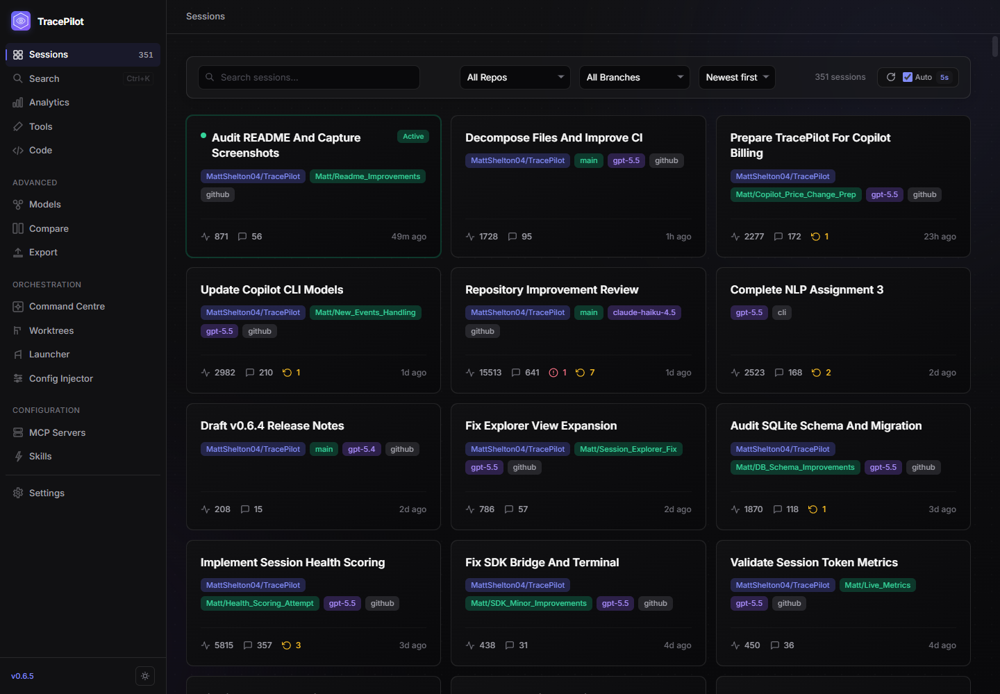

> **Project status:** TracePilot is early-stage software. It is useful today, but the UI and internal data model still change quickly.
>
> **Platform status:** TracePilot is currently tested on Windows. The stack is cross-platform, but macOS and Linux are not yet official targets.

<p align="center">
  <a href="#what-you-can-do">What you can do</a> |
  <a href="#screenshots">Screenshots</a> |
  <a href="#install-and-run">Install and run</a> |
  <a href="#architecture">Architecture</a> |
  <a href="#development">Development</a> |
  <a href="#license">License</a>
</p>

---

## What you can do

### Inspect Copilot CLI sessions

Browse your Copilot CLI session history as a searchable library, then open any session for a tabbed deep-dive:

| Area | What it helps with |
| --- | --- |
| **Overview** | Session metadata, plan/checkpoint summaries, incidents, and high-level stats. |
| **Conversation** | User/assistant turns, reasoning, subagent activity, tool calls, and rich tool-result renderers. |
| **Events** | Raw session events with filtering and pagination for debugging parser or CLI behavior. |
| **Todos** | Copilot's task state, including dependency relationships when available. |
| **Metrics** | Token usage, cache usage, model attribution, duration, and cost estimates. |
| **Explorer** | Files inside the session state directory, rendered with type-aware viewers where possible. |
| **Timeline** | Agent tree, swimlane, and waterfall views for understanding sequencing and parallel work. |

TracePilot also supports pop-out session windows, auto-refresh for live sessions, inline incident rendering, structured checkpoint rendering, and specialized renderers for common tool outputs such as diffs, shell output, search results, SQL, and file trees.

| Conversation | Agent timeline |
| --- | --- |
| 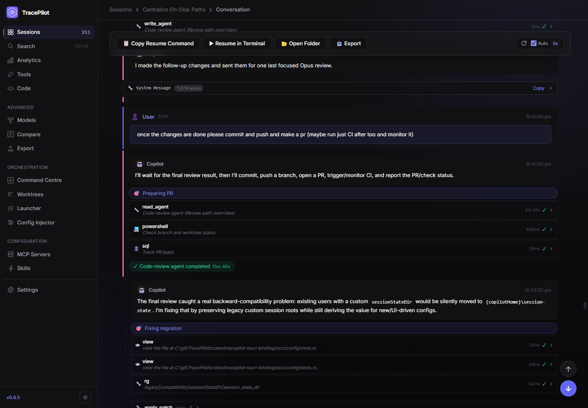 | 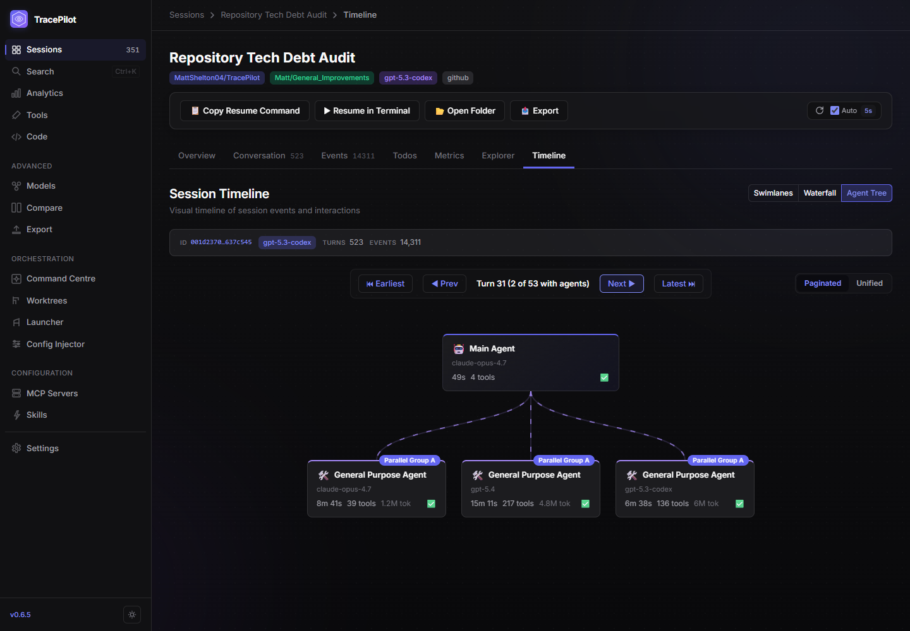 |

| Todos | Session files |
| --- | --- |
| 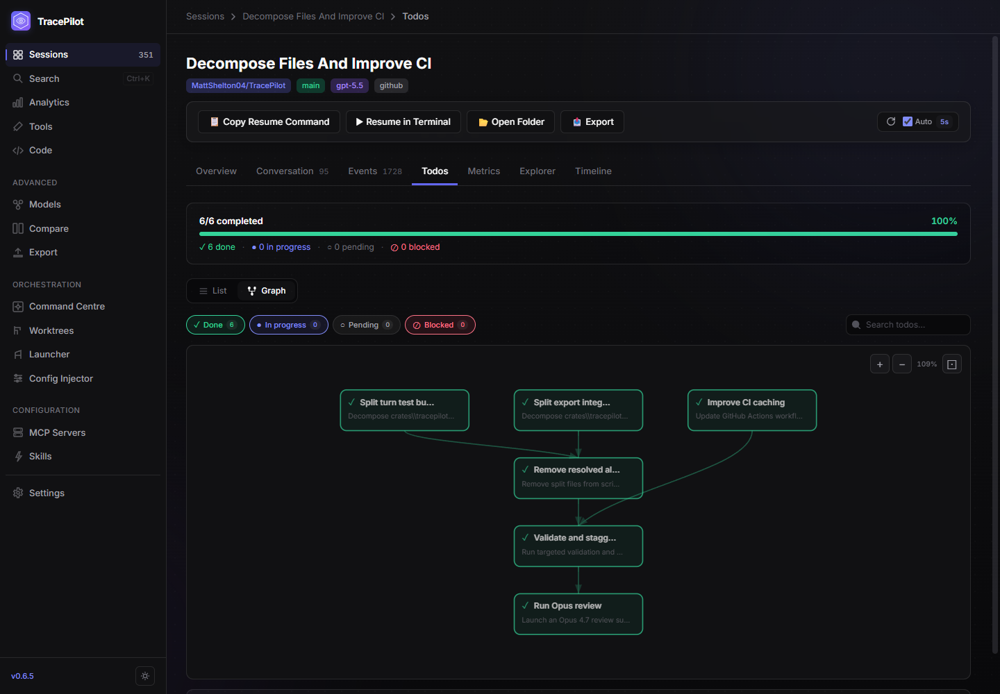 | 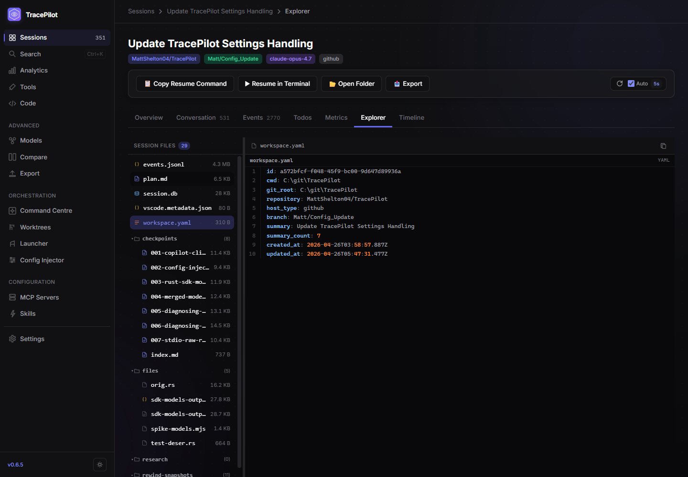 |

### Search and analyze session history

TracePilot maintains a local SQLite/FTS5 index so you can search across session metadata and conversation content without sending data to a remote service.

The analytics views help answer questions such as:

- Which repositories, models, and tools are consuming the most time or tokens?
- How often do tool calls fail, and which tools dominate a session?
- Which files and file types are touched most often?
- How do two sessions compare after normalizing by turns or duration?

Available top-level analysis pages include Search, Analytics, Tools, Code Impact, Model Comparison, and Session Comparison.

| Search | Analytics | Tool analysis |
| --- | --- | --- |
| 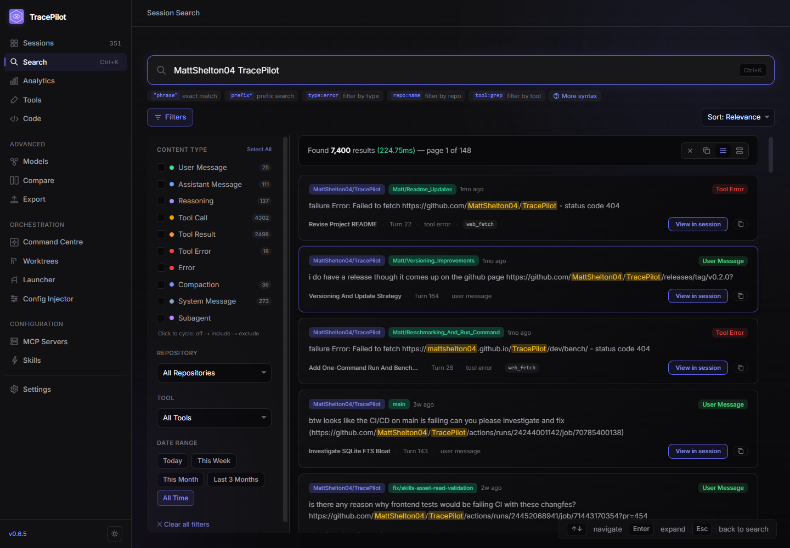 | 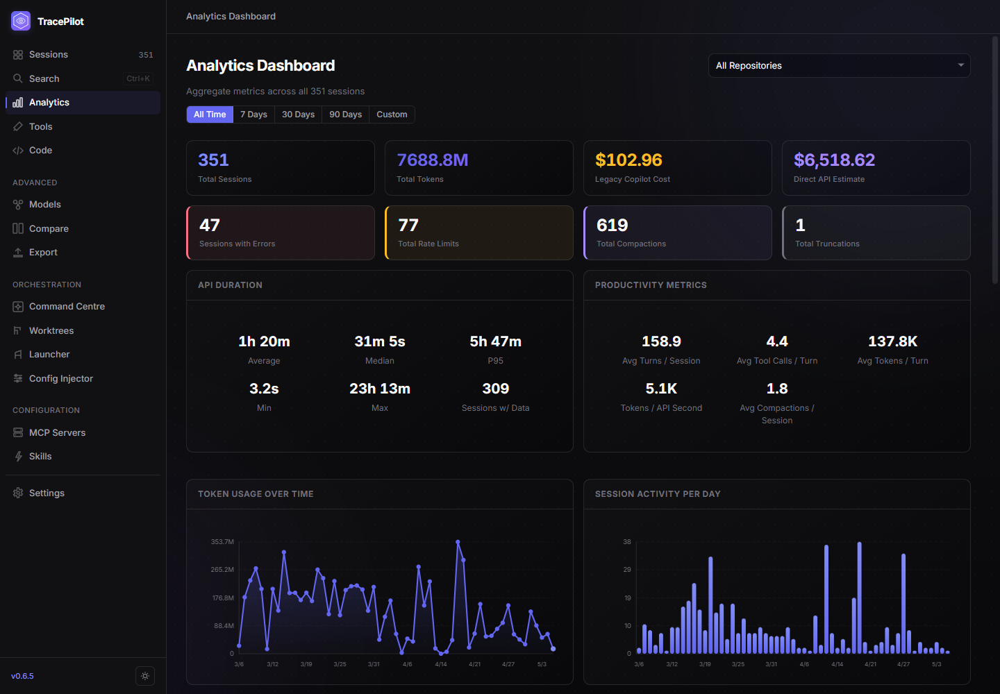 | 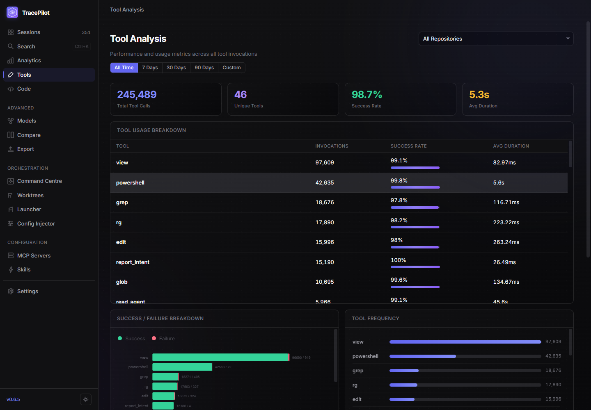 |

### Launch and manage Copilot CLI work

The orchestration pages are for starting and organizing Copilot CLI work from the desktop app:

- **Command Centre** shows repository/session status, recent activity, and system dependency health.
- **Session Launcher** builds Copilot CLI launch commands with repository, branch, model, prompt, environment, and optional worktree settings.
- **Worktree Manager** discovers registered repositories, creates/removes/prunes worktrees, fetches remotes, opens folders, and launches sessions from worktrees.
- **Config Injector** edits Copilot CLI agent model assignments and user settings, compares installed CLI versions, and backs up/restores config files.

TracePilot understands the newer Copilot CLI settings layout: user-editable settings belong in `~/.copilot/settings.json`, while CLI-managed internal state can remain in `~/.copilot/config.json`.

| Command Centre | Session Launcher |
| --- | --- |
| 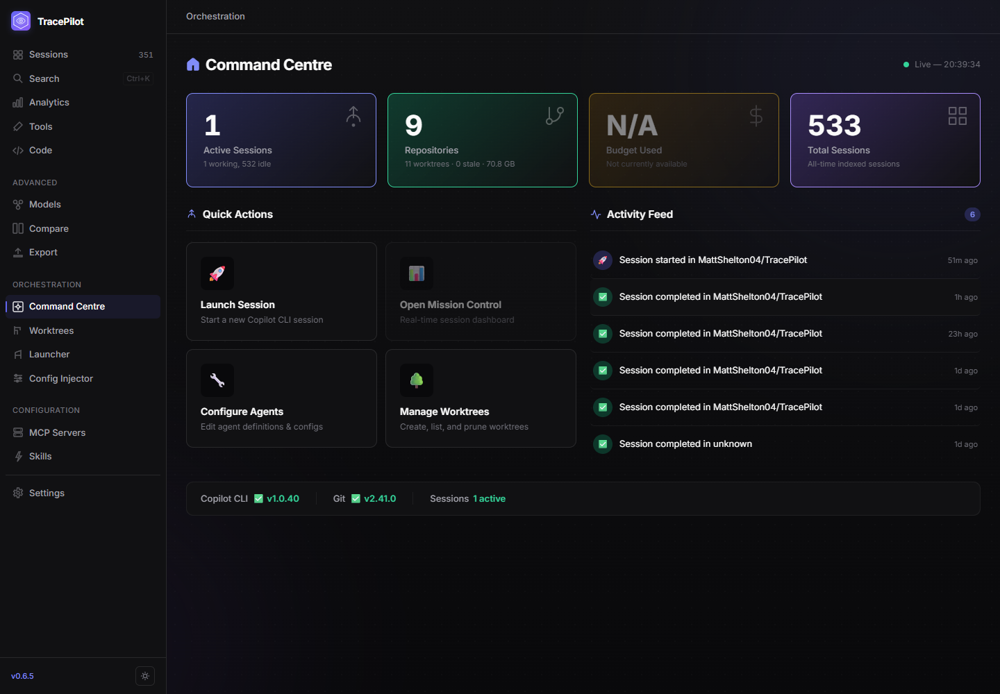 | 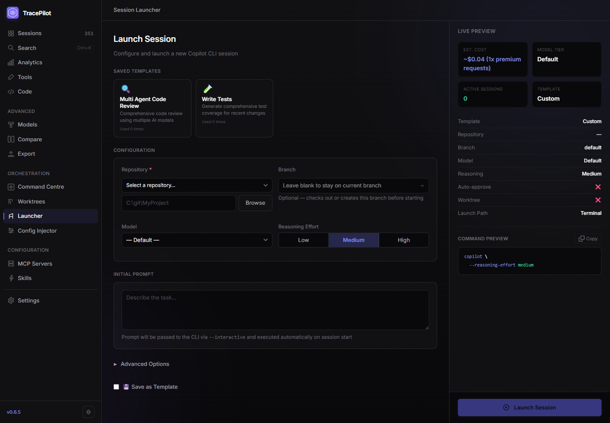 |

| Worktrees | Config Injector |
| --- | --- |
| 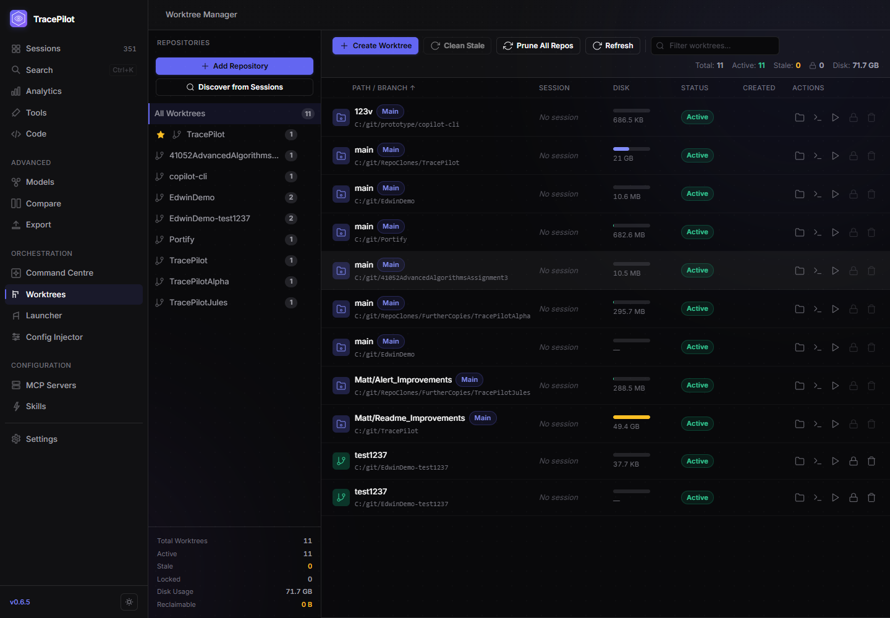 | 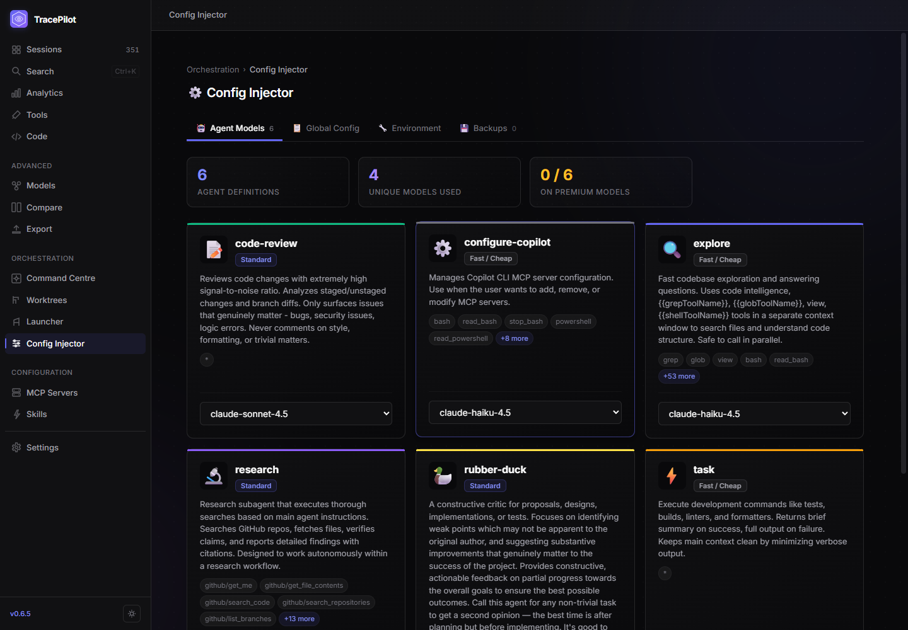 |

### Configure Copilot-adjacent tools

TracePilot includes feature-flagged configuration surfaces for:

- **Skills Manager**: create, edit, import, and manage Copilot CLI skills, including assets and GitHub imports through the `gh` CLI.
- **MCP Server Manager**: add, import, configure, toggle, and health-check MCP servers compatible with Copilot CLI configuration.
- **Session Replay**: step through session event timelines using indexed session data.
- **Copilot SDK bridge**: experimental live-session connection and steering support.

Skills, MCP servers, export view, and Markdown rendering are enabled by default in current builds. Session Replay and the Copilot SDK bridge remain experimental and disabled by default.

### Export and share sessions

TracePilot can export sessions as Markdown, TracePilot JSON, CSV, or raw session archives, with configurable sections and redaction options. Session-level export is available from session detail; the top-level Export page provides a broader export/import workflow when enabled.

---

## Screenshots

The README screenshots are generated from the running desktop app via the same Playwright-over-CDP automation used for local E2E diagnostics. The script captures more pages than the README embeds, so screenshots can be swapped in without manually driving the app.

```powershell
.\scripts\e2e\launch.ps1 -NoWatch
node scripts\e2e\capture-readme-media.mjs
```

Useful outputs:

| Path | Contents |
| --- | --- |
| `docs/images/readme-*.png` | Final README-ready screenshots from the selected viewport. |
| `scripts/e2e/screenshots/readme-candidates/` | Per-viewport candidates, manifest, storyboard, and optional FFmpeg helper. |
| `scripts/e2e/screenshots/readme-candidates/readme-demo-storyboard.html` | HTML/CSS storyboard with subtle pan/zoom animation for reviewing a demo sequence. |
| `scripts/e2e/screenshots/readme-candidates/make-readme-demo-video.ps1` | Optional FFmpeg command wrapper for creating an MP4 from the selected screenshots. |

---

## Install and run

### Prerequisites

- Windows with the WebView2 runtime.
- GitHub Copilot CLI with session history.
- For source builds: Rust, Node.js 20+, pnpm 9+, and the Tauri 2 prerequisites.

### Option A: install a Windows build (recommended)

Download the latest build from [GitHub Releases](https://github.com/MattShelton04/TracePilot/releases/latest).

The current release assets include:

| Asset | Use it for |
| --- | --- |
| `TracePilot_<version>_x64-setup.exe` | Recommended installer for most Windows users. |
| `TracePilot_<version>_x64_en-US.msi` | MSI installer for environments that prefer MSI packages. |
| `tracepilot-desktop.exe` | Standalone executable if you do not want to run an installer. |
| `latest.json` and `*.sig` files | Updater metadata and signatures used by the release pipeline. |

The app is not code-signed yet. Windows SmartScreen may warn on first launch; choose **More info** -> **Run anyway** if you trust the build, or build from source instead.

### Option B: run from source

```powershell
git clone https://github.com/MattShelton04/TracePilot.git
cd TracePilot
pnpm start
```

Use this path if you want to develop TracePilot, inspect the code before running it, or avoid unsigned release binaries. `pnpm start` installs workspace dependencies and launches the Tauri desktop app. On first launch, TracePilot guides you through setup and indexes your sessions.

> The terminal may print a Vite localhost URL during development. Use the desktop window for the real app; a normal browser tab does not have access to the Tauri backend.

---

## Architecture

TracePilot is a Rust/TypeScript monorepo:

```text
TracePilot/
├── apps/
│   ├── desktop/                    # Tauri 2 desktop app, Vue 3 frontend
│   └── cli/                        # Experimental TypeScript CLI utilities
├── crates/
│   ├── tracepilot-core/            # Session parsing, models, analytics
│   ├── tracepilot-indexer/         # SQLite + FTS5 indexing and queries
│   ├── tracepilot-export/          # Markdown/JSON/CSV/raw exports and imports
│   ├── tracepilot-orchestrator/    # Worktrees, launcher, config injection
│   ├── tracepilot-tauri-bindings/  # Tauri IPC commands and app state
│   ├── tracepilot-bench/           # Criterion benchmarks
│   └── tracepilot-test-support/    # Rust test support utilities
├── packages/
│   ├── client/                     # Typed TypeScript client for Tauri IPC
│   ├── types/                      # Shared TypeScript models/config
│   ├── ui/                         # Shared Vue components and renderers
│   └── config/                     # Shared TS config presets
├── docs/                           # Architecture, design, and developer docs
└── scripts/                        # Build, release, validation, and E2E helpers
```

The main data flow is:

```text
Copilot session files
  -> tracepilot-core parses JSONL/YAML/SQLite session data
  -> tracepilot-indexer stores searchable metadata/content in SQLite FTS5
  -> tracepilot-tauri-bindings exposes typed Tauri commands
  -> @tracepilot/client calls those commands from Vue/Pinia views
```

Useful deeper docs:

- [Architecture overview](docs/architecture/overview.md)
- [Data integration guide](docs/data-integration-guide.md)
- [Testing guide](docs/testing.md)
- [On-disk paths](docs/on-disk-paths.md)
- [Performance playbook](docs/performance-playbook.md)
- [Tauri command registration](docs/tauri-command-registration.md)

---

## Development

Install dependencies:

```powershell
pnpm install
```

Common commands:

| Task | Command |
| --- | --- |
| Launch desktop dev app | `pnpm --filter @tracepilot/desktop tauri dev` |
| Launch via convenience script | `pnpm start` |
| Frontend build/typecheck | `pnpm build` |
| Workspace typecheck | `pnpm typecheck` |
| JS/TS tests | `pnpm test` |
| Rust tests | `cargo test --workspace --exclude tracepilot-desktop` |
| Biome lint | `pnpm lint` |
| Regenerate IPC bindings | `pnpm gen:bindings` |
| Check docs links | `node scripts/check-doc-links.mjs` |
| Check file-size budgets | `node scripts/check-file-sizes.mjs` |

If you use [`just`](https://github.com/casey/just), `just --list` shows wrappers for the same tasks. `just ci` mirrors the main local CI gate.

### Versioning and releases

The workspace version is centralized in the root `Cargo.toml` and mirrored into package metadata by the release tooling.

```powershell
.\scripts\bump-version.ps1 -Version <version>
```

After a version bump, update `CHANGELOG.md`, update the release manifest if needed, run the validation gates, and publish through the repository release workflow.

---

## Roadmap

Current near-term areas:

- Make the Copilot SDK bridge reliable enough to graduate from experimental.
- Improve live-session monitoring and alerting.
- Continue hardening parser coverage as Copilot CLI evolves.
- Polish export/import workflows and team-shareable reports.
- Expand platform validation beyond Windows.

Historical design notes and implementation plans live in [`docs/`](docs/README.md).

---

## License

TracePilot is licensed under the [GNU General Public License v3.0](LICENSE).

You are free to use, modify, and distribute this software under the GPL-3.0. Derivative works and modifications must preserve the same license terms.

---

<p align="center">
  <sub>Built with Rust, Vue, SQLite, and Tauri.</sub>
</p>
