# TracePilot

<p align="center">
  
</p>

<p align="center">
  <strong>A desktop app for inspecting, searching, and launching GitHub Copilot CLI sessions.</strong>
</p>

TracePilot is built for developers who use GitHub Copilot CLI heavily and want a clearer view of what happened across their sessions: prompts, assistant turns, subagents and the messages they exchange, tool calls, todos, checkpoints, context growth, prompt-cache state, token usage, AI Credits, search, and orchestration.

It reads the session data Copilot CLI writes under `~/.copilot/session-state/` by default, indexes it locally, and presents it in a Tauri desktop app backed by Rust, SQLite, and Vue.

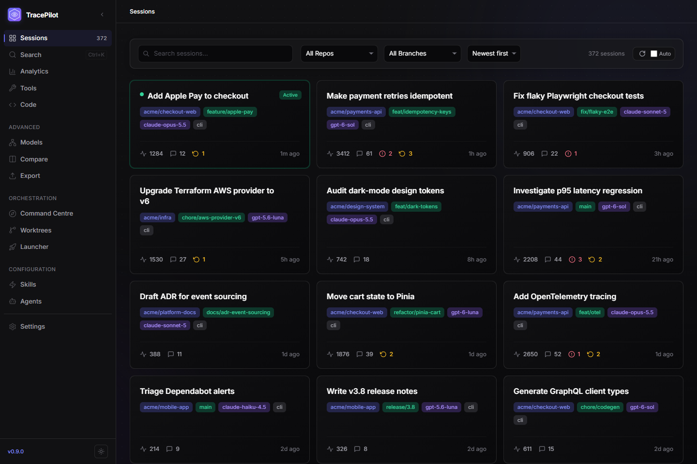

> **Project status:** TracePilot is early-stage software. It is useful today, but the UI and internal data model still change quickly.
>
> **Platform status:** TracePilot is tested on Windows. Apple Silicon Macs get a preview build; Intel Macs and Linux are not yet release targets.

<p align="center">
  <a href="#what-you-can-do">What you can do</a> |
  <a href="#screenshots">Screenshots</a> |
  <a href="https://mattshelton04.github.io/TracePilot/visual/">Visual history</a> |
  <a href="https://mattshelton04.github.io/TracePilot/">Website</a> |
  <a href="#install-and-run">Install and run</a> |
  <a href="#architecture">Architecture</a> |
  <a href="#development">Development</a> |
  <a href="#license">License</a>
</p>

---

## What you can do

### Inspect Copilot CLI sessions

Browse your Copilot CLI session history as a searchable library, then open any session for a tabbed deep-dive:

| Area | What it helps with |
| --- | --- |
| **Overview** | Session metadata, plan and checkpoint summaries, incidents, AI Credits, and high-level stats. |
| **Conversation** | User/assistant turns, reasoning, model switches, parallel subagents, skill invocations, tool calls, and rich tool-result renderers. |
| **Events** | Raw session events with filtering and pagination for debugging parser or CLI behavior. |
| **Todos** | Copilot's task state as a list or dependency graph. |
| **Metrics** | AI Credits, token and cache usage per model or per agent, duration, code changes, and prompt-cache timing. |
| **Context** | How the context window grows by turn or over time (system prompt, tool definitions, conversation), where compactions happened, and which tools contribute most. |
| **Explorer** | Files inside the session state directory, with viewers for Markdown, JSON/JSONL, CSV, SQLite, images, and more. |
| **Timeline** | Swimlane, waterfall, and agent-tree views, plus a **Messages** view of how agents launched, messaged, and read back from each other. |

The session header shows whether the prompt cache is warm, expiring, or expired, with a live countdown. Sessions can open in pop-out windows and auto-refresh while they run. Rich renderers cover common tool output such as diffs, patches, shell output, search and web-search results, SQL, file trees, `ask_user` prompts, and the agent-control tools (`read_agent`, `write_agent`, `list_agents`).

| Conversation | Agent timeline |
| --- | --- |
| 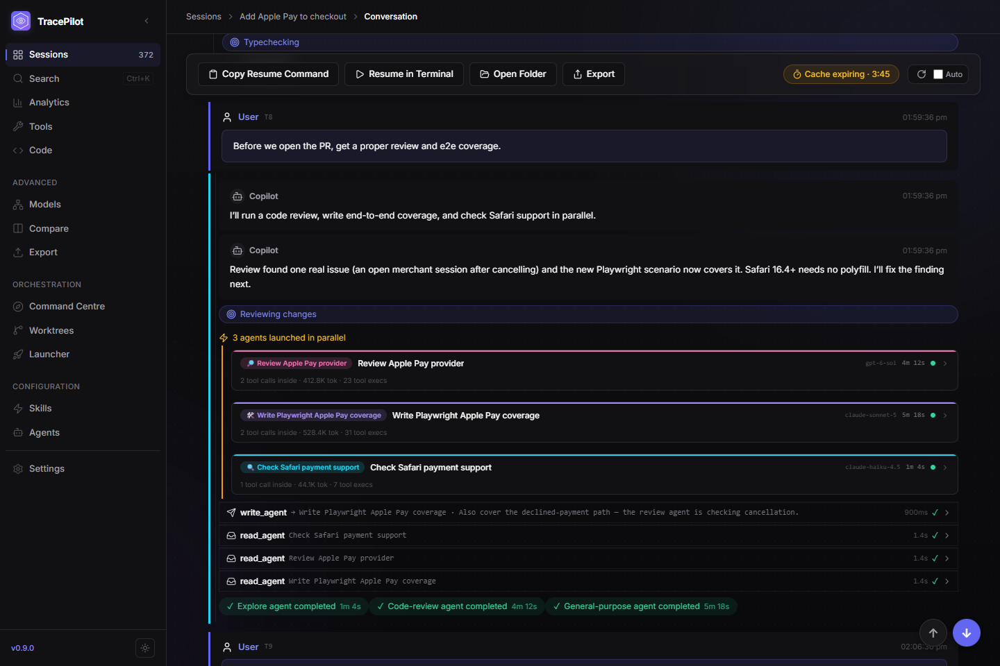 | 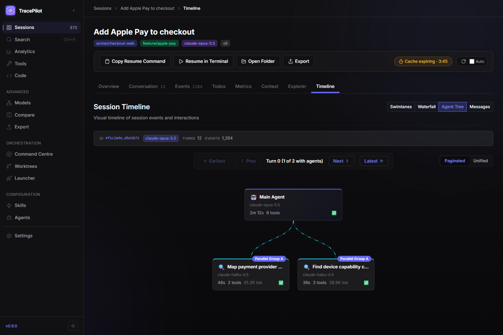 |

| Inter-agent messages | Todos |
| --- | --- |
| 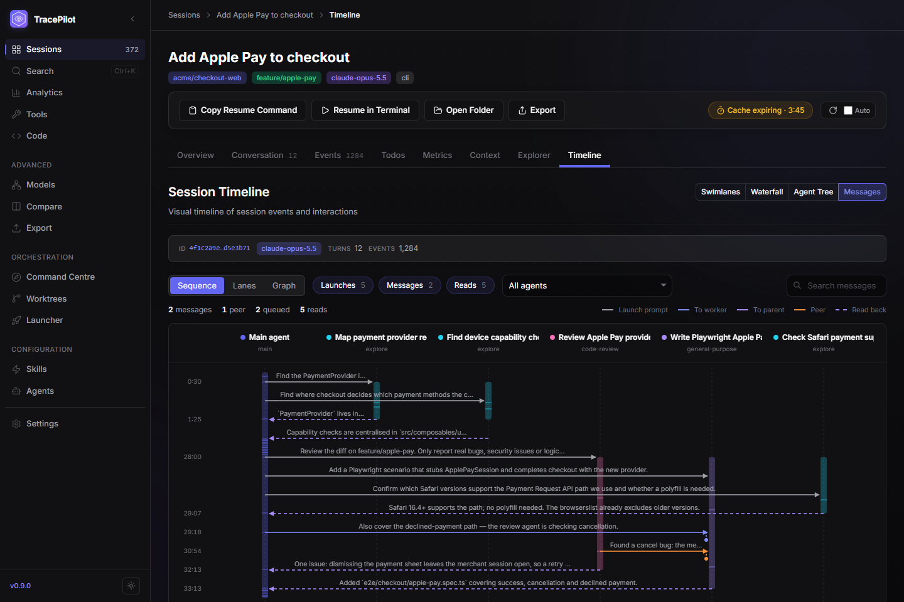 | 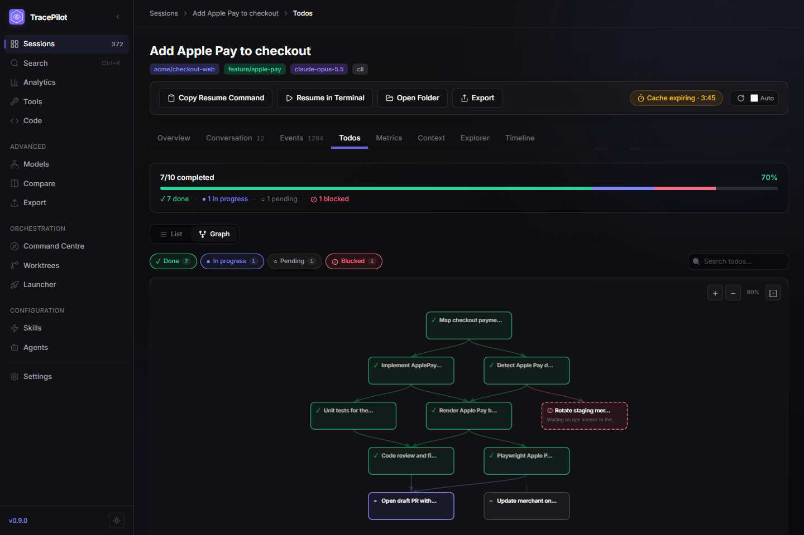 |

| Context | Metrics |
| --- | --- |
| 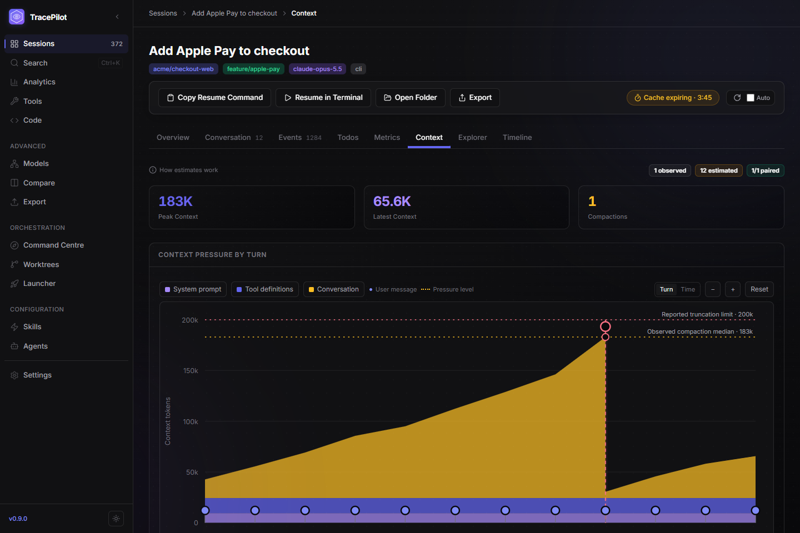 | 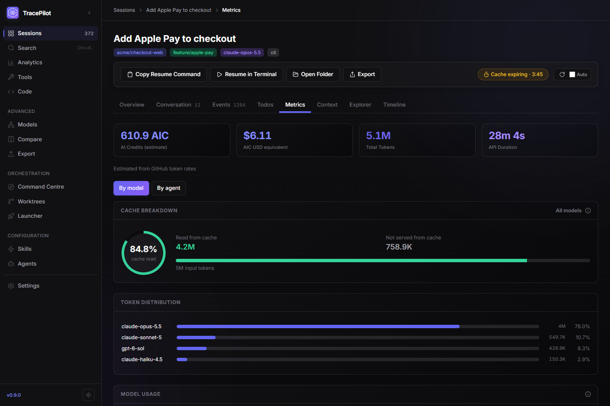 |

### Search and analyze session history

TracePilot maintains a local SQLite/FTS5 index so you can search across session metadata and conversation content without sending data to a remote service.

The analytics views help answer questions such as:

- Which repositories, models, and tools are consuming the most time, tokens, or AI Credits?
- How well is the prompt cache working, and how often do sessions resume after it expired?
- How often do tool calls fail, and which tools dominate a session?
- Which files and file types are touched most often?
- How do two sessions compare after normalizing by turns or duration?

Available top-level analysis pages include Search, Analytics, Tools, Code Impact, Model Comparison, and Session Comparison.

| Search | Analytics | Tool analysis |
| --- | --- | --- |
| 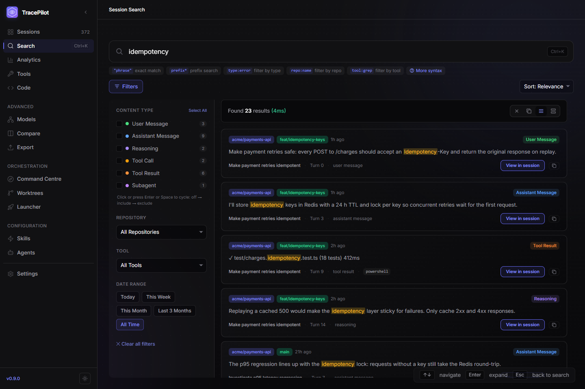 | 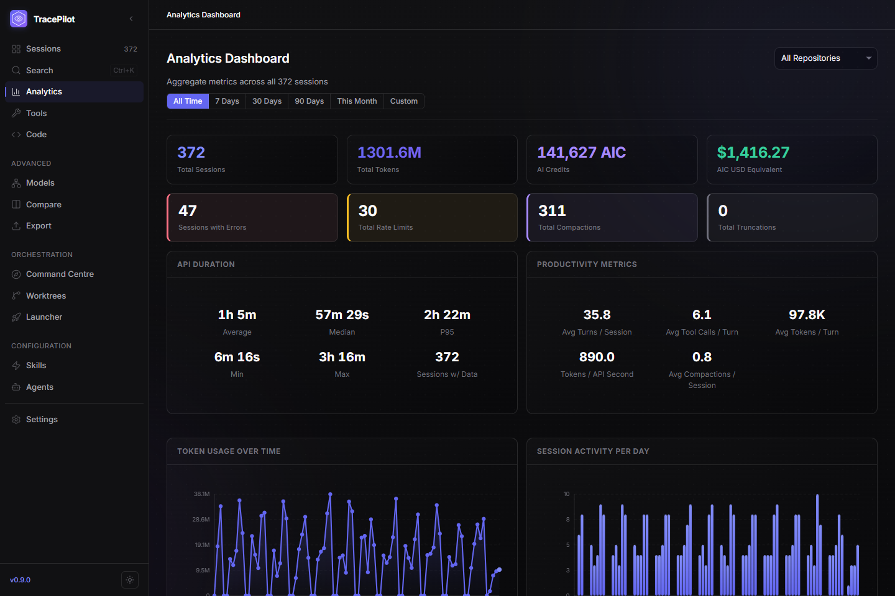 | 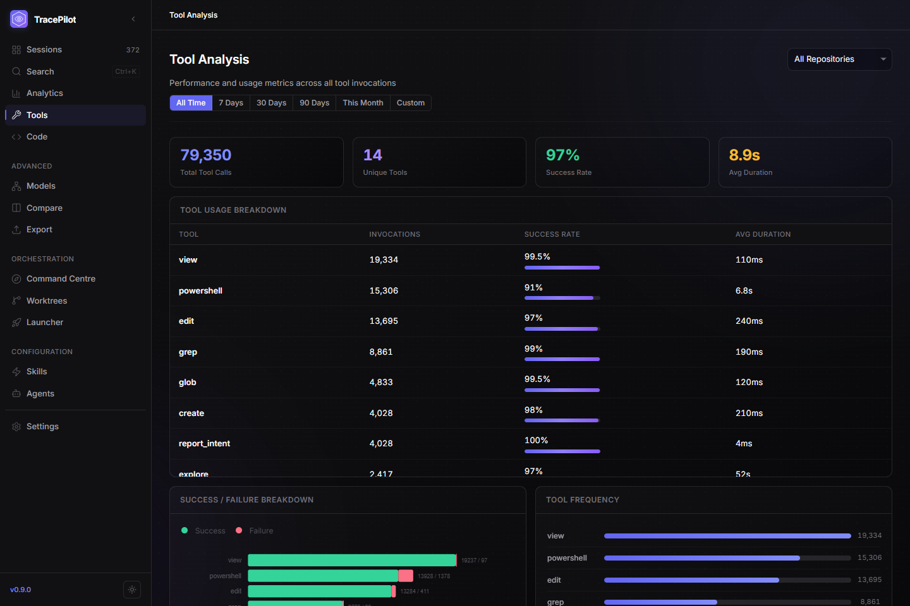 |

### Understand agents and skills

- **Agents** lists built-in, personal, and project Copilot CLI agents, plus agents seen only in sessions. Each has run counts, durations, and failure rates, a definition editor, its effective configuration, and `/subagents` model overrides.
- **Skills** creates, edits, and imports Copilot CLI skills (including from GitHub through the `gh` CLI) and shows how often each skill is invoked, by whom, and how many tokens it injects. Unused, dormant, drifted, and shadowed skills are flagged.

| Agents | Skills |
| --- | --- |
| 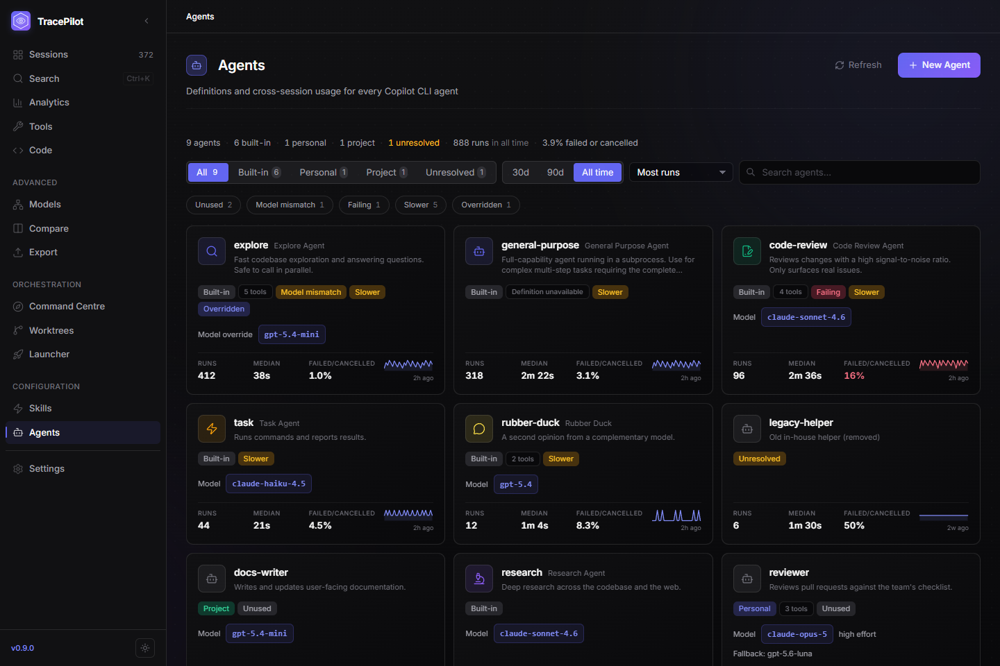 | 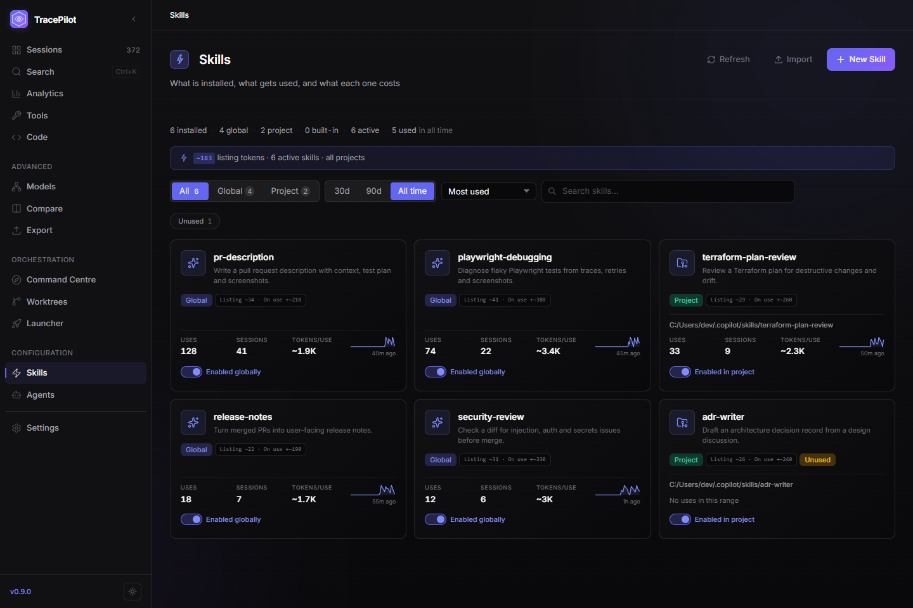 |

### Launch and manage Copilot CLI work

The orchestration pages are for starting and organizing Copilot CLI work from the desktop app:

- **Command Centre** shows repository/session status, recent activity, and system dependency health.
- **Session Launcher** builds Copilot CLI launch commands with repository, branch, model, reasoning effort, prompt, environment, and optional worktree settings.
- **Worktree Manager** discovers registered repositories, creates/removes/prunes worktrees, fetches remotes, opens folders, and launches sessions from worktrees.

TracePilot understands the newer Copilot CLI settings layout: user-editable settings belong in `~/.copilot/settings.json`, while CLI-managed internal state can remain in `~/.copilot/config.json`.

| Session Launcher | Worktrees |
| --- | --- |
| 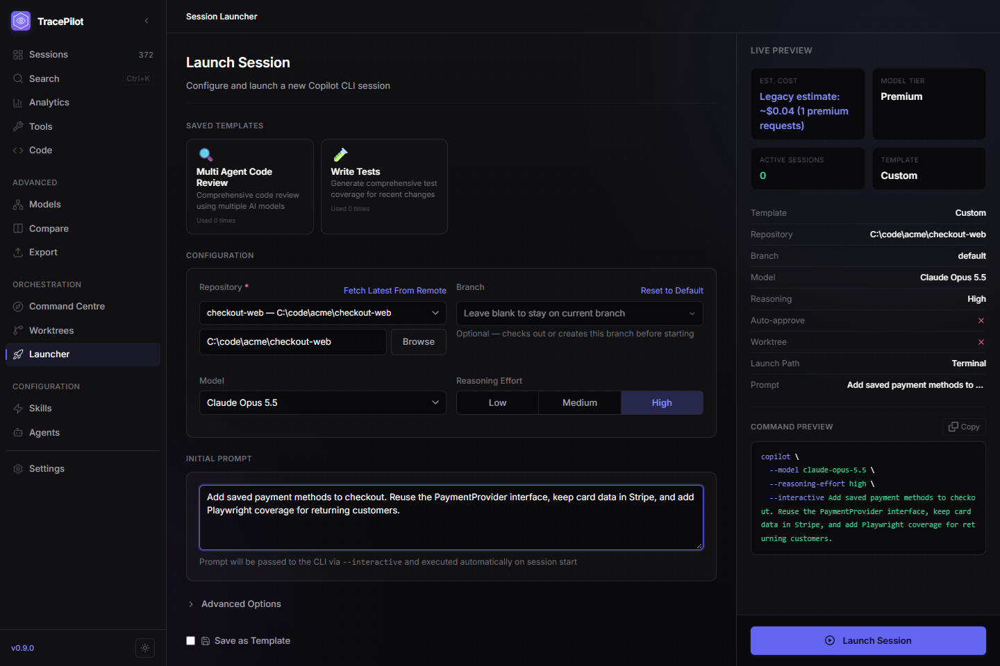 | 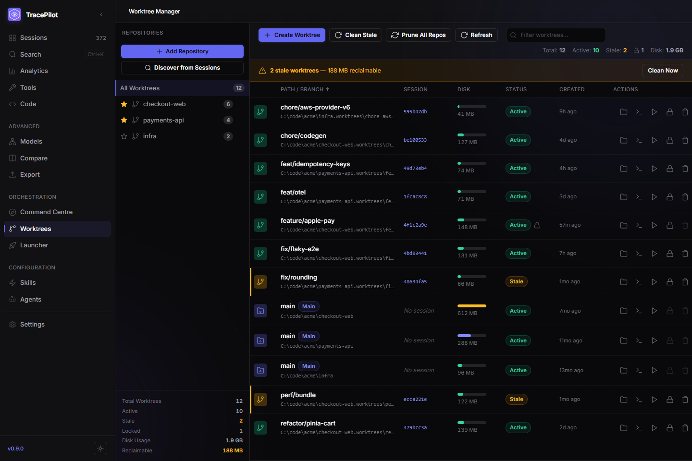 |

### Additional features

Settings → Additional Features groups optional surfaces:

- **Recommended:** Skills, Agents, Export, and Prompt Cache Insights are on by default. **Exact Context Capture** is opt-in and adds a CLI Context page that records and compares the exact context a session sends to the model.
- **Experimental** (off by default):
  - **Copilot SDK Bridge**: steer sessions from TracePilot through the official Copilot SDK, and follow terminal sessions live when they run with `copilot --ui-server` (sessions TracePilot launches get this flag by default).
  - **MCP Servers**: add, import, configure, toggle, and health-check MCP servers compatible with Copilot CLI configuration.
  - **Session Replay**: step through session event timelines using indexed session data.
  - **Config Injector**: edit Copilot CLI agent model assignments and user settings, compare installed CLI versions, and back up or restore config files.

### Export and share sessions

TracePilot can export sessions as Markdown, TracePilot JSON, or raw session archives, with configurable sections and redaction options. Session-level export is available from session detail; the top-level Export page provides a broader export/import workflow.

---

## Screenshots

The README screenshots are generated rather than captured by hand. The
[visual harness](docs/visual-regression.md#readme-screenshots) renders the real
frontend at 1440×960 against a synthetic showcase workspace of fictional
`acme/*` repositories, so the images contain no personal session data and can be
refreshed after any UI change:

```powershell
node scripts/visual/capture.mjs --suite=readme --channel=msedge --docs
```

More views are captured than this page embeds, including the
[session overview](docs/images/readme-session-overview.png),
[session files](docs/images/readme-session-explorer.png),
[code impact](docs/images/readme-code-impact.png),
[model comparison](docs/images/readme-model-comparison.png),
[Command Centre](docs/images/readme-orchestration.png), and
[Config Injector](docs/images/readme-config-injector.png).

Browse the [interactive screenshot history](https://mattshelton04.github.io/TracePilot/visual/)
for automated before/after comparisons of PRs and merges, with side-by-side,
wipe, overlay, and highlighted pixel differences. See
[how visual CI works](docs/visual-regression.md).

---

## Install and run

### Prerequisites

- Windows with the WebView2 runtime, or macOS 12+ on Apple Silicon.
- GitHub Copilot CLI with session history.
- For source builds: Rust, Node.js 22, pnpm 10, and the Tauri 2 prerequisites.
  The exact known-good versions are recorded in `.node-version` and the root
  `packageManager` field.

### Option A: install a Windows build (recommended)

Download the latest build from [GitHub Releases](https://github.com/MattShelton04/TracePilot/releases/latest).

The current release assets include:

| Asset | Use it for |
| --- | --- |
| `TracePilot_<version>_x64-setup.exe` | Recommended installer for most Windows users. |
| `TracePilot_<version>_x64_en-US.msi` | MSI installer for environments that prefer MSI packages. |
| `tracepilot-desktop.exe` | Standalone executable if you do not want to run an installer. |
| `latest.json` and `*.sig` files | Updater metadata and signatures used by the release pipeline. |

The app is not code-signed yet. Windows SmartScreen may warn on first launch; choose **More info** -> **Run anyway** if you trust the build, or build from source instead.

### Option B: install a macOS build (Apple Silicon preview)

Download `TracePilot_<version>_aarch64.dmg` from [GitHub Releases](https://github.com/MattShelton04/TracePilot/releases/latest), open it and drag **TracePilot** into **Applications**. Intel Macs are not supported yet.

The app is not notarized by Apple, so the first launch is blocked. Open TracePilot once, then choose **System Settings** -> **Privacy & Security** -> **Open Anyway**. Later versions install from inside the app in one click without that prompt. Run TracePilot from Applications rather than from the disk image, or it cannot update itself.

### Option C: run from source

```powershell
git clone https://github.com/MattShelton04/TracePilot.git
cd TracePilot
pnpm start
```

Use this path if you want to develop TracePilot, inspect the code before running it, or avoid unsigned release binaries. `pnpm start` installs workspace dependencies and launches the Tauri desktop app. On first launch, TracePilot guides you through setup and indexes your sessions.

> The terminal may print a Vite localhost URL during development. Use the desktop window for the real app; a normal browser tab does not have access to the Tauri backend.

---

## Architecture

TracePilot is a Rust/TypeScript monorepo:

```text
TracePilot/
├── apps/
│   ├── desktop/                    # Tauri 2 desktop app, Vue 3 frontend
│   └── cli/                        # Experimental TypeScript CLI utilities
├── crates/
│   ├── tracepilot-core/            # Session parsing, models, analytics
│   ├── tracepilot-indexer/         # SQLite + FTS5 indexing and queries
│   ├── tracepilot-export/          # Markdown/JSON/raw exports and imports
│   ├── tracepilot-orchestrator/    # Worktrees, launcher, config injection
│   ├── tracepilot-tauri-bindings/  # Tauri IPC commands and app state
│   ├── tracepilot-bench/           # Criterion benchmarks
│   └── tracepilot-test-support/    # Rust test support utilities
├── packages/
│   ├── client/                     # Typed TypeScript client for Tauri IPC
│   ├── types/                      # Shared TypeScript models/config
│   ├── ui/                         # Shared Vue components and renderers
│   ├── test-utils/                 # Shared frontend test helpers
│   └── config/                     # Shared TS config presets
├── docs/                           # Architecture, design, and developer docs
└── scripts/                        # Build, release, validation, and E2E helpers
```

The main data flow is:

```text
Copilot session files
  -> tracepilot-core parses JSONL/YAML/SQLite session data
  -> tracepilot-indexer stores searchable metadata/content in SQLite FTS5
  -> tracepilot-tauri-bindings exposes typed Tauri commands
  -> @tracepilot/client calls those commands from Vue/Pinia views
```

Useful deeper docs:

- [Architecture overview](docs/architecture/overview.md)
- [Data integration guide](docs/data-integration-guide.md)
- [Testing guide](docs/testing.md)
- [On-disk paths](docs/on-disk-paths.md)
- [Performance playbook](docs/performance-playbook.md)
- [Tauri command registration](docs/tauri-command-registration.md)

---

## Development

Install dependencies:

```powershell
pnpm install
```

Common commands:

| Task | Command |
| --- | --- |
| Launch desktop dev app | `pnpm --filter @tracepilot/desktop tauri dev` |
| Launch via convenience script | `pnpm start` |
| Launch real app for agent inspection | `pnpm app:start` (then the printed Playwright CLI attach command) |
| Launch frontend-only automation server | `pnpm app:ui` |
| Frontend build/typecheck | `pnpm build` |
| Workspace typecheck | `pnpm typecheck` |
| JS/TS tests | `pnpm test` |
| Rust tests | `cargo test --workspace --exclude tracepilot-desktop` |
| Biome lint | `pnpm lint` |
| Regenerate IPC bindings | `pnpm gen:bindings` |
| Regenerate README screenshots | `node scripts/visual/capture.mjs --suite=readme --channel=msedge --docs` |
| Check docs links | `node scripts/check-doc-links.mjs` |
| Check file-size budgets | `node scripts/check-file-sizes.mjs` |

If you use [`just`](https://github.com/casey/just), `just --list` shows wrappers for the same tasks. `just ci` mirrors the main local CI gate.

See [running-app automation](docs/app-automation.md) for browser-style interaction
with the real Tauri backend, screenshots, traces, and frontend-only exploration.
The [documentation index](docs/README.md) and [script command index](scripts/README.md)
cover the remaining guides and supported developer commands.

### Versioning and releases

The workspace version is centralized in the root `Cargo.toml` and mirrored into package metadata by the release tooling.

```powershell
.\scripts\bump-version.ps1 -Version <version>
```

The script updates only the root and pnpm workspace package manifests, leaving third-party test fixtures and local Copilot packages at their own versions. It requires pnpm and `cargo-edit` (`cargo install cargo-edit`).

After a version bump, update `CHANGELOG.md` and `apps/desktop/public/release-manifest.json`, run the validation gates, and open a PR to `main`. Once the PR is merged, tag the merged commit with `v<version>` and push that tag to trigger the repository release workflow.

The workflow builds the Windows installers and the Apple Silicon disk image in parallel, adds the macOS entry to `latest.json`, and publishes the release once every job passes. If only the macOS job fails, the draft already holds the Windows assets and a Windows-only `latest.json`, so it can be published by hand.

To rehearse a release without publishing it, bump a throwaway commit to a numeric prerelease version (for example `0.9.1-1`; MSI rejects non-numeric prerelease identifiers) and push a matching tag. Pushed prerelease tags stop at a draft. Draft assets are only downloadable by repository members while signed in, and the in-app updater cannot see drafts. Delete the draft and the tag afterwards.

---

## Roadmap

Current near-term areas:

- Make the Copilot SDK bridge reliable enough to graduate from experimental.
- Improve live-session monitoring and alerting.
- Continue hardening parser coverage as Copilot CLI evolves.
- Polish export/import workflows and team-shareable reports.
- Expand platform validation beyond Windows.

Historical design notes and implementation plans live in [`docs/`](docs/README.md).

---

## License

TracePilot is licensed under the [GNU General Public License v3.0](LICENSE).

You are free to use, modify, and distribute this software under the GPL-3.0. Derivative works and modifications must preserve the same license terms.

---

<p align="center">
  <sub>Built with Rust, Vue, SQLite, and Tauri.</sub>
</p>
