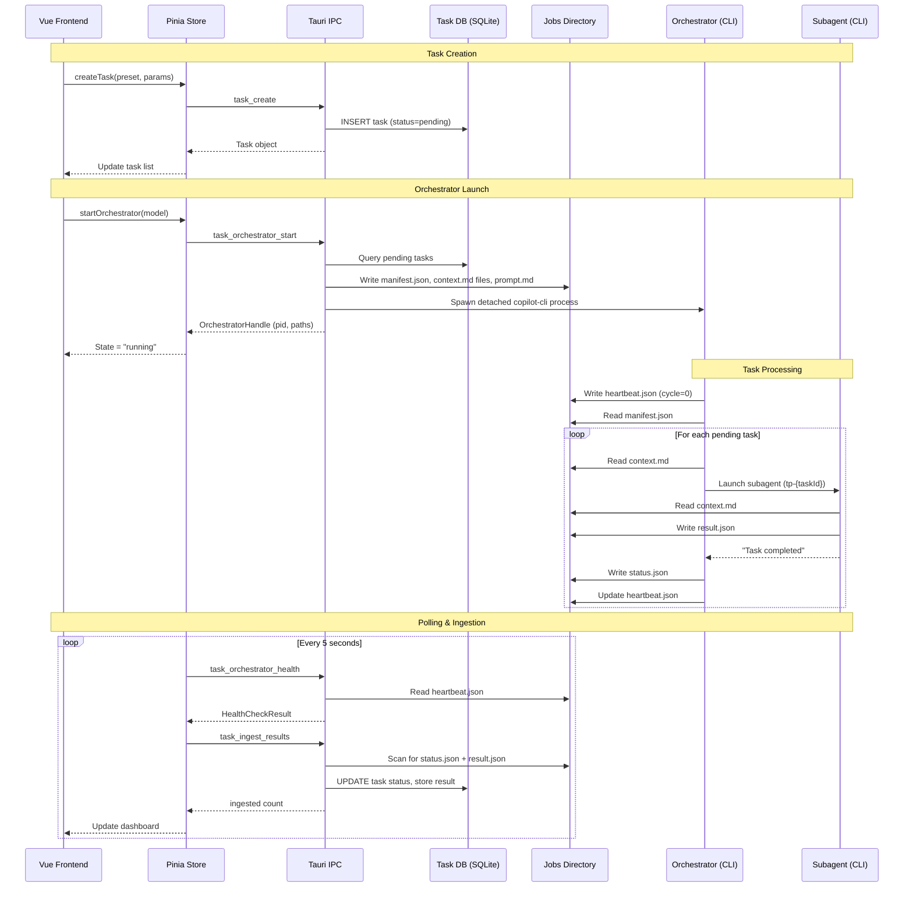
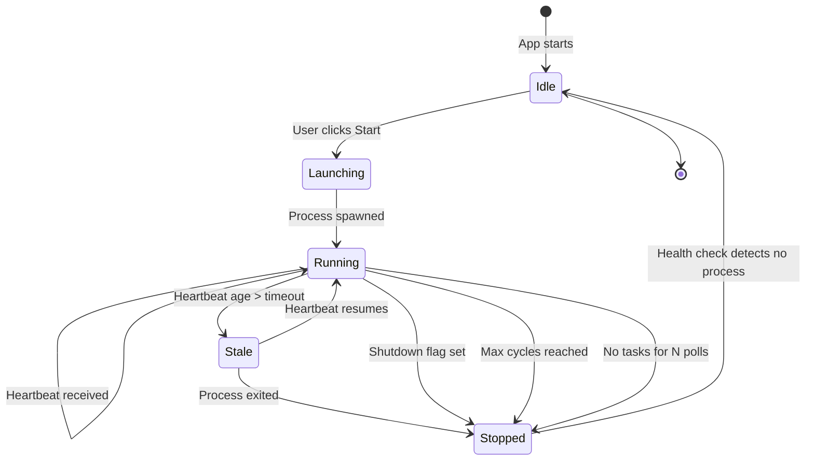
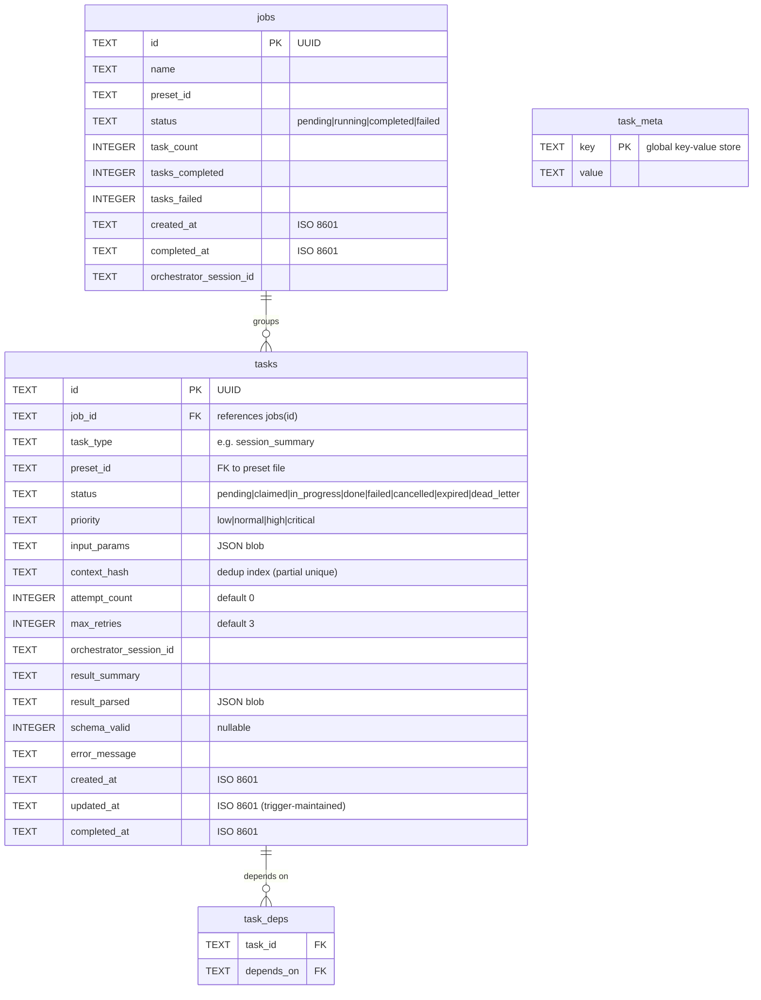
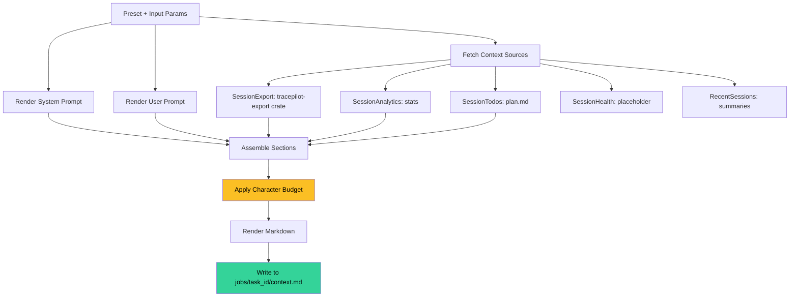
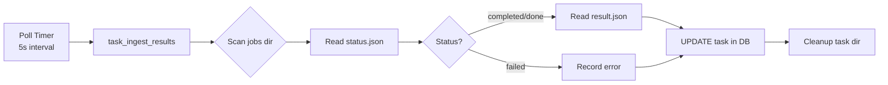

# AI Task System

> **Status**: Experimental (behind `aiTasks` feature flag)  
> **Introduced**: v0.7.0

TracePilot's AI Task System enables automated analysis of Copilot CLI sessions by
defining reusable task presets, assembling context from session data, and delegating
work to Copilot CLI subagents. Under Copilot billing, only the root orchestrator
prompt costs a premium request — all subagent work is free.

---

## Table of Contents

1. [Architecture Overview](#architecture-overview)
2. [Data Flow](#data-flow)
3. [Orchestrator Lifecycle](#orchestrator-lifecycle)
4. [Task Database](#task-database)
5. [Preset System](#preset-system)
6. [Context Assembly Pipeline](#context-assembly-pipeline)
7. [File-Based IPC Protocol](#file-based-ipc-protocol)
8. [Result Ingestion](#result-ingestion)
9. [Health Monitoring](#health-monitoring)
10. [Subagent Attribution](#subagent-attribution)
11. [Frontend Architecture](#frontend-architecture)
12. [IPC Command Reference](#ipc-command-reference)
13. [Configuration](#configuration)
14. [Troubleshooting](#troubleshooting)

---

## Architecture Overview

The system has five layers spanning the Rust backend and Vue frontend:

```
┌─────────────────────────────────────────────────────────┐
│                    Vue 3 Frontend                        │
│  ┌──────────┐  ┌──────────┐  ┌──────────┐  ┌────────┐  │
│  │Dashboard │  │  Detail  │  │ Monitor  │  │Presets │  │
│  │  View    │  │   View   │  │  View    │  │Manager │  │
│  └────┬─────┘  └────┬─────┘  └────┬─────┘  └───┬────┘  │
│       │              │             │             │       │
│  ┌────┴──────────────┴─────────────┴─────────────┴────┐  │
│  │              Pinia Stores (tasks, orchestrator)     │  │
│  └────────────────────────┬───────────────────────────┘  │
│                           │                              │
│  ┌────────────────────────┴───────────────────────────┐  │
│  │           @tracepilot/client (19 IPC wrappers)     │  │
│  └────────────────────────┬───────────────────────────┘  │
└───────────────────────────┼──────────────────────────────┘
                            │ Tauri invoke()
┌───────────────────────────┼──────────────────────────────┐
│                    Rust Backend                          │
│  ┌────────────────────────┴───────────────────────────┐  │
│  │        tracepilot-tauri-bindings (19 commands)      │  │
│  └──┬──────────┬──────────┬──────────┬───────────────┘  │
│     │          │          │          │                   │
│  ┌──┴───┐  ┌──┴───┐  ┌──┴───┐  ┌──┴──────────────┐   │
│  │TaskDb│  │Preset│  │Launch│  │Context Assembly │   │
│  │(SQL) │  │(JSON)│  │ er   │  │    Pipeline     │   │
│  └──────┘  └──────┘  └──┬───┘  └──────┬──────────┘   │
│                         │              │                │
│                    ┌────┴──────────────┴────┐           │
│                    │   File-based IPC       │           │
│                    │  (jobs directory)      │           │
│                    └────────┬───────────────┘           │
└─────────────────────────────┼────────────────────────────┘
                              │
                    ┌─────────┴─────────┐
                    │  Copilot CLI      │
                    │  Orchestrator     │
                    │  (detached proc)  │
                    └─────┬───────┬─────┘
                          │       │
                    ┌─────┴─┐ ┌──┴──────┐
                    │Sub-   │ │Sub-     │
                    │agent 1│ │agent 2  │
                    └───────┘ └─────────┘
```

### Crate Responsibilities

| Crate | Module | Purpose |
|-------|--------|---------|
| `tracepilot-orchestrator` | `task_db` | SQLite task/job storage, CRUD operations |
| `tracepilot-orchestrator` | `presets` | JSON-file preset CRUD, builtin seed |
| `tracepilot-orchestrator` | `task_context` | Context assembly from session data |
| `tracepilot-orchestrator` | `task_orchestrator` | Prompt rendering, manifest generation, process launch |
| `tracepilot-orchestrator` | `task_ipc` | File protocol definitions, result scanning, ingestion |
| `tracepilot-orchestrator` | `task_attribution` | Subagent tracking from orchestrator session events |
| `tracepilot-orchestrator` | `task_recovery` | Heartbeat-based health checks |
| `tracepilot-tauri-bindings` | `commands::tasks` | 19 Tauri IPC commands bridging frontend↔backend |

---

## Data Flow



---

## Orchestrator Lifecycle



### Launch Sequence

1. **User triggers start** via monitor UI (or programmatically)
2. `task_orchestrator_start` IPC command:
   - Queries pending tasks from DB
   - Loads preset for each task, assembles context via pipeline
   - Writes `manifest.json` with task entries (context paths, result paths, status paths)
   - Renders `orchestrator_prompt.md` from template with config values
   - Writes prompt to file (avoids PowerShell escaping issues)
   - Spawns detached `copilot-cli session --prompt "Read instructions at: {path}" --allow-all`
3. **Orchestrator reads prompt file** → enters main loop
4. **Main loop** (see [orchestrator_prompt.md](../crates/tracepilot-orchestrator/src/task_orchestrator/orchestrator_prompt.md)):
   - Read manifest → check shutdown → find pending → process → write heartbeat → sleep → repeat

### Shutdown

The orchestrator stops when any of these conditions are met:
- `shutdown: true` in manifest (set by `task_orchestrator_stop`)
- `max_cycles` reached (default: 100)
- `max_empty_polls` consecutive cycles with no pending tasks (default: 10)

### Bootstrap Prompt Pattern

Due to PowerShell 5.1 escaping issues with long multi-line strings, the actual CLI
receives a short bootstrap prompt:

```
Read and follow ALL instructions in the file at: C:\Users\...\.copilot\tracepilot\jobs\orchestrator-prompt.md
```

The orchestrator then uses its `view` tool to read the full prompt file.

---

## Task Database

SQLite database at `~/.copilot/tracepilot/tasks.db`.

### Schema



### Task Lifecycle

```
pending → claimed → in_progress → done
                                 → failed → pending (retry, up to max_retries)
                                          → dead_letter (exhausted retries)
pending → cancelled
in_progress → expired (stale release)
```

- Tasks start as `pending` when created
- Move to `in_progress` when claimed by the orchestrator
- `done` or `failed` after result ingestion
- `cancelled` via manual user action
- `retry` resets status back to `pending`

---

## Preset System

Presets define reusable task templates. Stored as JSON files in
`~/.copilot/tracepilot/presets/`.

### Preset Structure

```typescript
interface TaskPreset {
  id: string;            // e.g. "session-summary"
  name: string;          // "Session Summary"
  description: string;
  taskType: string;      // e.g. "session_summary"
  enabled: boolean;
  builtin: boolean;
  prompt: {
    system: string;      // System role prompt
    user: string;        // User instructions (supports {{variables}})
  };
  variables: [{
    name: string;        // e.g. "session_export"
    varType: string;     // "session_ref" | "text" | "number"
    required: boolean;
    description: string;
    defaultValue?: string;
  }];
  context: {
    sources: [{
      id: string;
      sourceType: string; // "session_export" | "session_analytics" | ...
      label?: string;
      required: boolean;
      config: object;
    }];
    maxChars: number;    // Character budget (default: 100,000)
    format: string;      // "markdown" | "json"
  };
  output: {
    schema: object;      // JSON Schema for result
    format: string;      // "markdown" | "json"
    validation: string;  // "strict" | "warn" | "none"
  };
  execution: {
    model: string;       // Default model (e.g. "gpt-5-mini")
    timeoutSeconds: number;
    retryCount: number;
  };
}
```

### Builtin Presets

| ID | Name | Task Type | Context Source | Budget |
|----|------|-----------|---------------|--------|
| `session-summary` | Session Summary | `session_summary` | SessionExport | 80,000 chars |
| `session-review` | Session Code Review | `code_review` | SessionExport | 80,000 chars |

### Custom Presets

Users can create custom presets via the Preset Manager UI. Custom presets support
the same structure as builtins, with additional flexibility in prompt templates,
context sources, and output schemas.

---

## Context Assembly Pipeline

The context assembly pipeline transforms a preset + input parameters into a
markdown document that the subagent reads.



### Budget System

The character budget (`maxChars` from preset, default 100,000) controls total
context size. Sections are prioritized:

| Priority | Behaviour | Examples |
|----------|-----------|---------|
| **Required** | Never dropped | System prompt, output schema |
| **Primary** | Truncated at line boundaries if over budget | Session export, analytics |
| **Supplementary** | Dropped first when over budget | Health, recent sessions |

### Context Sources

| Source Type | Data | Implementation |
|-------------|------|----------------|
| `SessionExport` | Full structured session export via `tracepilot-export` crate — conversation, plan, todos, metrics, incidents, health. Falls back to basic summary on failure. | `sources.rs` — uses `preview_export()` with curated section set |
| `SessionAnalytics` | Aggregate stats (event count, turns, repo, model, timestamps) | `sources.rs` |
| `SessionTodos` | Full `plan.md` content | `sources.rs` |
| `SessionHealth` | Placeholder (not yet implemented) | `sources.rs` |
| `RecentSessions` | Summary of up to 10 recent sessions | `sources.rs` |

**`SessionExport` Section Selection (default):**

The export source selects high-value sections for AI summarisation while
omitting verbose/low-signal data:

| Section | Included | Rationale |
|---------|----------|-----------|
| Conversation | ✅ | Core content — user/assistant dialogue |
| Plan | ✅ | Session goals and structure |
| Todos | ✅ | Task tracking state |
| Metrics | ✅ | Token usage, timing, model info |
| Incidents | ✅ | Error patterns and recovery |
| Health | ✅ | Session health scoring |
| Events | ❌ | Raw event stream — too verbose, duplicates conversation |
| Checkpoints | ❌ | Redundant with conversation for summary |
| RewindSnapshots | ❌ | Not relevant for analysis |

Sections can be overridden per-preset via `config.sections` array:
```json
{
  "id": "session-export",
  "sourceType": "SessionExport",
  "config": {
    "sections": ["conversation", "plan", "todos"],
    "max_bytes": 50000
  }
}
```

### Assembled Context Format

```markdown
# Task: Session Summary

## System Prompt
You are an expert technical writer analysing GitHub Copilot CLI sessions...

## Instructions
Summarise the following Copilot CLI session. Include:
1. **Objective** — what the user set out to do
...

## Session Export
**Session ID**: abc-123
**Turns**: 45
**Repository**: user/repo
...

### Turn 1 (User)
Can you help me refactor the auth module...

### Turn 1 (Assistant)
I'll help with that. Let me start by...

## Output Schema
```json
{ "objective": "string", "approach": "string", ... }
```

## Output Format
Return your result as valid JSON matching the Output Schema above.
Write result to: C:\Users\...\.copilot\tracepilot\jobs\{task_id}\result.json
```

---

## File-Based IPC Protocol

All orchestrator↔app communication happens through the filesystem. No sockets,
no HTTP, no stdin/stdout.

### Jobs Directory Layout

```
~/.copilot/tracepilot/jobs/
├── manifest.json              # Task list + shutdown flag
├── heartbeat.json             # Orchestrator health signal
├── orchestrator-prompt.md     # Rendered orchestrator instructions
├── {task-id-1}/
│   ├── context.md             # Assembled context for subagent
│   ├── result.json            # Subagent output (written by subagent)
│   └── status.json            # Completion signal (written by orchestrator)
├── {task-id-2}/
│   ├── context.md
│   ├── result.json
│   └── status.json
└── ...
```

### Manifest Format (`manifest.json`)

```json
{
  "version": 1,
  "poll_interval_seconds": 30,
  "max_parallel": 3,
  "shutdown": false,
  "tasks": [
    {
      "id": "abc-123",
      "type": "session_summary",
      "title": "Summarise session X",
      "model": "gpt-5-mini",
      "priority": "normal",
      "context_file": "C:/.../jobs/abc-123/context.md",
      "result_file": "C:/.../jobs/abc-123/result.json",
      "status_file": "C:/.../jobs/abc-123/status.json"
    }
  ]
}
```

### Heartbeat Format (`heartbeat.json`)

```json
{
  "timestamp": "2026-04-03T09:01:30Z",
  "cycle": 2,
  "activeTasks": ["abc-123"],
  "completedTasks": ["def-456"]
}
```

### Status File Format (`status.json`)

```json
{
  "taskId": "abc-123",
  "status": "completed",
  "completedAt": "2026-04-03T09:02:15Z",
  "errorMessage": null
}
```

### Result File Format (`result.json`)

```json
{
  "taskId": "abc-123",
  "result": {
    "objective": "Refactor the authentication module...",
    "approach": "The agent started by...",
    "outcome": "Successfully refactored...",
    "insights": "Notable patterns include..."
  },
  "summary": "Session focused on auth module refactoring"
}
```

### Atomic Writes

All files use atomic write pattern: write to `{path}.tmp`, then rename to `{path}`.
This prevents partial reads by the monitoring system.

---

## Result Ingestion

The app periodically scans the jobs directory for completed tasks and ingests
results into the database.



### Ingestion Flow

1. Frontend store polls `task_ingest_results` every 5 seconds
2. Backend queries all `pending` and `in_progress` tasks from DB
3. For each task, checks if `jobs/{task_id}/status.json` exists
4. If found: reads status + result, updates DB, optionally cleans up files
5. Returns count of ingested results

---

## Health Monitoring

Health is determined by heartbeat freshness and process handle validity.

### Health States

| State | Condition | UI Display |
|-------|-----------|-----------|
| `healthy` | Heartbeat age < timeout | Green "Running" |
| `stale` | Heartbeat exists but age ≥ timeout | Yellow "Stale" |
| `unknown` | No heartbeat file found | Blue "Starting" (if handle exists) |
| `stopped` | No process handle | Grey "Stopped" |

### Timeout Calculation

```
timeout = poll_interval_seconds × heartbeat_stale_multiplier
default = 30 × 6 = 180 seconds
```

---

## Subagent Attribution

The attribution system tracks subagent lifecycle by parsing the orchestrator's
session `events.jsonl` file.

### How It Works

1. Orchestrator spawns subagents named `tp-{task_id}`
2. Copilot CLI records `subagent.started`, `subagent.completed`, `subagent.failed` events
3. `tracker.rs` scans these events and correlates by agent name → task ID
4. Returns `AttributionSnapshot` with per-subagent status, timestamps, errors

### Attribution Data

```typescript
interface TrackedSubagent {
  taskId: string;
  agentName: string;           // "tp-abc-123"
  status: SubagentStatus;      // "spawning" | "running" | "completed" | "failed"
  startedAt: string | null;
  completedAt: string | null;
  error: string | null;
}

interface AttributionSnapshot {
  subagents: TrackedSubagent[];
  eventsScanned: number;
}
```

### Prerequisite

Attribution requires the orchestrator session path. The system discovers this
by scanning for `inuse.{PID}.lock` files in the session state directory after
launch.

---

## Frontend Architecture

### Routes

| Path | View | Sidebar ID |
|------|------|-----------|
| `/tasks` | TaskDashboardView | `ai-tasks` |
| `/tasks/:taskId` | TaskDetailView | `ai-tasks` |
| `/tasks/create` | TaskCreateView | `ai-tasks` |
| `/tasks/monitor` | OrchestratorMonitorView | `ai-monitor` |
| `/tasks/presets` | PresetManagerView | `ai-presets` |

### Stores

| Store | Purpose |
|-------|---------|
| `tasks` | Task CRUD, filtering, stats |
| `orchestrator` | Health polling, start/stop, ingestion |
| `presets` | Preset CRUD, loading |

### Feature Flag

The entire AI Tasks section is gated behind the `aiTasks` feature flag in
Settings → Experimental. When disabled, the sidebar section and all routes
are hidden.

---

## IPC Command Reference

| Command | Parameters | Returns | Description |
|---------|-----------|---------|-------------|
| `task_create` | `NewTask` | `Task` | Create a single task |
| `task_create_batch` | `NewTask[], jobName, presetId?` | `Job` | Create multiple tasks as a job |
| `task_get` | `taskId` | `Task` | Get task by ID |
| `task_list` | `TaskFilter?` | `Task[]` | List/filter tasks |
| `task_cancel` | `taskId` | `()` | Cancel a pending task |
| `task_retry` | `taskId` | `()` | Retry a failed task |
| `task_delete` | `taskId` | `()` | Delete a task |
| `task_stats` | — | `TaskStats` | Aggregate task statistics |
| `task_list_jobs` | `limit?: i64` | `Job[]` | List jobs (most recent first) |
| `task_cancel_job` | `jobId` | `()` | Cancel a running job |
| `task_list_presets` | — | `TaskPreset[]` | List all presets |
| `task_get_preset` | `presetId` | `TaskPreset` | Get preset by ID |
| `task_save_preset` | `TaskPreset` | `()` | Create/update preset |
| `task_delete_preset` | `presetId` | `()` | Delete a preset |
| `task_orchestrator_health` | — | `HealthCheckResult` | Check orchestrator health |
| `task_orchestrator_start` | `model?` | `OrchestratorHandle` | Launch orchestrator |
| `task_orchestrator_stop` | — | `()` | Set shutdown flag |
| `task_ingest_results` | — | `number` | Scan and ingest completed results |
| `task_attribution` | `sessionPath` | `AttributionSnapshot` | Get subagent tracking data |

---

## Configuration

In `~/.copilot/tracepilot/config.toml`:

```toml
[features]
ai_tasks = true

[tasks]
enabled = true
orchestrator_model = "claude-haiku-4.5"
default_subagent_model = "claude-sonnet-4.6"
poll_interval_seconds = 30
max_concurrent_tasks = 3
heartbeat_stale_multiplier = 6
max_retries = 3
auto_start_orchestrator = false
context_budget_tokens = 50000
```

---

## Troubleshooting

### "Command not found" errors

All 19 task commands must be registered in **two** places:
1. `crates/tracepilot-tauri-bindings/src/lib.rs` → `invoke_handler()`
2. `apps/desktop/src-tauri/build.rs` → `InlinedPlugin.commands()`

Missing from `build.rs` = runtime "not allowed" error even though the handler exists.

### Orchestrator won't start

- Check that `copilot-cli` is installed and on PATH
- Check that `--allow-all` flag is supported (requires recent Copilot CLI)
- Verify the feature flag is enabled in Settings → Experimental

### Tasks stay "pending" forever

- Check if the orchestrator is running (Monitor view)
- Check heartbeat age — if stale, the orchestrator may have crashed
- Manually trigger ingestion via the Monitor's Refresh button
- Check `~/.copilot/tracepilot/jobs/{taskId}/status.json` exists

### Long startup delay before "Running" state

The launcher pre-writes an initial heartbeat (cycle 0) before spawning the CLI
process, so the monitor shows "Running" immediately. The orchestrator prompt also
instructs the agent to write a heartbeat as its very first action. If neither
heartbeat appears, the monitor shows "Starting…" — check console for launch errors.
