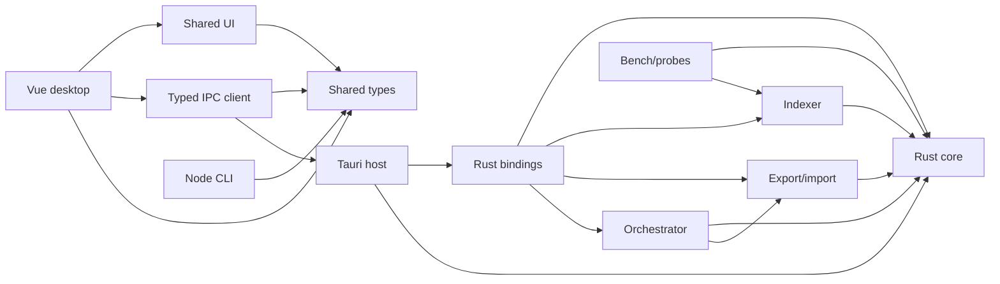
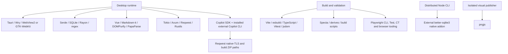

# Dependencies

TracePilot's dependency reference covers the Rust workspace, pnpm workspace, isolated visual-publisher npm project, native/build tools and CI provisioning. The audit baseline is merged main **e3ff0935641de98b96da49f9c2c9fb5b83e3cbf1**; the measured candidate is the **codex/dependency-audit** change set identified by the source and lock hashes in the ignored `.agent/dependency-audit/measurements.json` capture. Research and measurements were collected on **2026-09-27 UTC**, before committing the changes for review. The checkout was clean at baseline. These measurements remain tied to that revision even when later main changes are included in PR integration checks.

The delivered changes remove proven redundant declarations, narrow features, patch actionable Rust and JavaScript advisories, fix hook provisioning and expand CI security coverage. The largest security gain is the full pnpm graph: **27 unique advisories across nine affected package/version instances → zero** at the final scan. RustSec unsoundness warnings fall **six → two**, while eight maintenance notices remain. Cargo-deny is still failing on explicitly documented upstream maintenance, license-policy and internal path-version findings, plus explicit scanner-resolution diagnostics; no security policy was weakened.

Validation passes 4,026 JavaScript tests, 1,722 Rust tests, three native Windows journeys and the separate NSIS install/uninstall cycle. Fifteen graph invariants and 140 script/publisher tests pass. One component screenshot mismatch and one z-index policy failure reproduce at baseline. Direct declarations fall 197 → 189 and unique compiled Rust packages fall by five, but fresh builds show no established speed benefit. The executable grows 17,920 bytes, unsigned NSIS grows 11,467 bytes, and installed developer dependencies grow 14.3 MB, mostly Lefthook. All 241 desktop dist files match byte-for-byte. See [measurements](measurements.md) for scope, samples and remaining limits.

## Reference map

| Reference | Contents |
| --- | --- |
| [Rust](rust.md) | Every direct declaration, use sites, features, targets, duplicate/native/codegen findings and retained contracts |
| [JavaScript](javascript.md) | Every workspace and isolated npm declaration, peer/platform paths, external CLI modules and bundle reachability |
| [Update decisions](upgrades.md) | Delivered batches, ordinal risk rubric, current/latest/compatible/exact-target matrices |
| [Security](security.md) | Every baseline advisory, paths/exposure, scanner evidence, patched and remaining findings |
| [Measurements](measurements.md) | Original baseline versus delivered counts, builds, artifacts, installs, probes and validation |
| [Roadmap](roadmap.md) | Completed work, five highest-value remaining actions, acceptance tests and rollback |
| [Capture and rerun commands](../../scripts/dependencies/README.md) | Locked input capture, graph generation, provenance and invariant tests |

## Reconciled populations

Counts are declaration edges or resolved instances, not lines of code or bytes shipped. Cargo counts include eight internal workspace packages; pnpm counts below exclude its eight importer/root nodes. The separate npm island has one package. Test fixture package manifests are fixtures, not installation roots.

| Population | Baseline | Delivered | Coverage |
| --- | ---: | ---: | --- |
| Active Cargo member manifests | 8 | 8 | All members, build/dev/optional/target declarations |
| Cargo direct declarations | 119 | 113 | 119/119 baseline dispositions; 113/113 final mapped |
| Cargo direct internal / external edges | 15 / 104 | 14 / 99 | Internal links kept separate |
| Cargo distinct direct external names | 48 | 47 | Live registry version assessment includes the removed anyhow direct edge |
| Cargo all-target/all-feature lock instances | 723 | 721 | Every instance and parent edge mapped; eight are first-party |
| pnpm importer manifests | 8 | 8 | Root plus seven workspaces |
| pnpm direct declarations | 77 | 75 | 77/77 baseline dispositions, plus newly declared Lefthook; 75/75 final mapped |
| pnpm direct internal / external edges | 8 / 69 | 8 / 67 | Runtime/dev/peer categories preserved |
| pnpm distinct direct external names | 44 | 44 | Includes removed declarations in version review |
| pnpm package records / resolved peer snapshots | 429 / 429 | 430 / 430 | All metadata and peer contexts retained; counts need not generally be equal |
| Isolated npm direct / resolved | 1 / 1 | 1 / 1 | scripts/visual pngjs; separate lock and scanner |
| All direct declarations | 197 | 189 | Complete manifest-to-graph mapping |

All resolved nodes have purpose from published metadata or explicitly marked curated inference, parent/root reachability and scanner disposition or an explicit unknown. Sixteen pnpm purposes use inference because the published description is absent. This is **complete graph and direct-use coverage**, not an assertion that every upstream source line was manually audited. Deeper source/feature tracing concentrated on vulnerable, native, duplicate, build-script, permission-sensitive, expensive and removal-relevant paths. No finding from a scanner is a security proof. Resolver presence is not evidence of installation, compilation, binary inclusion or runtime execution.

The graph separates Windows, Linux and macOS resolver views; compiled artifact counts and actual native checks are in measurements. Platform views do not substitute for native builds. pnpm list can report nonexistent foreign-platform paths; path-presence and stale/extra records are reconciled separately. Fresh installation footprints exclude links/reparse traversal and do not masquerade as physical disk allocation.

## Architecture overviews

Runtime relationships are simplified below; test/build/optional links remain in the complete graph.

Generated graphs, raw measurements, scanner logs and one-off captures are local audit artifacts under ignored `.agent/dependency-audit/`. They are not source files. The maintained findings and reproducible commands above are the reviewable record.

## Limits and next work

The [roadmap](roadmap.md) prioritizes distribution policy, the Node LTS patch trial, coordinated Tauri/platform maintenance, Lucide's package rename, and remaining platform/parent-path validation. SDK and Specta pins remain intentional. Linux/macOS native execution, signed updater/MSI distribution and a provider-backed paid Copilot session are not established by Windows tests. The rejected desktop serde_json and UI compiler-dom removals are excluded from the delivered diff; compilation exposed their hidden macro/generated consumers.
