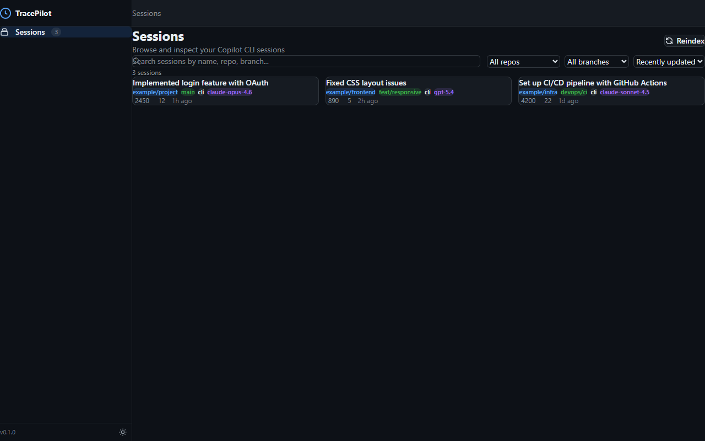
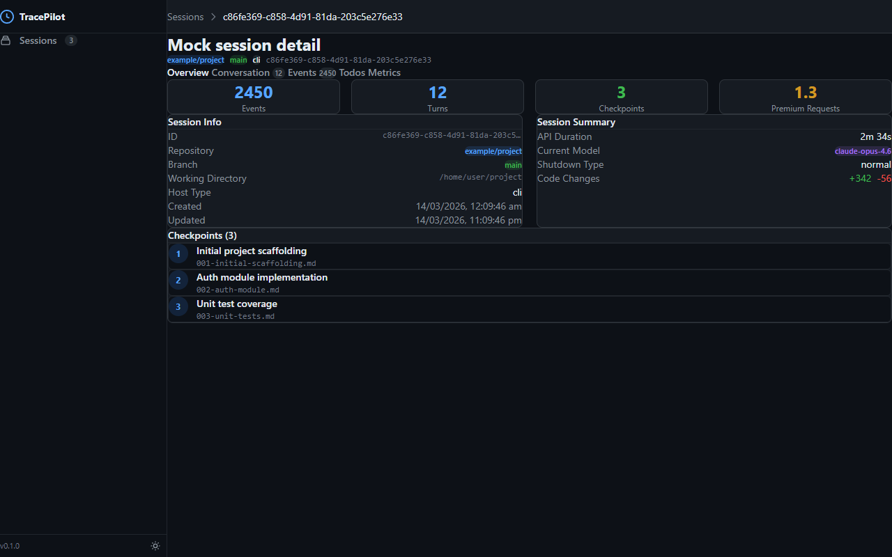
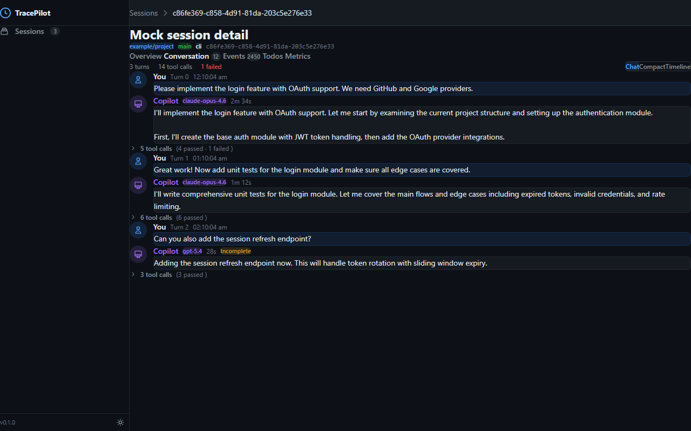
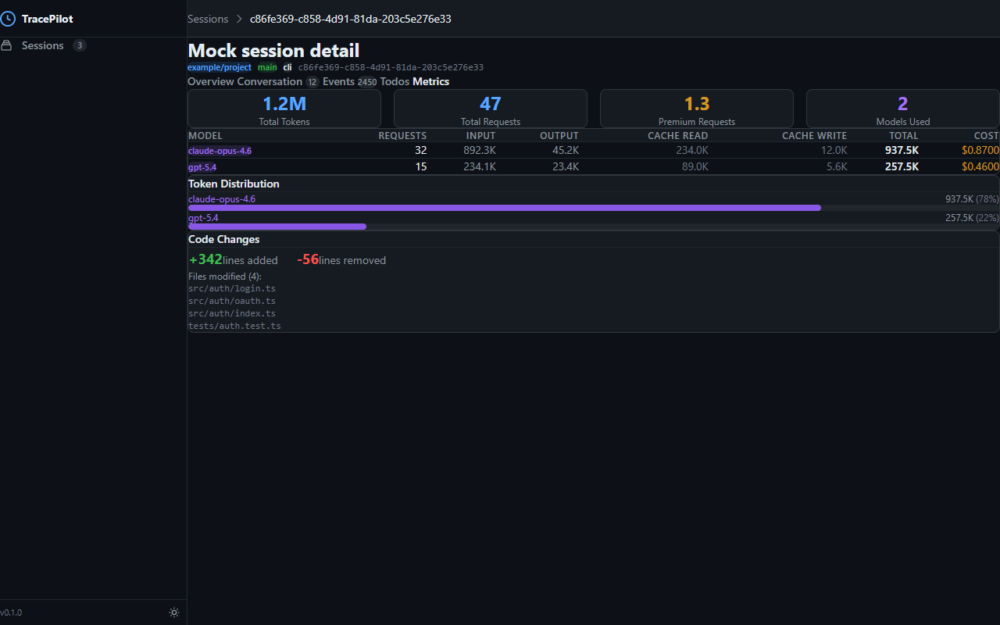
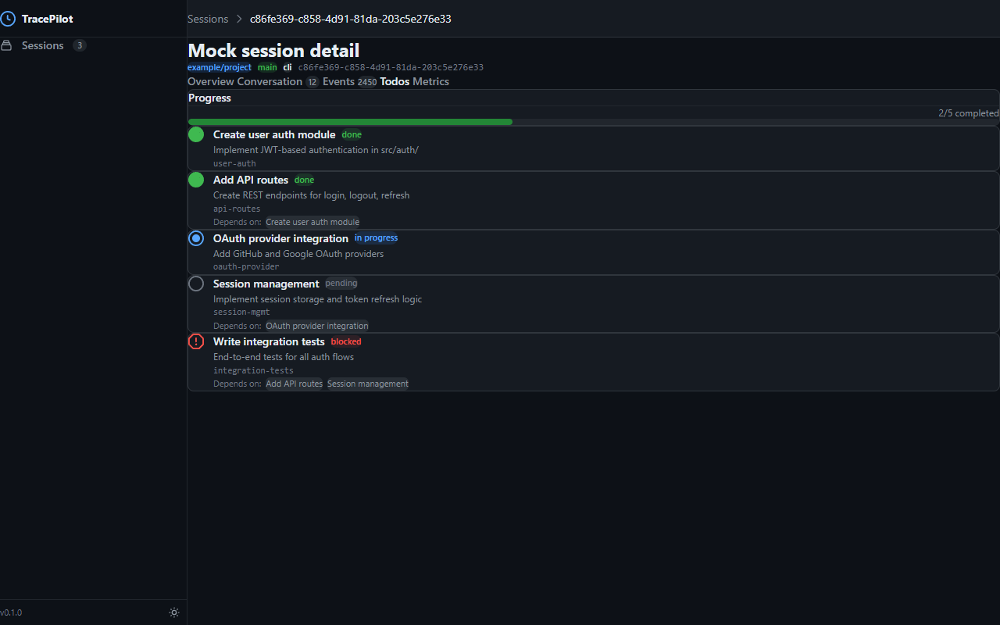
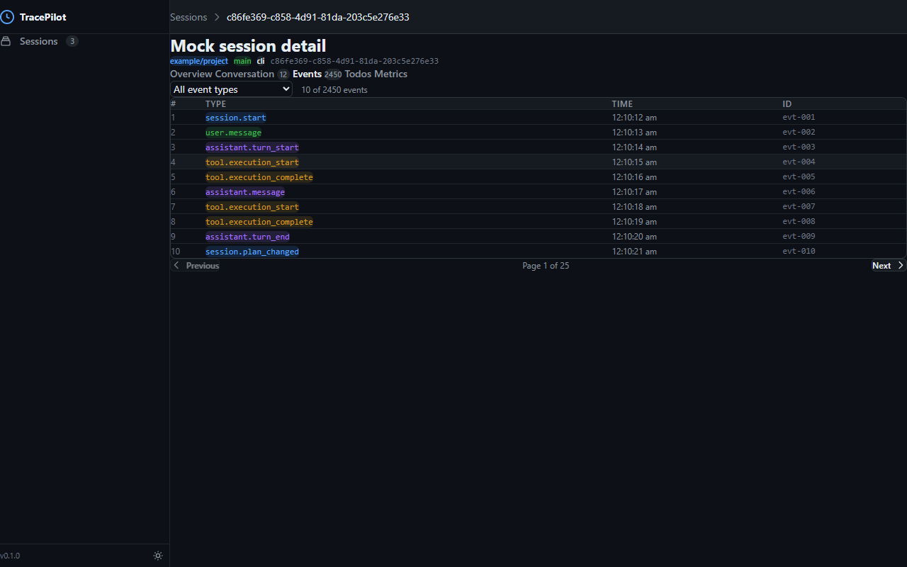

# TracePilot Frontend Redesign — Design Report

## Executive Summary

This document presents **two complete design variants** for the TracePilot desktop application, covering all 15 pages (6 existing + 9 future). Both variants were prototyped as self-contained HTML/CSS/JS files with realistic mock data and can be reviewed in any browser.

**Variant A: "Primer Evolved"** — Refines the existing GitHub Primer foundation with better polish, spacing, and visual hierarchy. Familiar to developers who use GitHub daily.

**Variant B: "Linear Minimal"** — A fresh aesthetic inspired by Linear, Raycast, and Vercel. Ultra-clean, tighter typography, indigo accent, gradient effects.

---

## Page Inventory

> **Note:** HTML prototypes for all three variants were removed during docs cleanup. The design decisions below remain authoritative. See `screenshots/final/` for production visual references.

| # | Page | Phase |
|---|------|-------|
| 1 | Session List (Home) | 2 ✅ |
| 2 | Detail: Overview | 2 ✅ |
| 3 | Detail: Conversation | 2 ✅ |
| 4 | Detail: Events | 2 ✅ |
| 5 | Detail: Todos | 2 ✅ |
| 6 | Detail: Metrics | 2 ✅ |
| 7 | Analytics Dashboard | 3 |
| 8 | Session Timeline | 3 |
| 9 | Tool Analysis | 3 |
| 10 | Code Impact | 3 |
| 11 | Health Scoring | 4 |
| 12 | Export Dialog | 5 |
| 13 | Session Comparison | 6 |
| 14 | Session Replay | 6 |
| 15 | Settings | 6 |

---

## Design Variant Comparison

### Variant A: "Primer Evolved"

**Philosophy:** Elevate the existing GitHub Primer DNA. Developers who live in GitHub will feel instantly at home.

| Aspect | Details |
|--------|---------|
| **Primary accent** | Blue (#58a6ff dark / #0969da light) |
| **Background** | GitHub dark (#0d1117) |
| **Font** | System font stack (-apple-system, Segoe UI) |
| **Border radius** | Rounded-full on badges (pill-shaped), 8-12px on cards |
| **Borders** | Visible but muted (#30363d at ~18% opacity) |
| **Cards** | Flat background, subtle borders, hover → accent border + shadow |
| **Typography** | 14px base, 24px display, generous letter-spacing |
| **Spacing** | Comfortable — 16px gaps, 20px card padding, 32px page padding |
| **Semantic colors** | Blue=accent, Green=success/branch, Amber=warning/cost, Red=danger, Purple=done/model |
| **Interactive feel** | Subtle transitions, border color changes on hover |

**Strengths:**
- Familiar to GitHub power users
- Higher information density without feeling cramped
- Strong semantic color system that maps naturally to TracePilot data
- Pill badges are very scannable for repo/branch/model identification
- More generous spacing feels comfortable for long exploration sessions

**Weaknesses:**
- May feel too "safe" / derivative of GitHub
- Less visually distinctive as a standalone product

### Variant B: "Linear Minimal"

**Philosophy:** Clean-sheet design inspired by the best modern developer tools. Crisp, opinionated, minimal.

| Aspect | Details |
|--------|---------|
| **Primary accent** | Indigo (#6366f1 dark / #4f46e5 light) |
| **Background** | Near-black (#09090b) — darker than GitHub |
| **Font** | Inter (Google Fonts) with tight letter-spacing (-0.03em) |
| **Border radius** | 6px on badges (squared), 8-10px on cards |
| **Borders** | Very subtle (rgba white 6-8%) — relies on spacing over borders |
| **Cards** | Gradient overlay, thin borders, hover → translateY + indigo glow |
| **Typography** | 13px base, 20px display, tight negative letter-spacing |
| **Spacing** | Tighter — 12px gaps, 16px card padding, 28px page padding |
| **Semantic colors** | Indigo=accent, Emerald=success, Amber=warning, Rose=danger, Violet=done |
| **Interactive feel** | Translatey micro-animations, glow effects, gradient accents |

**Strengths:**
- Visually striking and modern — feels like a premium tool
- Gradient text and glow effects add visual interest
- Tighter spacing allows more content on screen
- Squared badges feel more technical/precise
- Indigo + near-black palette is distinctive and doesn't clone GitHub
- Command palette (⌘K) hint signals power-user DNA

**Weaknesses:**
- Very subtle borders can make card boundaries less clear
- Tighter spacing may feel cramped on smaller screens
- Gradient text may have accessibility concerns (contrast)
- Inter font requires Google Fonts CDN or local bundling

### Variant C: "Hybrid" (Recommended)

**Philosophy:** Combine B's premium visual system with A's information density, refined by user preferences and multi-model review feedback.

| Aspect | Details |
|--------|---------|
| **Base** | Variant B's visual system (indigo, gradients, Inter, translateY hovers) |
| **Borders** | Increased visibility (rgba 0.10 vs B's 0.08) for clearer card separation |
| **Spacing** | Hybrid — 14px grid gaps, 18px card padding (between A and B) |
| **Letter-spacing** | Relaxed to -0.02em (between A's 0 and B's -0.03em) |
| **Accessibility** | Built-in `:focus-visible`, `prefers-reduced-motion`, ARIA labels |

**Page-Specific Hybrid Choices:**

| Page | What was combined |
|------|------------------|
| **Session List** | B's visual system + A's 4 pill badges (repo, branch, model, host) + **Repos/Branches** filters (not Models) |
| **Detail Overview** | A's title + tag badges at top + B's prose summary + session summary details + cost as **Premium Requests** |
| **Detail Conversation** | A's mini stat-cards for turn/tool/duration stats + B's expanded tool calls with pass/fail counts |
| **Detail Todos** | **Green** progress bar (success color, not indigo) + B's status counts row |
| **Detail Metrics** | Separate **Input/Output** token columns + **relative %** token distribution bars + B's cache breakdown ring + A's code changes |
| **Analytics** | A's model distribution by **total tokens** (not model count) + B's gradient chart styling |
| **Session Replay** | B's conversation layout + A's **Current Step Details** panel (tool, file, status, args, result) + B's side metrics |
| **Settings** | B's narrow layout + **Browse…** button for sessions directory + A's About section (session count, DB size, links) + shortcut config note |
| **Export** | B's two-column layout (strongly preferred by user) with live JSON preview |

### Production Screenshots (Variant C)

See `docs/design/screenshots/final/` for the full set of production design screenshots.

| Session List | Detail Overview |
|---|---|
|  |  |

| Conversation | Metrics |
|---|---|
|  |  |

| Todos | Events |
|---|---|
|  |  |

---

## Key Design Decisions

### 1. Sidebar Navigation (Both Variants)
The sidebar organizes all major sections with clear hierarchy:
- **Primary:** Sessions (home), Analytics, Health, Tool Analysis, Code Impact
- **Advanced:** Compare, Replay, Export, Settings

The "Advanced" section separator signals these are power-user features, keeping the primary nav clean.

### 2. Session Cards
Both variants show session cards with:
- Summary title (2-line clamp)
- Semantic badges: repository (accent/blue), branch (green), model (purple), host (gray)
- Footer stats: event count, turn count, relative time

**Variant A** shows more badges (repo includes org prefix, branch shown explicitly). **Variant B** is more compact, using just repo name without prefix.

### 3. Conversation View — Three Modes
The conversation page offers three view modes, each suited to different tasks:
- **Chat:** Familiar chat-bubble layout for reading through conversations
- **Compact:** Dense, one-card-per-turn layout for scanning many turns quickly
- **Timeline:** Vertical timeline with connected nodes for seeing temporal flow

### 4. Tab Navigation
Session detail uses 5 tabs (Overview, Conversation, Events, Todos, Metrics) with count badges. This follows the existing architecture and the progressive disclosure principle.

### 5. Analytics Charts
All charts are hand-drawn SVG (no library dependency) with 4 visualization types:
- Line chart (token usage over time)
- Bar chart (sessions per day)
- Donut chart (model distribution)
- Area chart (cost trend)

For implementation, we recommend integrating Apache ECharts or Chart.js for interactive features.

### 6. Health Scoring
Uses a circular ring gauge (conic-gradient CSS) to show scores 0-1.0 with color coding:
- ≥0.8: Green (healthy)
- 0.5-0.8: Amber (needs attention)
- <0.5: Red (critical)

### 7. Export Dialog
Dual UX: inline page with configuration panel + modal overlay for quick exports from session detail.

### 8. Session Replay
Timeline scrubber with playback controls (play/pause, step, speed). Shows conversation building progressively with grayed-out future turns.

---

## Screenshots

> **Note:** Variant A/B comparison screenshots were removed during docs cleanup. See `docs/design/screenshots/final/` for the production (Variant C) visual reference.

---

## Technical Notes for Implementation

### Shared Design System
Both variants use a comprehensive CSS custom property system (40+ tokens) for easy theming. This maps well to the existing Tailwind CSS v4 setup:
- Replace Tailwind's custom theme with the new CSS variable set
- Components can be progressively migrated from current styles
- Dark/light theme toggle is already implemented via `data-theme` attribute

### Component Migration Path
The existing Vue component library (`@tracepilot/ui`) can be restyled without structural changes:
1. Update CSS variables in `styles.css` to match chosen variant
2. Adjust spacing/radius/font constants
3. Add new components for future pages (charts, health ring, timeline scrubber)
4. Existing component API (props, events) stays unchanged

### Charting Recommendation
For production charts, recommend **Apache ECharts** (via `vue-echarts`):
- Rich interactive charts with zoom, tooltip, brush selection
- Dark theme out of the box
- Small bundle with tree-shaking (~150KB gzipped for common charts)
- SVG or Canvas rendering

### Responsive Strategy
Both variants are designed for resizable desktop (800px–4K):
- Sidebar collapses/hides below 900px
- Card grids: 3 → 2 → 1 columns
- Stat grids: 4 → 2 → 1 columns
- Table columns hide progressively on smaller viewports

---

## File Structure

> **Note:** Prototype HTML files and variant A/B CSS files were removed during docs cleanup. The remaining structure is:

```
docs/design/
├── design-report.md              ← This document
├── design-system.md              ← Production design system reference
├── prototype-design-process.md   ← Guide for creating future prototypes
└── prototypes/
    ├── shared/
    │   ├── design-system-c.css   ← Production Hybrid tokens
    │   └── shared.js             ← Mock data, utilities, sidebar generator
    └── setup-window/
        └── design-report.md      ← Setup window design decisions
```

---

## Multi-Model AI Review

Three AI models (Claude Opus 4.6, GPT 5.4, Gemini 3 Pro) independently reviewed both design variants. Below is the consolidated analysis.

### Consolidated Scorecard

| Criterion | Variant A (avg) | Variant B (avg) | Winner |
|-----------|:---:|:---:|--------|
| **Visual Hierarchy** | 4.3 | 4.5 | B — Gradients + tighter layout create stronger focal points |
| **Consistency** | 4.5 | 4.0 | A — More uniform badge/spacing patterns |
| **Information Density** | 4.2 | 3.8 | A — More metadata per card (repo, branch, model, host) |
| **Navigation & Wayfinding** | 4.3 | 4.2 | Tie — A has better tabs; B has human-readable breadcrumbs |
| **Accessibility** | 3.3 | 2.5 | A — Better contrast ratios (both need significant work) |
| **Responsive Design** | 3.7 | 3.5 | Tie — Both collapse grids; both lack mobile nav fallback |
| **Data Visualization** | 3.3 | 4.5 | B — Gradient charts, cleaner donut, dashed gridlines |
| **Interaction Design** | 3.2 | 4.3 | B — translateY hovers, glow effects, expanded tool calls |
| **Developer Tool UX** | 4.5 | 4.2 | A — Familiar GitHub feel, keyboard shortcut hints |
| **Overall Polish** | 4.0 | 4.8 | B — Feels like a finished premium product |
| **TOTAL** | **39.3** | **40.3** | **Variant B by slim margin** |

### Consensus Strengths — Variant A
All reviewers agreed on these Variant A advantages:
1. **Rich session card badges** — Repo, branch, model, host all visible. Best-in-class scannability for developer triage.
2. **Higher contrast / safer accessibility** — `#30363d` borders vs B's `rgba(255,255,255,0.08)`. More legible in varied lighting.
3. **Generous spacing** — 20px card padding, comfortable for long diagnostic reading sessions.
4. **Strong semantic color system** — Blue=accent, Green=branch, Purple=model, Amber=cost maps intuitively.
5. **Metrics detail table** — 8-column model breakdown (requests, input/output tokens, cache, cost) is information-rich.

### Consensus Strengths — Variant B
All reviewers agreed on these Variant B advantages:
1. **Premium visual polish** — Indigo gradients, glow effects, and translateY hover create a "crafted" feel.
2. **Superior health scoring page** — Horizontal ring + stat row + 3-column attention grid maximizes above-fold info.
3. **Better session replay layout** — Persistent side panel with step metrics + files + todos is an IA masterclass.
4. **Modern data visualization** — Gradient charts, dashed gridlines, donut with stroke-dash look production-quality.
5. **Human-readable breadcrumbs** — "Sessions / OAuth Login Implementation" vs UUID fragments.

### Consensus Issues Fixed (Post-Review)
These issues were identified by 2+ reviewers and **have been fixed** in the updated prototypes:

| Issue | Identified By | Fix Applied |
|-------|-------------|-------------|
| Variant B metrics page: template variables rendered as text (`${MOCK_METRICS...}`) | Opus | Replaced with hardcoded values (847/234/12) |
| Variant A breadcrumbs showed raw UUID (`c86fe369…`) | Opus, GPT | Replaced with "OAuth Login Implementation" |
| Variant B session cards missing branch badge | Opus, GPT | Added green branch badges to all 9 cards |
| No `prefers-reduced-motion` media query | All 3 | Added to both design system CSS files |
| No `:focus-visible` styles | Opus, GPT | Added focus ring styles to both CSS files |
| No ARIA attributes on sidebar navigation | All 3 | Added `role="navigation"`, `aria-label` in shared.js |
| Google Fonts CDN dependency (privacy for desktop app) | Opus, GPT | Noted for implementation: bundle Inter locally |

### Outstanding Items for Implementation Phase
These items were noted but not fixed in prototypes (better addressed during Vue migration):
- Full ARIA `role="tablist"` / `aria-selected` on tab navs
- `role="switch"` on theme toggle (currently a div with onclick)
- Skip-to-content link for keyboard navigation
- Sidebar hamburger menu for viewports < 900px (both variants hide sidebar with no fallback)
- Replace SVG chart prototypes with ECharts for interactive tooltips/zoom/filtering
- Reduce Variant B card border subtlety (increase rgba opacity from 0.08 → 0.12)

### Page-Level Review Highlights

| Page | Best Variant | Reviewer Notes |
|------|:---:|---|
| **Session List** | B shell + A badges | B's ⌘K search hint is great; A's 4-badge cards are more informative |
| **Detail Overview** | B | B's prose summary + "key files modified" is far more useful than A's stat-only view |
| **Conversation** | B | Tool calls expanded by default with pass/fail counts is better progressive disclosure |
| **Analytics Dashboard** | B | Gradient charts + compact donut with side legend wins clearly |
| **Health Scoring** | B | Horizontal layout, 3-col attention grid, descriptive health flags table |
| **Session Replay** | B | Persistent side panel with step metrics is excellent information architecture |
| **Metrics** | A | 8-column model breakdown table is more detailed; B's was buggy (now fixed) |
| **Settings** | Tie | Both strong; B's narrow max-width is cleaner, A's shortcuts table more complete |

---

## Variant C Multi-Model Review

Three AI models reviewed Variant C independently after it was built incorporating user feedback and prior A/B review recommendations.

### Variant C Consolidated Scorecard

| Criterion | Opus 4.6 | GPT 5.4 | Gemini 3 | **Avg** |
|-----------|:---:|:---:|:---:|:---:|
| **Visual Hierarchy** | 4.5 | 4.5 | 5.0 | **4.7** |
| **Consistency** | 4.0 | 4.0 | 5.0 | **4.3** |
| **Information Density** | 4.5 | 4.5 | 5.0 | **4.7** |
| **Navigation** | 4.0 | 4.0 | 4.0 | **4.0** |
| **Accessibility** | 3.0 | 3.0 | 4.0 | **3.3** |
| **Responsive Design** | 3.5 | 3.0 | 4.0 | **3.5** |
| **Data Visualization** | 4.0 | 4.0 | 5.0 | **4.3** |
| **Interaction Design** | 4.0 | 4.0 | 5.0 | **4.3** |
| **Developer Tool UX** | 4.5 | 4.5 | 5.0 | **4.7** |
| **Overall Polish** | 4.5 | 4.5 | 5.0 | **4.7** |
| **TOTAL** | **40.5** | **40.0** | **47.0** | **42.5** |

**Variant C scores 42.5 avg vs A's 39.3 and B's 40.3** — a meaningful improvement, with all reviewers unanimously endorsing it.

### Unanimous Hybrid Verdicts

All 3 reviewers confirmed these hybrid decisions work:

| Decision | Verdict | Reviewer Notes |
|----------|:---:|---|
| 4-badge session cards + B's visual system | ✅ | "Strongest feature" (Opus). Cards are highly scannable; B's clean surfaces support badge density well |
| Title + badges header on detail pages | ✅ | "Effective and reusable" (GPT). Strong wayfinding — always know which session and its metadata |
| Green (not indigo) progress bar on Todos | ✅ | "Essential for semantic clarity" (Gemini). Green = completion, Indigo = branding |
| Token Distribution with relative % bars | ✅ | "Useful and clear" (all 3). Showing both absolute count + percentage is genuinely valuable |
| Combined Replay panel (metrics + step details) | ✅ | "Comprehensive, not cluttered" (Opus). Side panel sections are visually contained. "Slightly crowded" (GPT) — monitor during implementation |
| Settings About section completeness | ✅ | "Complete enough" (all 3). Suggestion: add "Check for Updates" button |

### Variant C Issues Fixed (Post-Review)

| Issue | Identified By | Fix Applied |
|-------|-------------|-------------|
| CSS comment says "Variant B" instead of "Variant C" | Opus | Updated header comment |
| Missing ARIA on tool-analysis and settings sidebars | Opus, GPT | Added `role="navigation"` to all 15 `<aside>` tags |
| No `role="tablist"` / `aria-selected` on tab navs | Opus, GPT | Added to all 5 detail pages |
| Light-theme scrollbar invisible | Opus | Added light-theme scrollbar-thumb override |
| Gradient text fails high-contrast mode | Opus, Gemini | Added `prefers-contrast: more` fallback |

### Outstanding Items for Implementation Phase
- Hamburger menu for viewports < 900px (sidebar hidden with no nav fallback)
- Bundle Inter font locally (Google Fonts CDN present in prototypes)
- `role="switch"` on theme toggle
- Interactive chart tooltips/zoom via ECharts (static SVGs in prototype)
- Replay speed buttons keyboard semantics (`aria-pressed`)
- Events table: consider adding payload/args preview column

---

## Recommendation

**Variant C (Hybrid) is the recommended design direction**, unanimously endorsed by all three AI reviewers and incorporating specific user preferences.

### What Variant C delivers:
- B's premium indigo visual system with increased border visibility
- A's 4-badge session cards for maximum developer scannability
- Repos/Branches filters (user preference over Models)
- Title + badge headers on all detail pages
- Prose summary + session details on Overview
- Green progress bar on Todos (semantic clarity)
- Separate Input/Output token columns + relative % distribution bars
- Model distribution by total tokens (not model count)
- Combined Replay with step metrics AND step details
- B's export layout with live JSON preview
- Complete Settings with Browse button, shortcuts, and rich About section

### Prototypes are live at:
```
http://localhost:3333/variant-c/session-list.html
```

All 45 prototypes (15 per variant) and 45 screenshots remain available for comparison.
