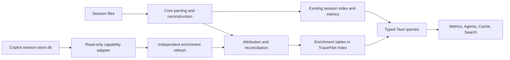

# Copilot session-store enrichment for TracePilot

Status: **Delivered (phases 1–5)** — investigated 2026-09-20, implemented
2026-09-21. Phase 6 remains deliberately unstarted; see §12.

The design below is kept as written, because it is the record of what the
evidence supported and why each rule exists. Where the implementation made a
choice the design left open, §12 names it.

This extends the [initial research](../research/copilot-session-store-db.md) with a
fresh read-only inspection of the local `~/.copilot/session-store.db`, its related
session logs, installed Copilot CLI 1.0.86 schemas, and TracePilot's current code.
Counts below describe this machine at inspection time, not guaranteed CLI behavior
or coverage on other machines. No prompts, responses, repository names, session
identifiers, or raw database copies are included in this document.

## 1. Recommendation and user value

Integrate the store as an **optional source of additional evidence**, behind a
setting enabled by default. Keep session files and TracePilot's existing shutdown
normalization authoritative for the existing session experience. Give store data
its own availability, freshness, coverage, and attribution metadata.

The first release should answer four questions:

| User question | Addition | Why it improves TracePilot |
|---|---|---|
| Which requests consumed the credits? | Request ledger with recorded AI credits and itemized billing categories/rates | Explains an expensive interaction, compaction, or worker without repricing historical usage with today's model rates |
| Where did the model time go? | Request duration, first-token timing, first observable output, and inter-token latency | Separates model-call behavior from tool runtime and whole-turn wall time |
| Did this request reuse the cache? | Recorded cache-read/write counts alongside existing cache predictions | Adds actual reuse evidence and exposes disagreements with predictions |
| Which sessions relate to this PR or issue? | Linked-work chips and structured reference search | Turns a conversation archive into a way to find the work behind a change |

Then extend Model Comparison and Agents Usage using the same request ledger.
Structured checkpoints are a worthwhile independent enhancement. Store-only
session discovery is lower priority. Dynamic context and Forge tables need more
evidence before product integration.

This is not a replacement for `events.jsonl`, an authoritative billing statement,
or a record of every failed request. It is a useful local observation source.

## 2. What the new inspection established

### 2.1 Method and coverage

The source was opened with SQLite URI `mode=ro` and `PRAGMA query_only=ON`.
SQLite's backup API copied a consistent view into an in-memory database; schema,
counts, nulls, aggregates, and integrity queries ran there. No source writes,
checkpoint, reindex, or CLI commands were executed. Related JSONL files were read
separately for reconciliation; the two sources are not an atomic snapshot together.

The main file was 51,650,560 bytes and the WAL was about 4.2 MB. Looking only at
the main file's modification time would miss changes in the WAL. The snapshot
returned `quick_check = ok` and no `foreign_key_check` violations.

| Observation | Result | Design implication |
|---|---|---|
| Source `schema_version.version` | **8**, versus 1 recorded in the earlier research | Record it for diagnostics; detect actual tables and columns independently |
| Sessions in store | **416** | Metadata coverage is broad |
| Direct session folders with `events.jsonl` | **391**, all 391 represented in the store | Store metadata can enrich every locally logged session in this sample |
| Session folders with `workspace.yaml` | **590**, of which 412 are in the store | Neither the store nor JSONL count represents every discovered directory |
| Store sessions without a local event log | **25**: 22 `host_type=github`, 3 NULL | “No local log” does not imply “remote session” |
| Store sessions without any local session directory | **4**, all `host_type=github` | Distinguish a store-only record from a local metadata-only session |
| Usage coverage | **383 requests in 18 sessions**, dated July 17–September 20 | Only 18/391 locally logged sessions have detailed requests; absence is not zero usage |
| Model distribution | 369 requests use `gpt-5.6-luna`; 14 span four other model identifiers | This sample cannot support a useful ranking of models |
| Persisted `assistant.usage` in the 18 inspected logs | **0** | The DB adds otherwise unavailable historical request detail |

The CLI 1.0.86 event schema explicitly marks `assistant.usage` as ephemeral.
Some usage information *is* persisted elsewhere: shutdown aggregates,
`session.usage_checkpoint`, and `session.compaction_complete.compactionTokensUsed`.
The integration must recognize overlap with those sources.

### 2.2 Every table, including SQLite internals

There are 17 table entries in `sqlite_master`, counting the FTS virtual table and
its five storage tables. There are no application views or triggers in the inspected
schema. Nonempty child tables have no orphan session references.

| Table | Rows / distinct sessions | Content and decision |
|---|---:|---|
| `sessions` | 416 / — | Session metadata; use for source binding, reference context and later store-only discovery. Do not overwrite richer local metadata. |
| `turns` | 1,736 / 389 | Flattened user/assistant text; useful for optional matching and a later explicitly limited preview. Do not replace reconstruction or index a duplicate transcript. |
| `checkpoints` | 697 / 181 | Structured compaction summaries; useful for a compaction ledger and handover views. Prefer local checkpoint/event content when available. |
| `session_files` | 5,835 / 228 | One row per session/path, with one tool and turn association. Supplemental file discovery only; not an edit log. |
| `session_refs` | 541 / 45 | 389 PR, 67 issue and 85 commit references. High-value linked-work enrichment. |
| `assistant_usage_events` | 383 / 18 | Per-request performance, tokens and billing; highest-value integration. |
| `search_index` | 6,044 / 389 | FTS5 content derived from turns, checkpoint sections and workspace artifacts. Keep TracePilot's existing search authoritative. |
| `dynamic_context_items` | 0 / — | Repository/branch-scoped retrieval content and counters; speculative context inventory only. Defer. |
| `forge_trajectory_events` | 0 / 0 | Tool/command execution and key/value events for Forge; possible future skill provenance, with no local behavioral evidence. Defer. |
| `forge_skill_proposals` | 0 / — | Draft skill manifests, status, scope, lineage and failure information. Possible future read-only proposal browser. Defer. |
| `schema_version` | 1 / — | One value, currently 8. Diagnostic metadata, not a sufficient capability contract. |
| `sqlite_sequence` | 5 / — | SQLite autoincrement allocation state; not a change feed. Never import as domain data. |
| `search_index_config` | 1 / — | FTS configuration storage. Ignore. |
| `search_index_content` | 6,044 / — | FTS content backing rows. Ignore; do not count as additional documents. |
| `search_index_data` | 1,693 / — | FTS index blocks. Ignore. |
| `search_index_docsize` | 6,044 / — | FTS document sizes. Ignore. |
| `search_index_idx` | 1,498 / — | FTS segment lookup data. Ignore. |

The FTS source types are `turn` (1,734), `workspace_artifact` (130), and six
checkpoint categories (696–697 each): files, history, next steps, overview,
technical details, and work done. A future artifact discovery feature should
first check whether the corresponding session files already supply that content.

## 3. Deep dive: `assistant_usage_events`

### 3.1 Complete field inventory

Only `session_id` and `model` are explicitly `NOT NULL`; `id` is the integer primary
key. The local presence figures below are observations, not required-field promises.

| Fields | Present out of 383 | Interpretation and handling |
|---|---:|---|
| `id` | 383 | Autoincrement source row identity. Scope it to a particular store generation; it is not a provider request ID. |
| `session_id` | 383 | Join to a session from the same bound source. |
| `turn_index` | 383 | Source interaction hint, observed 0–5. Not a TracePilot turn index. |
| `agent_id`, `parent_tool_call_id` | 150 each | Exact identifiers for subagent attribution when present. Use both, checking conflicts. |
| `model` | 383 | Execution model; preserve the raw identifier and use existing display normalization. |
| `input_tokens`, `output_tokens` | 383 each | Input includes cache categories in this sample; output includes reasoning. Do not add reasoning to output a second time. |
| `cache_read_tokens`, `cache_write_tokens` | 383 each | Reported reuse/creation counters. A reported zero is different from NULL, but does not prove the provider supported cache telemetry. |
| `reasoning_tokens` | 382 | Reasoning portion of output, not reasoning text. Missing on the compaction row discussed below. |
| `total_nano_aiu` | 383 | Recorded request charge. Preserve precision; convert to displayed AI credits by dividing by 1e9, consistent with TracePilot. |
| `request_multiplier` | 382 | Billing multiplier; 379 ones and 3 zeroes. Keep distinct from nano-AIU and legacy premium-request totals. |
| `duration_ms` | 383 | Whole API-call duration. Includes time before streaming begins; excludes unrelated tool runtime. |
| `time_to_first_token_ms` | 351 | Streaming first-token timing, as reported by the CLI. |
| `output_ttft_ms` | 187 | First observable model output, including reasoning and tool-call output as well as text. **Not time to the first user-visible answer.** |
| `inter_token_latency_ms` | 346 | Reported average inter-token latency. Do not substitute its reciprocal for measured visible-text throughput. |
| `initiator` | 219 | NULL 164; `sub-agent` 150; `agent` 45; `user` 23; `compaction` 1. Preserve unknown and future values. |
| `api_endpoint` | 382 | `ws:/responses` 368; `/responses` 10; `/chat/completions` 3; `/v1/messages` 1. A useful comparison dimension. |
| `reasoning_effort` | 382 | `high` 319; `xhigh` 43; `low` 13; `medium` 4; `none` 3. Missing and `none` differ. |
| `finish_reason` | 382 | `tool_calls` 330 and `stop` 52. Neither is inherently a failure. |
| `content_filter_triggered` | 382 | All recorded values are false; the remaining row is unknown. |
| `token_details_json` | 383 | JSON **array** of billing entries, not an object keyed by category. Preserve repeated categories and per-entry model attribution. |
| `created_at` | 383 | Recorded timestamp; ISO UTC with milliseconds in this sample, but the DDL default is SQLite `datetime('now')`. Not a guaranteed request start time. |
| `copilot_usage_model` | 0 | Optional default billing model for entries without their own model. Present in schema, entirely NULL locally. |

SQLite stores real values in the TTFT and ITL columns despite their declared
`INTEGER` types. The adapter must accept finite nonnegative INTEGER/REAL values as
`f64` milliseconds, not deserialize every declared INTEGER into a Rust integer.
Token counts should still be validated as nonnegative integral counts.

The local schema does **not** preserve `apiCallId`, `providerCallId`,
`serviceRequestId`, `interactionType`, `isByok`, `isAuto`, `cacheDetailsReported`,
`cacheExpiresAt`, `cacheTtlSeconds`, prompt/output limits, speculative-token
counters, or Fusion attribution from the newer ephemeral event schema. Do not
promise those features from this DB or invent request IDs from timestamps.

The 1.0.86 schema also marks `parentToolCallId` deprecated. It describes absent
`initiator` as user-initiated, whereas this stored sample includes explicit `user`
and many historical NULLs. Do not normalize every NULL to “user”.

### 3.2 Recorded billing rates are a substantial additional opportunity

All 383 `token_details_json` values are arrays. Entries contain `tokenType`,
`tokenCount`, `batchSize`, and `costPerBatch`; 56 entries also contain `model`.
The observed categories are input, cache read, cache write, and output.

For **383/383 requests**, decimal arithmetic reproduces the recorded charge:

```text
item_nano_aiu = tokenCount × costPerBatch / batchSize
request_nano_aiu = sum(item_nano_aiu)
displayed_ai_credits = total_nano_aiu / 1,000,000,000
```

This lets a request drawer explain “how this charge was composed” using the
rates recorded with that request. It also enables a historical billing-rate
comparison when a model's rate changes. It does not require assuming the current
pricing registry applied in the past.

Implementation rules:

- Use the recorded total as the request charge; the item sum is an explanation
  and a consistency check. Never multiply that total by `request_multiplier` again.
- Require a positive batch size before division. Keep unknown token categories
  and separate entries for different models. Do not merge an array into a map
  that silently loses repeated entries or rates.
- Billing model attribution order: entry `model`, then `copilot_usage_model`.
  The execution model may be displayed as a fallback context, but label that
  fallback as inferred rather than recorded billing attribution.
- Preserve integer nano units and use checked decimal/rational arithmetic for
  item calculations. The CLI permits fractional nano totals; the normalized
  representation should preserve decimals too. Send decimal strings over IPC
  for exact large values, converting only bounded display results to JS numbers.
- Do not add reasoning tokens again: every local billing output entry already
  equals `output_tokens`. Model cost estimates remain separate from recorded
  credits, and legacy premium requests remain separate units.
- Three `copilot-search-a` requests have zero recorded credits. Their token
  usage is still real; zero cost must not remove them from request statistics.

### 3.3 The earlier reconciliation discrepancy is explained

Comparing all request rows to the latest root shutdown in each of the 18 sessions:

- **17/18** match request counts and all five token counters.
- **18/18** match `totalNanoAiu` exactly.
- The remaining session has 112 usage rows and 111 model-metric requests.

The difference is exactly one `initiator=compaction` request: 158,498 input,
2,130 output, and 148,059 cache-read tokens. It matches the timestamp and metrics
of a persisted `session.compaction_complete.compactionTokensUsed` event. Its
4,061,590,000 nano-AIU charge is already included in the session's shutdown total.
This is an accounting-scope difference in the observed data, not evidence of a
request arriving after shutdown.

Excluding that explicit compaction request from the *model token/request*
comparison gives matches for all **20 session/model groups across 18 sessions**.
Do not exclude it from the all-request ledger or add its cost onto the session
total again. Do not generalize “always exclude compaction” to every producer:
reconciliation needs a scope-aware comparison, showing which adjustment matched.

The same row exposes a field-level disagreement: the flat cache-write counter is
0, but billing entries contain 10,364 cache-write tokens and 75 ordinary input
tokens. The other 382 requests' ordinary input entries equal
`input - cache_read - cache_write`. Preserve flat telemetry and billing entries
separately and flag this disagreement; do not silently rewrite either one.

TracePilot already handles cumulative and legacy segment shutdowns in
[`aggregate.rs`](../../crates/tracepilot-core/src/parsing/events/aggregate.rs).
Production comparisons must use that normalization and matched snapshot scope,
not blindly use the latest shutdown for every historical version as this local
sample comparison did.

### 3.4 Performance and cache observations

| Metric | Available requests | Local median | Meaningful use |
|---|---:|---:|---|
| API duration | 383 | 4,845 ms | Per-request distributions and slow-call drilldown |
| First-token time | 351 | 3,306.5 ms | Model-call responsiveness for recorded streaming calls |
| First observable output | 187 | 3,127.4 ms | Separate metric with its own coverage |
| Inter-token latency | 346 | 6.52 ms | Reported streaming cadence |

The medians use different subsets; their ordering does not imply output appeared
before the first token. On every row with both measurements, output TTFT is at
least first-token TTFT. Neither exceeds request duration locally.

349/383 requests report positive cache reads. A request-weighted “any reuse”
percentage and a token-weighted reuse ratio answer different questions:

```text
requests_reporting_reuse = count(valid cache_read_tokens > 0)
token_weighted_reuse = sum(cache_read_tokens) / sum(input_tokens)
```

Use identical valid-row populations in numerator and denominator. Reject or flag
rows with cache counts above input, negative values, or an invalid denominator.
Do not average per-request percentages to obtain the token-weighted ratio.

Zero cache reads support “no cache reads recorded”, not a proven TTL expiry:
this table lacks `cacheDetailsReported` and cache-frontier/TTL evidence. A positive
read count establishes reuse, but does not prove that the entire idle prefix
survived. Avoid inferring exact cache savings or causal latency improvements.

## 4. Joining requests to the existing session experience

### 4.1 Session and agent attribution

Bind every store to its resolved Copilot home. A session ID is eligible only when
its origin is that local source. Imported sessions with coincidentally matching
IDs must not acquire unrelated local telemetry. If the configured session-state
directory is a custom external directory, do not infer ownership from its parent;
require an explicit source binding or establish compatible local provenance first.
For the first release, automatic binding should be limited to the configured
Copilot home's normal `session-state` directory, excluding imported records.
Custom-root binding can follow later; a path or UUID match alone is insufficient.

All 150 subagent usage rows have both agent and parent-tool IDs. All 150 parent
tool IDs match persisted `tool.execution_start` IDs, and all 150 agent IDs occur
in the corresponding logs. They represent 15 distinct agents. Thirteen matched
agent entries in the latest shutdown ledgers also reconcile on credits.

Use `(source, session_id, agent_id)` first and `parent_tool_call_id` to connect to
the existing run/tool hierarchy. If both identify different runs, mark the join
ambiguous. A missing deprecated parent-tool field must not invalidate an otherwise
valid agent-ID join. Leave unresolved workers visible in the request ledger.

Keep **own** usage exclusive. Derive branch totals by summing descendants once,
as the existing Agents metrics UI does. Never add a branch total and its child
totals into a session total. A root request with unknown initiator can be shown as
“unattributed/root candidate”; absence of an agent ID alone is not proof of a
particular interaction class.

### 4.2 Turn attribution is weaker

**85/383 usage rows have no matching `(session_id, turn_index)` in `turns`.**
Those include historical NULL initiators, subagents, a compaction and a user call.
An exploratory exact-text match between stored turns and root user events also
produced multiple index offsets. A constant `+1` conversion is unsafe.

The first release should offer a correct session/agent request ledger even when
turn attribution is unavailable. Later matching should follow this order:

1. Exact agent/tool linkage into the reconstructed event tree.
2. A uniquely identified compaction event with matching model, counters and time.
3. A source turn mapped to a specific root user event using its timestamp and,
   if needed, an in-memory content comparison. Repeated text alone is insufficient.
4. Model, initiator, order and event interval checks to validate candidates.
5. Otherwise leave the request unjoined. Do not select the nearest turn silently.

Store `join_method`, `join_status`, target event/run identity and the event-file
fingerprint used for the mapping. Recompute mappings if the log is rewritten or
the reconstructor changes. A temporal guess may be shown as approximate navigation,
but cannot enable an “Observed” cache-window claim or exact per-turn billing.

There is no provider request ID or interaction ID in the store. Matching remains
limited even when an SDK version can supply those IDs live. Do not deduplicate
future SDK events against DB rows by timestamp alone.

## 5. Product changes

### 5.1 Session Metrics: request ledger

Add a collapsible **Model requests** section with:

- Coverage, last synchronized time, request count and recorded credit sum.
- Filters for model, agent, initiator, effort, finish reason and recorded reuse.
- A paginated table: recorded time, model, agent, input/output, cache reads,
  credits, duration, first output and completion reason.
- A detail drawer containing itemized billing, both TTFT metrics, ITL, raw source
  values, attribution evidence and any reconciliation discrepancy.
- “Go to agent/turn” only when a supported mapping exists.

Show session shutdown totals and observed request totals as separately named
figures. With no shutdown, show “Recorded requests so far”, not an inferred final
session total. A resumed session may have newer request rows than its last
shutdown; compare only compatible intervals and keep the later tail separate.

At 1440×960, keep the useful columns visible and put secondary timings in the
drawer. At 960×640, reduce columns and preserve access to all fields in the drawer.
At 2560×1440, allow more columns without widening prose indefinitely. Use the
existing UI components, formatting and feature-flag conventions.

### 5.2 Prompt Cache: observations alongside predictions

Extend the [prompt-cache plan](prompt-cache-insights-plan.md) with a distinct
request observation attached to an idle window:

```text
prediction: existing outcome + Predicted/Estimated/Unavailable
observation: request identity + cache counters + join evidence + freshness
comparison: agrees / differs / not comparable
```

The current `CacheConfidence` enum has no `Observed` variant. Prefer keeping
expiry confidence separate from observed reuse, rather than changing an “Expired”
prediction to “Warm” because a later request reused some tokens. The UI can say
“Predicted expired; resumed request recorded 12k cache reads.”

Only attach observations to the first relevant root resume request when its
association is sufficiently reliable. Exclude concurrent subagent calls and
compaction from that association. Multi-request turns must not use their final
request as a proxy for the first request. Without a reliable match, retain the
current prediction and expose the requests only in the ledger.

Current predicted miss-cost estimates remain estimates. Recorded cache billing
can explain what was charged, but a no-miss counterfactual still needs assumptions.
Do not label a cost difference “actual savings”.

### 5.3 Agents Usage and Model Comparison

Extend the existing Agents Usage run breakdown with request count, own credits,
cache-read ratio and latency distributions. Keep shutdown-based agent totals
when request coverage is incomplete. Display missing attribution explicitly.

Add a separate **Observed request performance** section to Model Comparison:
median/p95 API duration, TTFT, output TTFT, ITL, sample count, represented sessions,
and field coverage. Apply existing repository/date filters and additional effort,
initiator and endpoint filters. Use request timestamps for this series; do not
assign every request to the session's creation date.

Compute quantiles over actual request samples, not averages of session p95s.
Suppress p95 below a proposed minimum of 20 valid samples, while retaining count
and median. This is a presentation threshold, not statistical confidence.
Different prompt sizes and agent roles can dominate model differences; these
are observational comparisons, not controlled benchmarks or quality rankings.

If throughput is added, label `output_tokens / (duration_ms / 1000)` as overall
output-token throughput for a call. It includes pre-output waiting and reasoning.
Do not call `1000 / ITL` visible tokens per second or derive reasoning duration
from the difference between the two TTFT fields.

### 5.4 Linked work and search

Display a **Related work** list on the session overview. Deduplicate by normalized
reference identity, preserving source association and whether navigation is verified.
Current counts are 389 PR refs in 37 sessions, 67 issue refs in 12 sessions, and
85 commit refs in 20 sessions. All local PR/issue values are bare decimal numbers
and all 541 refs have a session repository value.

These are *references found in a session*, not proof that the session authored,
merged or completed that work. The source uniqueness key is
`(session_id, ref_type, ref_value)`, so repeated mentions and different repositories
sharing a number may already have been collapsed upstream.

Rules for resolution:

- Prefer explicit repository/host evidence from a URL or the repository registry.
  A session's repository is a candidate context; cross-repository references can
  make it wrong. Do not silently treat every bare `#123` as a verified link.
- Support GitHub Enterprise via known host metadata. A `host_type` value is not
  a hostname. Do not universally prepend `https://github.com`.
- Validate positive PR/issue numbers and recognized HTTP(S) host/path forms before
  creating links. Unresolved values remain useful searchable labels.
- Only 59/85 commit values are 7–40 hexadecimal characters; **26 are other refs**.
  Label them as Git refs, not commit SHAs. A hex-looking value is a candidate,
  not proof that the commit exists. Resolve against a known local repo or leave
  it unverified; do not execute shell text from the database.
- Omit the “go to turn” action unless the source turn has a validated mapping.

Add structured `pr:`, `issue:` and `commit:` filters beside existing `repo:`.
Example: `repo:owner/project pr:123`. Bare `pr:123` should search across repositories
and show repository context. Apply the filters consistently to result rows,
counts and facets, using parameterized `EXISTS` clauses over the reference table.
Support a qualifier-only search; it must not require a nonempty FTS expression.
When the store is unavailable, explain that linked-reference search has no
available source rather than suggesting no such work exists.

A later fallback can extract explicit URLs or references from local logs. It
should use the same normalized reference model and identify the extraction source.
That parser is not required to ship the optional store integration.

## 6. Uses for the remaining product tables

### Sessions and turns

`sessions` contains `id`, `cwd`, `repository`, `host_type`, `branch`, `summary`,
`created_at` and `updated_at`. Locally, 54 repository values, 61 branch values and
27 summaries are missing/empty. A NULL host type must not become “local”.

Keep existing local session discovery unchanged initially. Later, expose
store-only entries in a separate discovery view or explicit filter with
availability values such as `local-log`, `local-metadata-only`, and `store-only`.
Do not create synthetic session folders or offer replay/resume/export commands
that assume an event log exists. The current index prunes sessions absent from
disk; store-only metadata must have separate storage/lifecycle before listing it.

`turns` has `id`, `session_id`, `turn_index`, `user_message`, `assistant_response`
and `timestamp`, unique on session/turn. It has no full tool/reasoning/event graph.
At most, use it for on-demand matching or a clearly labeled limited preview for
missing logs. Do not mix its messages into the authoritative conversation.

### Checkpoints

`checkpoints` is unique on `(session_id, checkpoint_number)` and contains `id`,
`title`, `overview`, `history`, `work_done`, `technical_details`, `important_files`,
`next_steps` and `created_at`. Only 128/697 have nonempty titles; most other
sections are complete, with one missing history and next-steps section.

A compaction ledger could show section-level changes, important files, work
completed and next steps, linked to compaction token usage. Prefer structured
parsing of local checkpoint files or `summaryContent` first; use the store as a
fallback. Align by checkpoint number and event evidence, not timestamp alone.
Render model-written summaries as untrusted content. A summary is not verified
evidence that work succeeded or a task was actually completed.

### Files

`session_files` has `id`, `session_id`, `file_path`, `tool_name`, `turn_index` and
`first_seen_at`, unique on `(session_id, file_path)`. Locally the tool is `create`
on 2,921 rows and `edit` on 2,914. All rows have a turn hint.

The table can fill file-discovery gaps for sessions with incomplete logs, but
cannot prove edit counts, final diffs, net lines changed, reads, renames or
deletions. Reuse `session_modified_files` analytics when available. Normalize
relative paths against a known session CWD, preserve Windows path semantics, and
use existing file-open validation. Do not infer a file still exists.

### Dynamic context and Forge

`dynamic_context_items` is keyed by `(repository, branch, src, name)` and includes
`description`, `content`, `read_count`, `count`. Future value: a repository context
inventory, counters and possible context-pressure inspection. There is no session
ID or timestamp, so it cannot establish which request used an item, its freshness,
or token cost. No initial UI or import is justified by an empty table.

`forge_trajectory_events` has `id`, `session_id`, `tool_call_id`, `turn_index`,
`event_type`, `command`, `output`, `exit_code`, `event_key`, `event_value`,
`created_at`. It could later explain the execution evidence behind a skill
proposal, but may duplicate richer tool events and contain sensitive output.

`forge_skill_proposals` has `id`, `repo_owner`, `repo_name`, `git_root_path`,
`branch_name`, `trigger_mode`, `status`, `fingerprint`, `manifest_json`,
`summary_json`, `workspace_before_json`, `superseded_by`, `failure_reason`,
`created_at`, `updated_at`. A future read-only Skills proposal view could show
scope and lineage. It must not install or execute proposals automatically. Neither
Forge table should block usage/ref support or be read speculatively at startup.

## 7. Integration architecture



Add `crates/tracepilot-core/src/session_store/`, named for the actual data source
rather than a specific CLI command. Keep SQLite reading and pure normalization
in core; persistence and refresh policy belong in the indexer. The UI never opens
the source DB, issues arbitrary SQL, or spawns Copilot to repair/reindex it.

| Area | Existing integration point | Proposed work |
|---|---|---|
| Paths | [`paths.rs`](../../crates/tracepilot-core/src/paths.rs), [`config/paths.rs`](../../crates/tracepilot-tauri-bindings/src/config/paths.rs) | Add `CopilotPaths::session_store_db()`; derive from resolved configured Copilot home and honor isolation |
| SQLite | [`utils/sqlite/connection.rs`](../../crates/tracepilot-core/src/utils/sqlite/connection.rs) | Reuse read-only flags, add adapter-specific timeout/query guards; do not call the write-oriented `configure_connection` |
| Core accounting | [`parsing/events/aggregate.rs`](../../crates/tracepilot-core/src/parsing/events/aggregate.rs), [`agent_usage.rs`](../../crates/tracepilot-core/src/parsing/events/agent_usage.rs) | Reuse shutdown scope and exclusive agent ledgers for reconciliation |
| Index lifecycle | [`indexing/reindex.rs`](../../crates/tracepilot-indexer/src/indexing/reindex.rs), [`session_writer.rs`](../../crates/tracepilot-indexer/src/index_db/session_writer.rs) | Add an independent refresh pass; baseline source-file staleness must not gate store reads |
| Index schema | [`migrations/plan.rs`](../../crates/tracepilot-indexer/src/index_db/migrations/plan.rs) | Add the next migration; current plan ends at 19. Keep enrichment format version separate from analytics version (currently 13) |
| Desktop orchestration | [`commands/search/reindex.rs`](../../crates/tracepilot-tauri-bindings/src/commands/search/reindex.rs) | Schedule enrichment independently of search-content phase 2, with serialization and bounded background work |
| Cache API | [`commands/session/prompt_cache.rs`](../../crates/tracepilot-tauri-bindings/src/commands/session/prompt_cache.rs) | Overlay indexed observations on current event-derived predictions; add enrichment revision to response/cache identity |
| Session refresh | [`sessionFingerprint.ts`](../../apps/desktop/src/composables/session/sessionFingerprint.ts) | Invalidate enrichment views when DB data changes even if JSONL size/mtime does not |
| Agent accounting | [`agentUsageRows.ts`](../../apps/desktop/src/utils/agentUsageRows.ts), [`session_writer/agent_runs.rs`](../../crates/tracepilot-indexer/src/index_db/session_writer/agent_runs.rs) | Attach requests to existing run IDs and preserve own/branch semantics |
| Comparison | [`useModelComparison.ts`](../../apps/desktop/src/composables/useModelComparison.ts) | Add observed request distributions with coverage, separate from existing aggregate metrics |
| Search | [`parseQualifiers.ts`](../../apps/desktop/src/utils/parseQualifiers.ts), [`search_reader/query_builder.rs`](../../crates/tracepilot-indexer/src/index_db/search_reader/query_builder.rs) | Extend typed filters, queries, count/facet paths and qualifier-only behavior |
| Contracts | [`packages/types`](../../packages/types/src), [`packages/client`](../../packages/client/src) | Shared request/ref/status DTOs, client methods and mock responses; register new Tauri commands |
| Exports | [`builder/session.rs`](../../crates/tracepilot-export/src/builder/session.rs) | No implicit store access from directory-based exports; a later versioned optional enrichment section |
| CLI compatibility | [`version-analyzer/schema.ts`](../../apps/cli/src/lib/version-analyzer/schema.ts) | Later report store DDL/schema capabilities alongside event schemas |

The old proposed adapter returned `Option<Self>`. Use a result that distinguishes
missing, disabled, unreadable, incompatible and ready instead. Optional dependency
failure must never trigger the existing “incremental failed, rebuild everything”
path. Preserve successful baseline indexing if enrichment fails.

## 8. Proposed storage and API contracts

Names below are proposed additions to TracePilot's own index, not source tables.
All child data should be removable without changing baseline session rows.

| Table | Key and important fields | Purpose |
|---|---|---|
| `session_store_sources` | `source_id`; bound root, generation, schema fingerprint/version, capability set, status, last attempt/success, revision | Availability and source ownership |
| `session_request_usage` | `(source_id, generation, source_row_id)`; session FK, all normalized request fields from §3, row fingerprint | Small, durable local request ledger without transcript content |
| `session_request_billing_items` | Request FK + entry ordinal; token type, count, batch size, cost per batch, optional model | Lossless itemized billing, including repeated categories |
| `session_work_refs` | Source/generation/row ID; session FK, raw kind/value, candidate repository, resolved host/repo/value, resolution status, turn hint | Deduplicated linked-work evidence with explicit resolution |
| `session_store_coverage` | Source/generation/session; row counts, field coverage, refresh status, reconciliation results, event fingerprint, revision | Completeness and refresh decisions independent of baseline indexing |
| `session_request_links` | Request FK; target event/run identity, mapping method/status, event fingerprint, mapping version | Rebuildable joins without overwriting source hints |

Normalize billing numbers to exact decimal strings where needed; do not store
entire source JSON blobs when typed numeric fields suffice. Keep bounded unknown
category names for forward compatibility. Rejected field counts and error codes
belong in coverage diagnostics, not raw payload logs.

Useful indexes: request `(session_id, recorded_at, source_row_id)`,
`(session_id, agent_id)`, `(model, recorded_at)`, refs `(kind, normalized_value)`
and `(resolved_host, resolved_repo, kind, normalized_value)`. Add only indexes
required by measured queries. For source queries, `(session_id, id)` already
supports request paging; the local `EXPLAIN QUERY PLAN` confirmed its use.

Baseline session upserts delete/rebuild their own child rows in
[`child_rows.rs`](../../crates/tracepilot-indexer/src/index_db/session_writer/child_rows.rs).
**Do not add enrichment rows to that unconditional delete list.** They must
survive a baseline reindex while the external store is temporarily unavailable.
Deleting a session should still cascade its local enrichment and prevent a
background refresh from recreating an ineligible/deleted session.

Suggested APIs:

```text
get_session_store_status() -> source status + capabilities + coverage counts
get_session_request_usage(session_id, filters, cursor, limit)
    -> requests + next_cursor + coverage + enrichment_revision
get_session_work_refs(session_id) -> refs + source status + revision
get_request_performance(filters) -> distributions + sample/field coverage
refresh_session_enrichment(session_id?) -> refresh outcome
```

Use opaque cursors including source generation and revision, with a stable
timestamp/row-ID sort. Invalidate pagination after a generation replacement;
do not mix pages from different versions of the source. Clamp page size (proposed
default 50, maximum 200), validate session IDs, and bind all filter values.

Coverage is multidimensional, not one boolean:

```text
availability: disabled | missing | ready | busy | unreadable | incompatible
freshness: current | stale | refreshing
reconciliation: unverified | reconciled | scope_difference | partial | mismatch
attribution: exact | validated | ambiguous | unavailable
fieldCoverage: valid / missing / invalid counts for each metric
```

“Reconciled” always identifies the metric set, accounting scope and shutdown/event
fingerprint used. Matching credits alone cannot claim complete token attribution;
matching request count alone cannot prove matching request identity.

## 9. Read-only access, refresh and recovery

### 9.1 Opening the source safely

Resolve the configured Copilot home first, including `COPILOT_HOME` defaults and
`TRACEPILOT_DATA_ROOT` isolation. Do not scan unrelated home directories or choose
a store based on which one has more records. Tests with an isolated root must
never fall back to the real user store.

Open a connection with `SQLITE_OPEN_READ_ONLY`, set `query_only`, a short busy
timeout (proposed 250 ms) and a total operation deadline. Use only allowlisted
tables/columns, explicit projections and bound values. Do not use `immutable=1`,
change journal mode, attach the DB for writes, run migrations, VACUUM, or request
a WAL checkpoint on the Copilot source.

A read-only WAL connection still participates in SQLite's locking/shared-memory
protocol; `NO_MUTEX` is not a “no file locks” guarantee. If required WAL access is
unavailable, report a transient/unreadable source and retain the baseline.
Do not work around it by reading only the main DB and ignoring the WAL.
[SQLite's WAL documentation](https://www.sqlite.org/wal.html) describes these
access requirements and why long readers can delay checkpoint progress.

Use a short read transaction for a consistent bounded batch, then release it
before writing the TracePilot index. For long investigations or bulk snapshots,
use SQLite's backup API with a deadline and controlled destination. **Do not copy
the live DB, WAL and SHM independently**: those file copies are not an atomic
snapshot. [SQLite's backup API](https://www.sqlite.org/backup.html) supplies a
consistent copy; [snapshot isolation](https://www.sqlite.org/isolation.html)
explains consistent reads within a transaction.

### 9.2 Capability detection

Inspect `sqlite_master` and `PRAGMA table_info` when opening a new source or after
a schema change. Hash the relevant table/column signatures. Record version values
for diagnostics, but never run source migrations or insist on a specific version.

Minimum capabilities should be granular:

- Request listing: `id`, `session_id`, `model`; missing optional metrics project as
  NULL and disable only dependent displays.
- Billing: valid total and/or valid item details; expose which source is present.
- Timing: each timing column independently supported and validated.
- References: `session_id`, `ref_type`, `ref_value`; lack of source `id` can use a
  validated composite identity for full replacement.
- Checkpoint sections: discovered independently, read only when that feature ships.

Treat malformed optional cells as invalid fields while retaining the rest of the
row. A malformed required identity rejects the row. Cap text/JSON sizes and entry
counts; record bounded diagnostic counts. Unknown columns or enum values must not
crash parsing. Source table removal disables only that capability.

### 9.3 Initial synchronization strategy

Choose correctness before append-only optimization. At 383 request rows and 541
refs, full replacement of a session's small enrichment set is straightforward.

1. Index baseline sessions through the existing pipeline.
2. Independently schedule enrichment for eligible source-bound sessions, including
   sessions whose event files have not changed. Startup and explicit refresh
   schedule a full pass; an open/live session gets higher priority.
3. Probe availability/capabilities, read the session's supported rows in a short
   source transaction, validate and compute normalized fingerprints.
4. Release the source read. Atomically replace that session's successful table
   results and coverage in the TracePilot index. A failed or truncated read is
   **not** a successful empty result and must not delete cached rows.
5. Reconcile against the relevant event snapshot; update links when both sources
   are available. Publish a new enrichment revision only when visible data or
   status changed, and invalidate affected UI/analytics caches.
6. Periodically revisit inactive sessions so source edits/deletions/rebuilds are
   discovered. Maintain a resumable queue, cancellation and bounded work per pass.

Proposed initial cadence: refresh an open active session no more often than every
5 seconds while foregrounded; attempt a background sweep every 5 minutes while
the app is active; immediate refresh on demand. These are tunable starting points,
not measured performance guarantees. Batch/session budgets prevent large stores
from monopolizing indexing. Coordinate writers and full-index rebuilds through
the existing indexing gates, including multiple windows.

A future file watcher should watch parent-directory changes for both `.db` and
`-wal` creation/replacement, with debounce. SHM activity is not a content signal.
File stats and `PRAGMA data_version` can be hints; `data_version` comparisons only
make sense on the same open connection. Neither supplies a durable change log.

### 9.4 Replacement, mutations and stale data

The source has no stable per-request update timestamp, tombstone stream or provider
request key. `id > last_seen_id` alone misses updates/deletes and can fail after
rebuilds. `sessions.updated_at` is also not proven to change on every usage write.

Detect replacements using file identity where available, source schema and
sentinel fingerprints. Start a new local generation after a confirmed replacement
or incompatible identity reset. Do not append a rebuilt source onto old rows.
Full per-session rereads remain the correctness path even when IDs/counts/maxima
are unchanged, and handle late updates within the same generation.

For confirmed replacement, stage a fresh generation and switch the active source
generation atomically only after all eligible sessions in that rebuild have been
processed successfully. Keep the previous generation marked stale until then;
cancel/restart the staging pass if source identity changes again. Ordinary refreshes
within a generation still commit per session. Keep old data during a failed rebuild.
For transient busy/unreadable/missing states, retain the last good cache and its
timestamp, never advance a cursor, and retry with bounded backoff. On a successful
read confirming no rows, remove that session's former store rows. A healthy
absence and an inaccessible source must not have the same deletion semantics.

## 10. Fallback behavior

The stored preference means “use this source when available”. Do not rewrite it
to false because the file is missing; users may install/update Copilot later.

| Condition | User-visible behavior | Background behavior |
|---|---|---|
| Feature explicitly disabled | Existing TracePilot views; enrichment queries excluded | No source reads; cancel refresh; purge owned enrichment rows so the toggle disables retention too |
| DB absent, no cache | Existing metrics/cache predictions/search; no request detail | Record missing, probe again on later refresh; never create the source DB |
| DB absent, cached detail exists | Last known request/ref detail marked stale | Retry later; exclude stale observations from live cache-window claims |
| DB exists, usage table absent | Linked refs can still work; request detail unavailable | Continue other supported capabilities |
| Usage table empty or session absent | “No recorded request detail”; existing shutdown totals remain | Recheck later; do not infer zero API calls |
| One timing field NULL/missing | Show that cell as unavailable and its coverage count | Keep other request metrics |
| Busy, permissions error, malformed/corrupt source | Existing views remain usable; cached data marked stale with a concise diagnostic | Bounded retry, no full-index rebuild or CLI repair |
| Only some rows parse | Partial observed figures and invalid-row count | Retain valid rows; never describe the resulting sum as complete |
| Counts/credits disagree | Show both sources and comparison scope/delta | Keep canonical existing totals; record reconciliation evidence |
| Requests newer than shutdown | Recorded requests so far and separate post-snapshot tail | Reconcile again when a newer compatible snapshot appears |
| Imported session or unrelated custom root | Existing imported-session experience | No implicit join to the personal store |
| Store-only record | Hidden from main list initially; later an explicit limited discovery view | No synthetic files, no replay/resume assumption |
| Headless CLI/export use | Existing session-file behavior | Optional explicit adapter reuse later; no hidden dependency on a desktop cache |

Expected absence should not emit a warning on every poll. Settings can show the
resolved source, enabled capabilities, last refresh and a manual retry. Runtime
diagnostics should be deduplicated by state transition.

## 11. Privacy, exports and retention

Persist only the allowlisted request counters/timings/billing entries, references
and provenance required by shipped features. Do not import full `turns`, FTS
content, checkpoint prose, dynamic context content, commands or Forge output into
the enrichment cache. Source data is untrusted even though it is local.

Existing redaction/export rules do not automatically cover new tables. The first
release should leave directory-based portable/ZIP exports unchanged and explicitly
state that request enrichments are not included. A later versioned optional section
can include normalized request/ref data with provenance, redaction and import
support. Never bundle the global source DB with a session export.

Enrichment queries must obey existing repository/session filters. Escape strings
in the UI, validate external links and reuse local-file access controls. Do not
log full paths, reference values or payloads as part of routine status telemetry.

Disabling the setting should remove enrichment rows and invalidate dependent
caches without changing session files. Explain this behavior beside the setting.
Deletion also follows existing session deletion and index-reset behavior. Store
source IDs/root bindings remain local configuration; exclude them from shareable
artifacts unless a sanitized provenance representation is requested.

## 12. Delivery plan

Each phase should be independently reviewable and ship with the baseline still
working on a machine that has no Copilot session store.

| Phase | Status | Where it lives |
|---|---|---|
| 1. Adapter and evidence model | **Delivered** | `crates/tracepilot-core/src/session_store/` — source binding, per-column capabilities, exact decimal/rational billing arithmetic, normalized requests and refs, typed status, read budgets |
| 2. Index lifecycle and minimal UI | **Delivered** | Migration 020, `index_db/enrichment/`, `indexing/enrichment.rs`, the `sessionStoreEnrichment` setting, and the Model requests section with its billing drawer |
| 3. Linked work | **Delivered** | `work_ref.rs`, `session_work_refs`, the Related work panel, and `pr:` / `issue:` / `commit:` search qualifiers |
| 4. Attribution and cache | **Delivered** | `index_db/enrichment/attribution.rs` and `prompt_cache/observation.rs` |
| 5. Aggregate performance | **Delivered** | `analytics_queries/request_performance.rs`, plus the Model Comparison and Agents Usage surfaces |
| 6. Optional extensions | **Not started, by design** | Structured checkpoint fallback, store-only discovery, the versioned export section and the schema analyzer each need their own design and fixtures |

Do not block the useful session ledger on perfect turn mapping. Likewise, refs
can ship without latency analytics, and checkpoint structure can improve older
sessions without depending on the store at all.

### Choices the implementation made

Where §4.2 left the turn-mapping ladder open, only its first two rungs were
built: exact agent/tool linkage, and a compaction request matched to a
`session.compaction_complete` event on identical recorded counters. Rungs
three and four — mapping a source turn to a root user event by timestamp and
content — were **not** built. 85 of 383 local rows have no matching source
turn at all, and the exploratory text match produced several different index
offsets, so there was no rule that would have been safe. Unjoined requests
stay visible in the ledger, which §4.2 states is the acceptable outcome.

Cache observations (§5.2) attach only to the first root request inside a
window's resume interval, with the model agreeing and no timestamp tie.
Subagent and compaction requests are excluded outright. `CacheConfidence`
gained no `Observed` variant, as §5.2 requires.

Cross-session request performance (§5.3) is exposed as its own command with
its own repository/date filters rather than being folded into the existing
aggregate metrics, so the two populations can never be confused.

Exports (§11) are unchanged and explicitly exclude enrichment; the reason is
recorded at `crates/tracepilot-export/src/builder/session.rs`.

For schema watch, extend the existing CLI version analyzer with DDL extraction
from installed native runtime packages, producing capability diffs. Binary string
extraction is diagnostic evidence, not a substitute for probing the actual store.
Do not run migrations against real data just to discover a historical schema.

## 13. Validation and acceptance tests

Use synthetic fixtures derived from schema/edge cases, not copies of the author's
database or transcripts.

**Core adapter:** missing file/directory; read permission failure; busy writer;
older/newer schema versions with identical capabilities; missing optional columns;
NULL vs zero; SQLite REAL values in INTEGER-affinity timing columns; negative,
nonfinite, huge or fractional counters; malformed/oversized JSON; repeated billing
categories/models; zero batch size; large/fractional nano units; unknown enums.

**Accounting and joins:** cumulative, segment and mixed shutdowns; resumed tail;
same count but different token totals; explicit compaction overlapping a persisted
event; flat-vs-billing cache-write disagreement; exact agent/tool match, missing
deprecated field and conflicting IDs; duplicate prompts; missing source turns;
unmatched requests retained; rewritten logs invalidating old mappings; own/branch
accounting; nonzero usage with zero charge.

**Index lifecycle:** source changes while JSONL is unchanged; late mutation and
deletion below an old high watermark; source recreation with reused IDs and the
same row count; WAL-only new rows; connection errors after a last-good refresh;
truncated reads cannot prune; successful empty reads can prune; cancellation and
crash leave atomic local state; baseline reindex retains enrichment; full rebuild
serializes with refresh; session deletion cannot be undone by refresh; disabling
purges only owned rows; imported UUID collision; isolation never reads real home.

**Queries/UI:** pagination across equal timestamps and revision changes; date/repo
filters across rows/counts/facets; NULL timing denominators; quantiles from samples;
refs with identical numbers in different repos; unresolved Enterprise context;
invalid link schemes and non-SHA Git refs; all fallback rows in §10; stale badges;
no cache observation on an ambiguous request; exports exclude source DB/content.

When implemented, run focused core/indexer Rust tests, relevant Vue/client tests,
binding generation/typechecks and the repository's required checks. For app QA,
follow [app automation](../../.github/skills/tracepilot-app-automation/SKILL.md):
start the real Windows Tauri app with `pnpm app:start` against isolated synthetic
data, attach using its printed Playwright CLI command, and verify 1440×960 first,
then 960×640 and 2560×1440. Frontend-only mocks do not prove source access or fallback.

### Branch review and native validation (2026-09-21)

The branch adds exactly one index migration, `020_session_store_enrichment.sql`.
It was consolidated in place before release; databases that already ran an earlier
local revision of 020 must rebuild their disposable TracePilot index. The Copilot
source database is never migrated. Tests cover a populated version-19 upgrade,
repeat migration application, foreign-key integrity, session deletion, and event-log
changes invalidating derived links while preserving request evidence.

The review corrected partial refresh publication, cancellation rollback, source
switching, same-size rewrites and cursor invalidation, NULL timestamp pagination,
inclusive end-date filtering, missing-field coverage, partial billing totals, and
reference identity collisions between sessions. SQLite progress handlers interrupt
expensive reads; exceeding row limits fails the refresh instead of publishing a
truncated population. Numeric JSON billing rates preserve their decimal digits.

Frontend views now reload when enrichment finishes and reject late responses from
previous sessions. The Models page displays observations independently of shutdown
totals. Settings saves the preference before refreshing; its toggle no longer
competes with a second background refresh. Billing leads the request drawer, source
diagnostics are collapsible, accounting labels are readable, and long reference
lists expand on demand.

Native Windows Tauri validation used an ignored, isolated backup of the real source
and 25 real session logs: all 383 requests across 18 sessions, plus 103 references
across two other sessions. Source and indexed charge totals matched using decimal
arithmetic. Request duration, TTFT, first observable output, and inter-token latency
had 383, 351, 187, and 346 valid samples respectively. Screenshots were inspected at
1440×960, 960×640, and 2560×1440; the minimum viewport keeps additional timing columns
inside a focusable scrolling table. Ledger pagination and itemized billing were
checked through real IPC. Disabling removed all cached enrichment while retaining
25 baseline sessions; re-enabling restored the 383 requests and 103 references.

Observed debug-build sweeps over this snapshot took roughly 0.8–1.3 seconds.
This is a local measurement, not a production or large-store latency guarantee.
The full Rust workspace test suite (excluding the desktop executable), Clippy with
warnings denied, frontend tests, type checks, lint, design-system checks, file-size
limits, and documentation-link checks are the release validation commands. No
private logs, database copies, or screenshots are committed.

## 14. Remaining uncertainties and explicit non-goals

- Per-request persistence coverage and rebuild retention across every CLI version
  have not been proven. Do not promise `/chronicle reindex` can recover ephemeral
  historical requests, and never invoke it automatically.
- General request-to-turn mapping and arbitrary accounting-scope transitions need
  fixtures beyond this local sample. The ledger remains useful without those joins.
- The source lacks a stable generation/update feed; periodic complete reads are
  the initial correctness choice. Optimize only after measuring larger stores.
- `copilot_usage_model` has no non-NULL local examples. Per-item model overrides,
  new token types and richer billing layouts require synthetic compatibility cases.
- Zero reported cache reads cannot distinguish all causes. No causal “model X is
  slower because cache expired” claim, quality score, automatic model switch or
  cost recommendation is justified by these observations alone.
- No local data supports useful Forge/context counters yet. Schema presence is
  not sufficient reason to add a feature or a background content import.
- No changes to Copilot-owned databases, automatic skill installation, cloud
  synchronization, network reference verification or source repair are in scope.

## Appendix: reproducible read-only inspection

This minimal Python example captures a consistent in-memory view including
committed WAL data. It does not write the Copilot DB or place transcript copies
in the repository. Give a production backup operation a total deadline as well
as a lock timeout; the example includes an elapsed-time guard.

```python
import sqlite3
import time
from pathlib import Path

path = Path.home() / ".copilot" / "session-store.db"  # explicit research source
source = sqlite3.connect(path.as_uri() + "?mode=ro", uri=True, timeout=0.25)
snapshot = sqlite3.connect(":memory:")
started = time.monotonic()

def progress(status, remaining, total):
    if time.monotonic() - started > 10:
        raise TimeoutError("Snapshot deadline exceeded")

try:
    source.execute("PRAGMA query_only=ON")
    source.backup(snapshot, pages=128, progress=progress, sleep=0.05)
finally:
    source.close()

try:
    for name, ddl in snapshot.execute(
        "SELECT name, sql FROM sqlite_master WHERE type='table' ORDER BY name"
    ):
        print(name, ddl)  # schema only
    print(snapshot.execute("SELECT version FROM schema_version").fetchall())
    print(snapshot.execute("""
        SELECT count(*), count(DISTINCT session_id),
               count(time_to_first_token_ms), count(output_ttft_ms),
               count(inter_token_latency_ms), count(copilot_usage_model)
        FROM assistant_usage_events
    """).fetchone())
finally:
    snapshot.close()
```

The example's projection describes the inspected schema; unlike the production
adapter it does not dynamically substitute NULL for missing columns. Additional
aggregate-only queries used during this investigation:

```sql
SELECT initiator, count(*), count(agent_id), count(parent_tool_call_id)
FROM assistant_usage_events GROUP BY initiator;

SELECT count(*) AS unmatched_turn_rows
FROM assistant_usage_events u
LEFT JOIN turns t
  ON t.session_id = u.session_id AND t.turn_index = u.turn_index
WHERE t.id IS NULL;

SELECT ref_type, count(*), count(DISTINCT session_id)
FROM session_refs GROUP BY ref_type;

SELECT source_type, count(*) FROM search_index GROUP BY source_type;
```

Related evidence: [original research](../research/copilot-session-store-db.md),
[prompt-cache implementation plan](prompt-cache-insights-plan.md),
[data integration guide](../data-integration-guide.md), and the local CLI 1.0.86
`schemas/session-events.schema.json` definitions for `AssistantUsageData`,
`AssistantUsageCopilotUsage` and `AssistantUsageCopilotUsageTokenDetail`.
