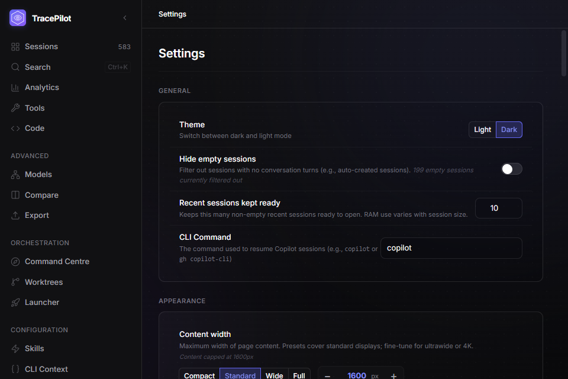
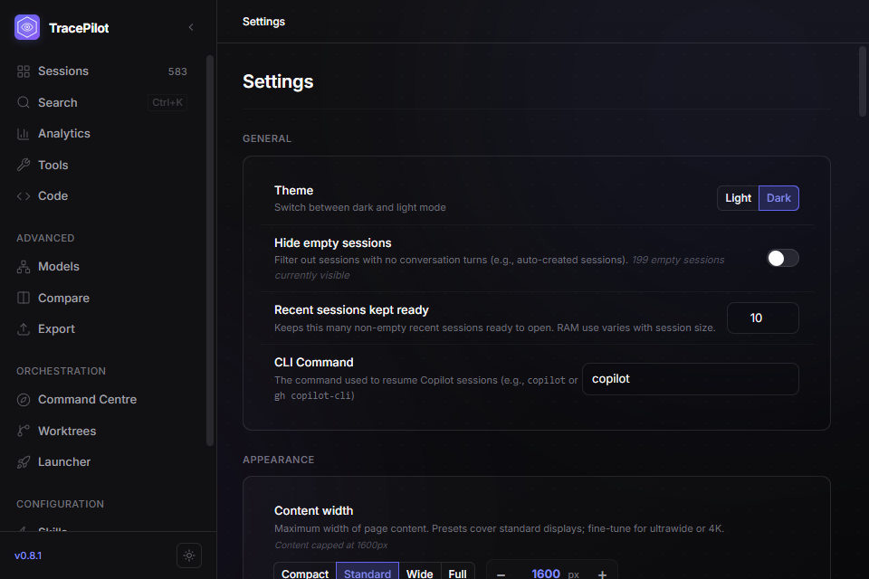
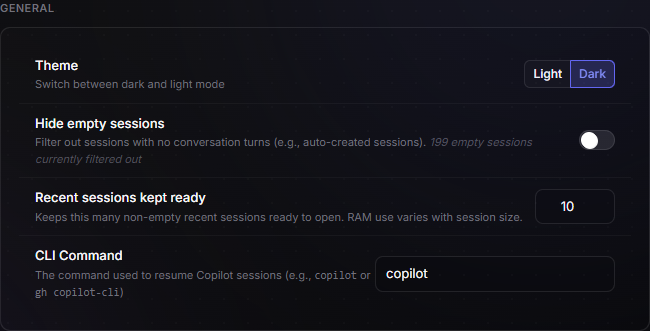
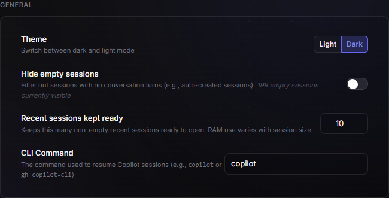

# App automation validation — 2026-09-12

The replacement integration was exercised on Windows against the actual Tauri
dev app, using the configured Rust/SQLite backend, and separately against Vite
with the client's existing mock data. The implementation decision and commands
are in [running-app automation](../app-automation.md).

## Interactive proof

- Started Tauri from source, attached the pinned upstream CLI over CDP, and
  verified native IPC. No Rust automation plugin or IPC proxy was added.
- Used CLI snapshots, clicks, filling, keyboard input, screenshots, evaluation,
  console inspection, and trace start/stop. Real full-text search returned results
  from the existing index. The inspected flow reported no frontend console errors.
- Repeated startup reused the running instance. Frontend-only mode ran alongside
  desktop mode on another port; its runtime had no Tauri internals and rendered
  the mock Settings screen successfully.
- Frontend edits appeared in the real app through HMR. Detaching the CLI left
  the native app healthy. Stopping frontend mode left desktop mode healthy.
- Native shutdown removed the tracked processes and released the UI/CDP ports.
  A fresh start and CLI reattachment succeeded afterwards.

## UI issues found and fixed

At the supported minimum desktop size (960×640), the sidebar's navigation exceeded
the available height and pushed Settings and the footer outside the clipped
sidebar. Navigation now scrolls independently while the brand and footer stay in
place. Keyboard focus can reveal and activate Settings.

| Before | After |
| --- | --- |
|  |  |

The Settings explanation claimed empty sessions were filtered out even when
“Hide empty sessions” was off. It now reports visible/hidden according to the
switch, and the CLI Command input has an explicit accessible name.

| Before | After |
| --- | --- |
|  |  |

These captures are from the real app, with matching route, dark theme, viewport,
data, and settings. The focused General crops avoid publishing local data paths
or session content. Default and large desktop screenshots were also visually
reviewed and remain in ignored local test output.

## Validation

| Check | Result |
| --- | --- |
| Real-app smoke | 19 checks passed, including Settings keyboard reachability and brand/footer bounds at 1440×960, 960×640, and 2560×1440. |
| Lifecycle/readiness suite | All 6 Node tests passed. Healthy reuse, complete process-tree cleanup, stale PID protection, timeout cleanup, occupied-port refusal; paths with spaces exercised. |
| Readiness fixture tests | Browser mocks and failed native IPC rejected; CDP failure disconnects without closing the target; setup works without a database. |
| Workspace JS/TS suite | 3,224 tests passed across 353 files. |
| Typecheck and frontend production build | Passed. The native dev build also completed and ran. |
| Skill validation, documentation links, file sizes | Passed. |
| Changed JS/TS/Vue/CSS lint and format | Passed. |

The final smoke run reported eight timing-budget overruns under the configured
session workload (including search facets and worktree disk usage); these remain
diagnostic warnings and are not presented as performance improvements. The
repository-wide design checks still report pre-existing hex fallbacks in
`skills-manager.css` and a literal z-index in `FileContextMenu.vue`. Neither file
was changed. Emoji and backdrop checks passed.

The tested desktop transport is Windows WebView2 CDP. macOS/Linux native automation,
OS-owned dialogs, and the optional MCP adapter were not validated. Frontend-only
mode is supplementary; it is never counted as proof of Rust behavior.
