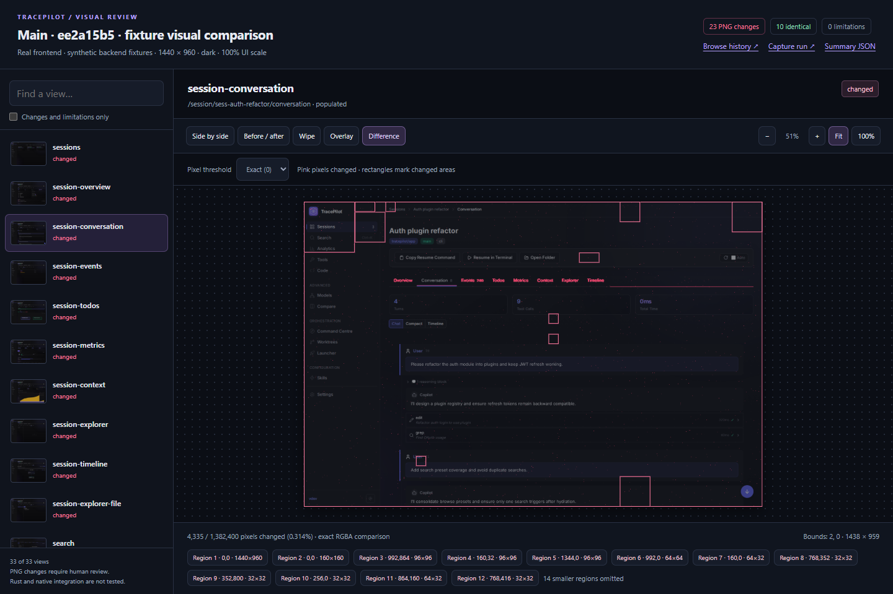
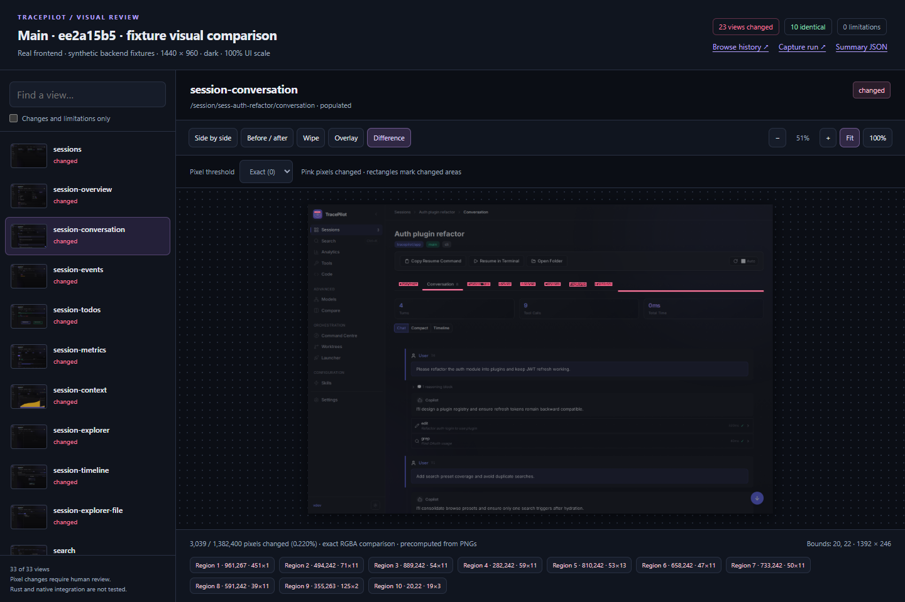

# Consistent visual comparisons and precise change regions

Scope: the screenshot report, its trusted CI publisher, and README discoverability.
No desktop components or capture fixtures changed in this follow-up.

Investigated [main capture 34691740224](https://mattshelton04.github.io/TracePilot/visual/runs/34691740224/),
including all 33 paired views (66 original PNGs). The reported example is
`session-conversation`, at 1440×960, dark theme, 100% app scale, populated synthetic
sessions. Comparisons below use those exact source PNGs and matching viewer state.

## Findings and resolutions

| ID | Severity and impact | Root cause | Resolution and verification |
| --- | --- | --- | --- |
| VIS-001 | Medium: browser-dependent speckles inflate metrics and distract reviewers across unrelated areas. | The old viewer extracted both screenshots with `getImageData` and exported its heatmap with `toDataURL`. Browser fingerprinting protections can perturb these APIs. | Compute exact RGBA metrics and four threshold heatmaps in trusted CI; display plain PNG assets with no canvas readback. All five modes work with extraction APIs disabled, including offline. |
| VIS-002 | Medium: region boxes imply broad changes where only small details changed. | Every changed pixel expanded to an occupied 32×32 tile; sparse adjacent cells joined into large rectangles. | Group nearby pixels in 8px cells, union actual pixel bounds, and retain all changed pixels. Tests preserve isolated one-pixel changes, a 400×1 line, and separated sparse pixels. The real conversation comparison retains its 451×1 border and 125×2 underline. |
| VIS-003 | Low: encoding-only PNG changes are incorrectly marked as visual changes. | Summary and comment classification used PNG byte hashes. | Classify paired views by exact decoded RGBA equality; retain source hashes. A regression encodes identical pixels as RGB versus RGBA and confirms an unchanged classification with an explanatory message. |
| VIS-004 | Low: screenshot history is difficult to discover from the repository landing page. | README had no link. | Add Visual history to README navigation and explain the gallery beside Screenshots, with a link to the workflow documentation. |

### Reproduction and evidence

1. Open the linked run, select `session-conversation`, choose Difference and Exact (0).
2. Clean Edge and independent Pillow decoding agree: **3,039 changed pixels**,
   bounds **20,22 · 1392×246**. The source PNGs do not contain the scattered changes
   across the conversation background shown in the reported screenshot.
3. For a controlled reproduction, perturb 650 deterministic scattered red-channel
   samples by one bit per `getImageData` call. The old viewer reports **4,335 pixels**
   and bounds **2,0 · 1438×959**, creating broad false regions. This simulates the
   failure mechanism, not a particular browser's algorithm. The user's browser and
   exact privacy setting were not established.
4. Under the same perturbation, the corrected viewer reads no canvas pixels and
   reports the original **3,039 pixels**, with ten tight regions. No detection
   threshold was raised and no application area was masked.

[Brave documents canvas output randomization](https://brave.com/privacy-updates/4-fingerprinting-defenses-2.0/),
including the two APIs used by the original viewer. This supports the inferred
cause of the user's extra speckles; the controlled failure and fix were reproduced
independently of the user's browser configuration.

**Before: old viewer with simulated canvas noise.**

**After: same source PNGs and perturbation, precomputed comparison.**

Both screenshots were opened and inspected before committing. They contain only
public synthetic CI fixtures. The user-supplied screenshot, downloaded run artifacts,
local scripts and raw evidence remain in ignored local storage.

## Validation and limits

- All 66 original PNGs safely decode. Their pixels produce **23 changed views,
  10 identical views, zero incomplete views and zero missing bases**. These 23
  comparisons contain real differences; this fix removes spurious regions rather
  than suppressing the previous usability changes.
- 21 Node regression tests and two Python extractor tests pass. PNG tests reject
  truncated/corrupt input, duplicate headers, unsupported color metadata, interlace,
  invalid dimensions and unsupported depth before accepting a comparison.
- Browser regression passes against both a generated one-pixel case and the
  actual reported conversation pair: side-by-side, toggle, wipe with pointer and
  keyboard, opacity, all four thresholds, region navigation and zoom, 1440×960,
  960×640 and 2560×1440, offline file loading, and explicit missing-overlay feedback.
  Canvas extraction is disabled throughout; successful workflows have no page errors.
- Independent read-only review found no blocking implementation issues and
  independently reproduced the 3,039-pixel count from the downloaded PNGs.
- Regenerating the complete 33-view report locally took **11.34 seconds**, versus
  0.14 seconds for the old HTML-only report. Each pair is decoded once; thresholds
  run sequentially, and unchanged pairs need no heatmap assets. The browser regression
  took about **2.5 seconds**. These measurements exclude installation and upload;
  hosted timings may differ. Four capture runners remain parallel; the browser check
  runs only once. No Rust build or additional browser installation is added.
- The publisher installs only one pinned decoder from its own trusted-main lockfile,
  with lifecycle scripts disabled. It never installs PR dependencies or consumes PR
  caches. PNGs are bounded before decoding; invalid inputs are explicit limitations.
- This is report/CI verification, not native app verification. No app behavior changed.
  New publisher code becomes active after merge. Historical reports keep their
  original viewer. The linked main report can be regenerated by rerunning its
  original capture workflow after merge; closed or superseded PR reports cannot
  be republished by rerunning because the publisher rejects stale PR heads.
