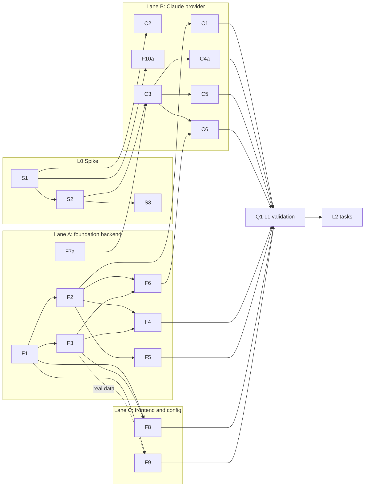

# Implementation Plan

> Part of the [Claude Code integration plan](README.md). The design is in
> [architecture.md](architecture.md) and the mappings are in [mapping.md](mapping.md).

## 1. Estimating assumptions

- **Unit:** focused engineer-days for someone who knows the codebase. Estimates include unit
  tests, fixtures and the repo's validation gates (`cargo test`, `pnpm test`, typecheck, lint).
- **Calendar time:** "1 lane" means one engineer working serially; "3 lanes" means three
  people or agents working in parallel per §4. Review and merge time is not included.
- **Agents:** with autonomous agents ([docs/agents](../../agents/README.md)), calendar time
  shrinks further. Review bandwidth and conflicts in shared files (the bindings crate above
  all) become the limit, not typing.
- **Ranges:** these are planning ranges. The spike (L0) exists to narrow them.

## 2. Levels at a glance

| Level | Adds | Eng-days (increment) | Cumulative | 1 lane | 3 lanes |
| --- | --- | ---: | ---: | --- | --- |
| L0 Spike | S1–S3 | 4–6 | 4–6 | 1 wk | 1 wk |
| L1 Basic (internal milestone) | F1–F10a, C1–C6, Q1 | 33–45 | 37–51 | 8–10 wks | 3–4 wks |
| **L2 Good (first release, Experimental)** | C4, C7–C11, U1–U3, F10b, Q2 | 25–35 | 62–86 | 12–17 wks | 5–7 wks |
| L3 Parity | C12–C14, U4, U5, Q3, Q4 | 17–25 | 79–111 | 16–22 wks | 7–10 wks |
| Codex provider (after L2) | X1–X6 | 15–25 | — | 3–5 wks | 2–3 wks |

**Why this is higher than the earlier estimate.** The earlier study gave 5–8 weeks for Claude
Code. That figure predates the code audit, which found work it did not count:
- 25 path-resolution call sites
- about 15 cache and freshness sites
- global pruning
- no metrics path besides `session.shutdown`
- source enable/disable and per-source purge
- the AI Credits fallback
- pricing aliases and the 1h cache-write rate
- fixture and VRT coverage

## 3. Task breakdown

**ID prefixes:** S = spike, F = foundation, C = Claude provider, U = UI, Q = quality,
X = Codex.

**Estimates:** in engineer-days.

**Lanes:** A = foundation backend, B = provider, C = frontend and config. See §4.

### L0 — Spike (validate before building)

| ID | Task | Est | Depends on | Lane | Output kept? |
| --- | --- | ---: | --- | --- | --- |
| S1 | Claude record model and streaming reader. Tolerant serde, file order, group blocks by `message.id` keeping the last usage, polymorphic `toolUseResult`, drop image base64 | 1.5–2 | — | B | **Yes**, becomes C2 |
| S2 | Translator prototype → `TypedEvent`s: prompts, text, thinking, tool pairs, `Agent → task` with `agent_type`, subagent stitching via `meta.toolUseId`, compaction | 2–3 | S1 | B | **Yes**, becomes C3 |
| S3 | Real-data validation harness: an `#[ignore]` integration test gated on `TRACEPILOT_CLAUDE_PROBE_DIR` (the same pattern as `tracepilot-orchestrator/tests/live_copilot_bridge.rs`). It runs `reconstruct_turns` over real sessions and prints **aggregate counts only**, never content. A throwaway Copilot-shaped mirror (never committed) shows sessions in the real UI. **Decide:** turn granularity (per API call or per prompt); totals vs `cost-state`; `Read` and `Edit` rendering | 1 | S2 | B | Harness yes, mirror no |

**Exit criterion:** 5 real sessions render in Conversation via the mirror, including one with
subagents, one with compaction and one resumed. De-duplicated usage sums are within 5% of
`cost-state`, excluding Haiku side calls.

### L1 — Basic

| ID | Task | Est | Depends on | Lane |
| --- | --- | ---: | --- | --- |
| F1 | Core source types: `SessionSource`, `SourceCapabilities`, `Liveness`, `SessionLocator`, `SourceFingerprint`, `SessionRole` (with specta feature) | 1 | — | A |
| F2 | `SessionProvider` trait, `ProviderRegistry` and **`CopilotProvider`** wrapping today's code. **Golden regression tests**: index rows, turns and analytics byte-identical on existing fixtures. `FixtureProvider` acceptance test ([architecture §7](architecture.md#7-codex-stress-test)) | 4–5 | F1 | A |
| F3 | Index migration M22 (`source`, `parent_session_id`, `role`/`hidden`, `source_format_version`), upsert source guard, **per-source prune**, `source` on `SessionListItem` | 2–3 | F1 | A |
| F4 | `with_session_locator` resolution through the index with a provider fallback. Migrate all 25 IPC call sites. Per-provider allowed roots for the file browser and image preview. Capability-gated refusal for resume, context capture and import | 3–4 | F2, F3 | A |
| F5 | Opaque `source_version`: `EventCache`/`TurnCache` keys, `FreshnessResponse` (keep the legacy fields), search fingerprint, `source_bytes_hint` batching | 2–3 | F2 | A |
| F6 | Multi-provider reindex and lifecycle (`IndexTarget` = registry snapshot), with progress per source | 2–3 | F2, F3 | A |
| F7a | IR additions: `RawEvent.native`, `native_tool_name`, provider `SessionMetrics` with `cost_basis` mapped into `ShutdownMetrics` with AIC and premium `None` | 2 | — | A |
| F8 | Enable/disable ([README §5](README.md#5-enabling-and-disabling-claude-code)): the `features.claudeCodeSessions` experimental flag (Rust `FeaturesConfig`, `DEFAULT_FEATURES`, Settings → Experimental); `SourcesConfig.claudeCode.configDir` (`CLAUDE_CONFIG_DIR` default, validated) shown in Data & Storage when on; registry rebuild on config change; reindex on enable and **purge that source's rows on disable**. The setup wizard is unchanged (D1) | 3–4 | F1, F3 | C |
| F9 | Frontend plumbing: `types/sources.ts`, `source` on list, detail and search DTOs, source badge and list filter, `mapSessionTabs(caps)` plus router guard, source-aware main-agent label (3 sites), **guard the AIC estimate fallback**, hide SDK steering and Copilot resume | 3–4 | F1 (F3 for real data) | C |
| F10a | Fixtures: a Claude transcript builder in `tracepilot-test-support` (main, subagent and `meta.json`, compaction, `cost-state`, errors), built from redacted real shapes | 1.5–2 | S1 | B |
| C1 | `ClaudeCodeProvider::discover` and fingerprint: `projects/*/<uuid>.jsonl` + `subagents/*` (skipping `memory/`), file-list fingerprint, `cwd` from records | 1–2 | F2 | B |
| C2 | Harden the S1 parser: memory bounds on huge lines, partial trailing line, unknown types → native `Unknown` | 1–2 | S1 | B |
| C3 | Complete the translator: user-record classification (human, meta, command, hand-back, notification, interrupt, compact summary), `<synthetic>` → `session.error`, `session.start` context, model change | 3–4 | S2, F7a | B |
| C4a | Minimal normalization: `Agent → task` (required for subagents); name map for icons | 1 | C3 | B |
| C5 | Summary and metrics: title (`ai-title` → `agent-name` → first prompt), repository chain (`git_state` origin → `pr-link` → none), branch, created/updated, **`cost-state` → `SessionMetrics`**, falling back to de-duplicated sums labelled partial | 2 | C3, F7a | B |
| C6 | Search content for Claude: exclude attachments and bookkeeping; FTS over prompts, messages, visible reasoning and tool text | 1 | C3, F6 | B |
| Q1 | L1 real-data validation: index the full local corpus; spot-check 10 sessions in the app at 1440×960 | 1–2 | all L1 | any |

**L1 acceptance:**
- Copilot golden tests pass unchanged.
- Enabling **Settings → Experimental → Claude Code sessions** indexes that source.
- Claude sessions list, search, open in Conversation and Events, and show totals from
  `cost-state`.
- Copilot-only tabs are hidden for Claude sessions.
- Disabling it purges only Claude Code rows, and Copilot data is untouched.

### L2 — Good (first release behind Experimental)

| ID | Task | Est | Depends on | Lane |
| --- | --- | ---: | --- | --- |
| C4 | Full normalization table and result reshapes per [mapping.md §2](mapping.md#2-tools--canonical-kinds--renderers): Bash/PowerShell exit codes and persisted output, Read from `file.content` + `startLine`, Edit, Write (create or patch from `structuredPatch`), Grep, Glob, SendMessage, TaskStop, WebFetch, WebSearch annotations, Skill, AskUserQuestion schema, MCP split. Move core literals to a canonical `shell` family | 4–5 | C3 | B |
| C7 | `tracepilot.model_call` event (with `known-events.ts` parity), `metrics_from_model_calls` for live sessions, per-turn usage on `ConversationTurn` | 2–3 | F7a, C3 | A |
| C8 | Context "total only" anchor; observed prompt cache (`CacheConfidence::Observed`, TTL from the `cache_creation` split, 1h) | 3–4 | C7 | A |
| C9 | Liveness from `sessions/<pid>.json` (pid alive, `procStart`, `sessionId`), busy/idle running badge | 1–2 | F2 | B |
| C10 | Indexer analytics rows for Claude: model metrics, tool calls (canonical + native), modified files, incidents (429s, interrupts, denials), agent runs, skill invocations, cache windows | 2–3 | C4, C7, F6 | A |
| C11 | Pricing: model-id alias rule, optional `cacheWrite1hPerM`, `provider-wholesale` Anthropic rows with provenance, `cost_basis` labels | 2–3 | F7a | C |
| U1 | Renderer tweaks: `nativeToolName` in the tool header, waterfall and swimlanes; ShellOutput title from the tool; "copy `claude --resume <id>`" | 1.5–2 | C4 | C |
| U2 | Source-aware Overview, Metrics, Context and header: USD-estimate cards, no AIC or premium, total-only context chart, 1h cache countdown | 3–4 | C7, C11, F9 | C |
| U3 | Analytics source filter (backend SQL filters + about 6 frontend files), cost split by source, model grouping by normalized id | 3–4 | F3, C10 | C |
| F10b | `pnpm app:ui` mock Claude sessions (`packages/client/src/mock/sessions.ts`); `scripts/fixtures` native Claude generator wired into `session-fixtures.mjs` (so `-Fixtures` exercises the real provider); renderer samples for each canonical mapping in `scripts/fixtures/rich-tools.mjs` | 2–3 | C4 | B |
| Q2 | Validation in the real app (`pnpm app:start -Fixtures`) at 1440×960, 960×640 and 2560×1440; visual regression captures; perf budget check (index time, open time for a 52 MB session) | 2 | all L2 | any |

**L2 acceptance:**
- Every observed Claude tool renders through its mapped renderer or the generic fallback.
- Metrics token totals equal `cost-state` totals for ended sessions.
- The prompt-cache countdown uses 1h.
- Analytics "All / Copilot / Claude Code" filtering works on every analytics page.
- Cost is never summed across sources without a label.
- No Copilot visual regressions.

### L3 — Parity

| ID | Task | Est | Depends on | Lane |
| --- | --- | ---: | --- | --- |
| C12 | Todos and tasks. `TaskCreate/Update/List/Get` and legacy `TodoWrite` are on by default only for older models (Opus 4–4.7, Sonnet 4–4.6, Haiku 4.5) and unobserved here, so handle them defensively. Add a `TodoListRenderer`, synthesize the Todos tab via `artifacts()` only when those tools were used, and build a background-task list from notifications and `task_status` | 3–4 | C4 | B |
| C13 | Plan (`ExitPlanMode`, `plans/<slug>.md`), file-history → checkpoint/rewind view, Explorer roots (`subagents/`, `tool-results/`) | 3–4 | F2 | B |
| C14 | Export: `source` on the document, export from `ProviderSnapshot` (`workspace.yaml` optional), record-level redaction ([data-comparison §5](data-comparison.md#5-privacy-inventory)), import gated to Copilot | 2–3 | F2, F7a | A |
| U4 | Tool analysis by canonical kind with native drill-down; code impact; cross-source model comparison; session comparison suppressing billing deltas across sources | 4–5 | U3, C10 | C |
| U5 | Copy pass on shared UI only (Copilot-first, decision D1), empty states, user docs, `docs/on-disk-paths.md`, troubleshooting | 2–4 | — | C |
| Q3 | Format-drift tooling: promote the census script to `scripts/` (with a `scripts/README.md` entry) and add a per-source diagnostics panel listing unmapped record and attachment types and versions seen | 2–3 | C3 | any |
| Q4 | Alerts and notifications on liveness transitions (busy → idle) | 1–2 | C9 | B |

### Later (L4, independent)

| ID | Task | Est | Notes |
| --- | --- | ---: | --- |
| E1 | Opt-in archive of transcripts before Claude Code's cleanup deletes them | 3–5 | **Deferred** (decision D3: respect the rolling window for now). Copy into the TracePilot data root and keep the fingerprint pointing at the archive |
| E2 | Estimated context split from `prompt_snapshot` (system, tools) | 3–4 | Labelled as estimated |
| E3 | Node CLI (`apps/cli`) support for Claude sessions | 3–5 | |
| E4 | Cross-source repository view ("this repo across agents"), PR linking from `pr-link` | 3–5 | |

### Codex provider (after L2)

| ID | Task | Est |
| --- | --- | ---: |
| X1 | Discovery from `state_5.sqlite` (read-only overlay) plus rollouts, archived and guardian roles | 3–4 |
| X2 | Detection of the three format generations; `item_completed`-first parsing with de-dup | 4–6 |
| X3 | Child-thread stitching (fold), skipping the history prefix | 3–4 |
| X4 | Tool normalization table, `token_count` → `ModelCall`, `update_plan` → todos | 3–5 |
| X5 | Fixtures and real-data validation | 2–4 |
| X6 | Config, badge, docs | 1–2 |

If the foundation passes its `FixtureProvider` acceptance test, **no X task touches files outside
`provider/codex/`** except config, fixtures and copy.

## 4. Parallelism and dependencies

Within L2:
- **Lane A** takes C7 → C8 and C10.
- **Lane B** takes C4 → F10b, plus C9.
- **Lane C** takes C11 → U2, and U1 once C4 lands, and U3 once C10 lands.

**Critical path (L1):** F1 → F2 → F3 → F4 → Q1. That is about 11–15 days; F4 is the longest
item.

**Off the critical path:** lane B's provider work runs against fixtures and the S1/S2 code
from day 1. It needs F2 only to plug in.

**Conflict hotspots:**

| Hotspot | Mitigation |
| --- | --- |
| F4 touches about 24 bindings files | Land it as one PR early, then rebase other bindings work |
| F3/F5/F6 overlap in `tracepilot-indexer/src/indexing` | Keep them in one lane |
| Frontend DTO types (`packages/types/src/session.ts`, `conversation.ts`) are hand-maintained | Make F9 the only owner during L1 |

**Suggested PR sequence (L1):**
1. F1 + F7a (types only)
2. F2 (Copilot wrapper and golden tests; no behaviour change)
3. F3
4. F4
5. F5 + F6
6. F8
7. F9
8. C1–C6 behind the Experimental flag
9. Q1 fixes

Each PR keeps Copilot behaviour identical; the golden tests are the gate.

## 5. Test strategy

- **No Copilot regression.** Golden snapshots of index rows, turns and analytics DTOs on
  `tracepilot-test-support` fixtures are captured before F2 and asserted after every
  foundation PR.
- **Provider fixtures.** These are synthetic Claude transcripts that reproduce the measured
  hazards:
  - per-block records with growing `output_tokens`
  - out-of-order timestamps
  - a `logicalParentUuid` cycle
  - a string `toolUseResult` on error
  - an image Read
  - persisted output
  - a subagent with hand-back and task notification
  - compaction
  - a `<synthetic>` 429
  - a resumed session with two `cost-state` pairs

  Never commit real transcripts. They contain emails, org ids and full system prompts.
- **Unverified shapes.** `TodoWrite`/`Task*`, MCP and `MultiEdit` get fixtures built from public
  docs, marked `// unverified shape` until real samples exist.
- **Renderers.** Each canonical mapping gets a sample in `scripts/fixtures/rich-tools.mjs`;
  the registry coverage test enforces this. Per [visual regression](../../visual-regression.md),
  keep the fixtures current and one-off captures untracked.
- **Real app.** Use the [app automation skill](../../../.github/skills/tracepilot-app-automation/SKILL.md)
  with `pnpm app:start -Instance <name> -Fixtures` at the three required viewports.

## 6. Risks

| Risk | Severity | Mitigation |
| --- | --- | --- |
| Claude Code format churn (12 versions in 18 days) | High | Tolerant parsing, native `Unknown` passthrough, Q3 diagnostics panel, Experimental flag, census script re-run per release |
| Double counting (per-block usage, subagents vs `cost-state`) | High | Parser rules 3 and 5 in [data-comparison.md](data-comparison.md#2-parser-rules-the-data-forces); fixture tests; L2 acceptance "Metrics = `cost-state`" |
| Silent mispricing (AIC fallback, 5m vs 1h cache rate, model-id mismatch) | High | F9 guard, C11, `cost_basis` everywhere |
| Foundation refactor regresses Copilot | High | Golden tests gate every F PR; `CopilotProvider` is a wrapper, not a rewrite |
| Transcript retention removes sessions after 30 days | Low (accepted, D3) | Sessions lapse with Claude Code's window, like deleted Copilot sessions; document it; E1 deferred |
| Turn granularity feels wrong (per API call vs per prompt) | Medium | Decide in S3 with real sessions before C3 hardens |
| Single-user corpus (no MCP, todos, macOS) | Medium | Unverified-shape fixtures; ask Experimental users for redacted census output (Q3 script) |
| Privacy (email, org ids, system prompt) | Medium | FTS exclusions (C6), export redaction (C14) |
| Merge conflicts across lanes | Medium | PR sequence and lane ownership in §4 |

## 7. Kickoff

### Readiness

| Item | State |
| --- | --- |
| Product decisions D1–D5 | Made 2026-10-05 ([README §4](README.md#4-decisions-2026-10-05)) |
| Enable/disable UX | Specified ([README §5](README.md#5-enabling-and-disabling-claude-code), task F8) |
| Data format, parser rules, record shapes | [data-comparison.md](data-comparison.md), [record-shapes.md](record-shapes.md) (synthetic, safe for fixtures) |
| Retention default | Verified: 30 days, `cleanupPeriodDays`; Desktop/Cowork sessions exempt |
| Todo/task tool availability | Verified: default-on only for older models, so C12 is low priority |
| Seam design and Copilot regression gate | [architecture.md §3](architecture.md#3-the-a-design); golden tests in F2 |
| Open questions for the spike | Turn granularity, totals vs `cost-state`, `Read`/`Edit` rendering (S3) |

### Conventions

- **Code layout.** All source-specific code lives under `crates/tracepilot-core/src/provider/`:
  - `mod.rs` and `types.rs`: F1 types, the trait and the registry
  - `copilot/`: F2 wrapper
  - `claude_code/`:
    - `records.rs`: serde shapes
    - `reader.rs`: streaming, ordering, per-message usage
    - `translate.rs`: events
    - `tools.rs`: normalization table
    - `summary.rs`: summary and metrics
    - `liveness.rs`

  Respect the 500-line Rust budget (`node scripts/check-file-sizes.mjs`).
- **Names:**
  - `SessionSource` serializes as `"copilot"` / `"claudeCode"`.
  - The feature flag is `claudeCodeSessions`.
  - The per-call usage event is `tracepilot.model_call`.
  - The native tool name field is `native_tool_name` / `nativeToolName`.
- **Nothing is user-visible** until F8 registers the provider behind the default-off
  experimental flag. Earlier PRs are inert or behaviour-preserving.
- **Private data.** Fixtures are synthetic, built from [record-shapes.md](record-shapes.md).
  Real-data checks run only through the S3 ignored test, and print aggregates only.

### First work packages (run in parallel)

| Package | Lane | Tasks | Branch | Must not touch |
| --- | --- | --- | --- | --- |
| **WP1: Claude Code parser spike** | B | S1, S2, S3, F10a | `feat/claude-code-parser` | `tracepilot-indexer`, `tracepilot-tauri-bindings`, frontend |
| **WP2: Provider seam** | A | F1, F7a, F2 | `refactor/session-provider-seam` | `provider/claude_code/` |

- **WP1** exposes free functions such as `parse_claude_session(path, cancel) -> ClaudeParse { events, metrics, diagnostics }`.
  - Until WP2 lands F7a, it may keep the native record JSON in `RawEvent.data`.
  - It adopts `RawEvent.native` and `native_tool_name` when it rebases onto WP2.
  - C1 later wraps these functions in the trait.
- **Shared edits:** both packages touch `crates/tracepilot-core/src/lib.rs` (module
  registration) and nothing else.

**Next:** F3 → F4 → F5/F6 (lane A), C1–C6 (lane B), F8/F9 (lane C), then Q1.
