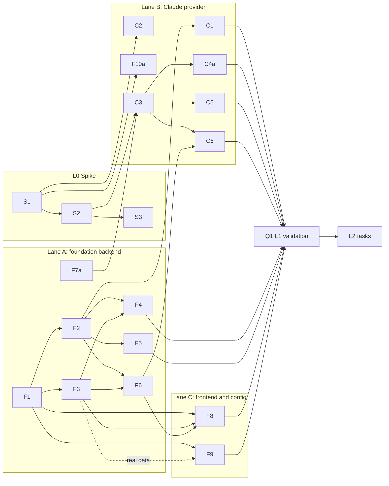

# Implementation Plan

> Part of the [Claude Code integration plan](README.md). The design is in
> [architecture.md](architecture.md) and the mappings are in [mapping.md](mapping.md).

## 1. Estimating assumptions

- **Unit:** focused engineer-days for someone who knows the codebase. Estimates include unit
  tests, fixtures and the repo's validation gates (`cargo test`, `pnpm test`, typecheck, lint).
- **Calendar time:** "1 lane" means one engineer working serially; "3 lanes" means three
  people or agents working in parallel per §4. Review and merge time is not included.
- **Agents:** with autonomous agents ([docs/agents](../../agents/README.md)), calendar time
  shrinks further. Review bandwidth and conflicts in shared files (the bindings crate above
  all) become the limit, not typing.
- **Ranges:** these are planning ranges. The spike (L0) exists to narrow them.

## 2. Levels at a glance

| Level | Adds | Eng-days (increment) | Cumulative | 1 lane | 3 lanes |
| --- | --- | ---: | ---: | --- | --- |
| L0 Spike | S1–S3 | 4–6 | 4–6 | 1 wk | 1 wk |
| L1 Basic (internal milestone) | F1–F10a, C1–C6, Q1 | 33–45 | 37–51 | 8–10 wks | 3–4 wks |
| **L2 Good (first release, Experimental)** | C4, C7–C11, U1–U3, F10b, Q2 | 25–35 | 62–86 | 12–17 wks | 5–7 wks |
| L3 Parity (done; Q4 dropped) | C12–C14, U4, U5, Q3, ~~Q4~~ | 15–23 | 77–109 | 16–22 wks | 7–10 wks |
| Codex provider (after L2) | X1–X6 | 15–25 | — | 3–5 wks | 2–3 wks |

**Why this is higher than the earlier estimate.** The earlier study gave 5–8 weeks for Claude
Code. That figure predates the code audit, which found work it did not count:
- 25 path-resolution call sites
- about 15 cache and freshness sites
- global pruning
- no metrics path besides `session.shutdown`
- source enable/disable and per-source purge
- the AI Credits fallback
- pricing aliases and the 1h cache-write rate
- fixture and VRT coverage

## 3. Task breakdown

**ID prefixes:** S = spike, F = foundation, C = Claude provider, U = UI, Q = quality,
X = Codex.

**Estimates:** in engineer-days.

**Lanes:** A = foundation backend, B = provider, C = frontend and config. See §4.

### L0 — Spike (validate before building)

| ID | Task | Est | Depends on | Lane | Output kept? |
| --- | --- | ---: | --- | --- | --- |
| S1 | Claude record model and streaming reader. Tolerant serde, file order, group blocks by `message.id` keeping the last usage, polymorphic `toolUseResult`, drop image base64, record `persistedOutputPath` without opening it, cancellation, partial trailing line (including a split UTF-8 sequence) | 1.5–2 | — | B | **Yes**, becomes C2 |
| S2 | Translator prototype → `TypedEvent`s with **canonical `raw.data`** ([§7 WP1 contract](#wp1-claude-code-parser-spike)): prompts, text, thinking, tool pairs, `Agent → task` with `agent_type`, meta records without extra turns ([mapping §1.1](mapping.md#11-user-records-that-must-not-open-a-turn)), `assistant.turn_end` rules ([mapping §1.2](mapping.md#12-turn-boundaries)), subagent stitching and the visible branch ([mapping §1.3](mapping.md#13-ordering-ids-branches-and-subagents)), compaction | 2–3 | S1 | B | **Yes**, becomes C3 |
| S3 | Real-data validation harness: an `#[ignore]` integration test gated on `TRACEPILOT_CLAUDE_PROBE_DIR` (the same pattern as `tracepilot-orchestrator/tests/live_copilot_bridge.rs`). It runs `reconstruct_turns` over real sessions and prints **aggregate counts only**, never content, including the **usage reconciliation report** (below). A throwaway Copilot-shaped mirror (never committed) shows sessions in the real UI. **Decide:** turn granularity (per API call or per prompt); `Read` and `Edit` rendering | 1 | S2 | B | Harness yes, mirror no |

**Usage reconciliation (replaces a percentage gate).** `cost-state` legitimately exceeds the
transcripts: it counts side models that never appear in a transcript and calls that are never
persisted, such as compaction. In this corpus, two ended sessions are 7% and 13% above their
transcript sums on the *same* model. A fixed "within N%" gate would fail correct code, and
"fixing" it by adjusting totals would hide real bugs. Instead:
- **Synthetic fixtures are exact.** For every F10a fixture, the de-duplicated per-call sums
  equal hand-computed expected values for each model and token category, and each fixture's
  `cost-state` is written to be consistent with them.
- **Real data is reported, not forced.** S3 prints aggregate coverage (transcript ÷ last
  snapshot) by model and by token category: input, cache read, cache write, output. Each
  per-session, per-model residual is classified:
  - `sideModel`: the model appears only in `cost-state`.
  - `compaction`: the session has `compact_boundary` records.
  - `negative`: the transcript exceeds the snapshot. This is a parser bug and must be 0.
  - `unexplained`: everything else.
- Totals are never adjusted to make the numbers meet. Each `unexplained` residual needs a
  written hypothesis before C5 starts.
- **Resumed and running sessions.** `cost-state` snapshots are **cumulative across resumes**.
  In all 5 resumed sessions in the corpus, the later snapshot equals the earlier one plus the
  calls between them, exactly to the token. Each exit writes an identical pair.
  - A snapshot covers what comes **before its file position**.
  - The current total = the last snapshot + the **tail**: de-duplicated calls whose first
    record comes after that position, plus subagents whose launching `tool_use` comes after it.
  - When the tail is non-empty, the session total is labelled partial.
  - A snapshot's presence alone never means "ended" or "current".
  - Fixtures cover both resumed-and-ended and resumed-and-still-running.

**Exit criterion:**
- 5 real sessions render in Conversation via the mirror, including one with subagents, one
  with compaction and one resumed.
- The serialize → parse → reconstruct equivalence test passes.
- Synthetic accounting is exact.
- The real-data reconciliation report shows 0 `negative` residuals, and each `unexplained`
  residual is listed with a hypothesis.

### L1 — Basic

| ID | Task | Est | Depends on | Lane |
| --- | --- | ---: | --- | --- |
| F1 | Core source types: `SessionSource`, `SourceCapabilities`, `Liveness`, `SessionLocator`, `SourceFingerprint`, `SessionRole` (with specta feature) | 1 | — | A |
| F2 | `SessionProvider` trait, `ProviderRegistry` and **`CopilotProvider`** wrapping today's code. **Golden regression tests**: index rows, turns and analytics byte-identical on existing fixtures. **Provider parity tests**: `CopilotProvider` output equals today's direct loaders for summaries, events, turns, metrics, fingerprints and liveness. A registry-level `FixtureProvider` smoke test (discover and load through the trait). The full pipeline acceptance test is part of Q1 ([architecture §7](architecture.md#7-codex-stress-test)) | 4–5 | F1 | A |
| F3 | Index migration M22 (`source`, `parent_session_id`, `role`/`hidden`, `source_format_version`), upsert source guard, **per-source prune**, `source` on `SessionListItem` | 2–3 | F1 | A |
| F4 | `with_session_locator` resolution through the index with a provider fallback. Migrate all 25 IPC call sites. Per-provider allowed roots for the file browser and image preview. Capability-gated refusal for resume, context capture and import | 3–4 | F2, F3 | A |
| F5 | Opaque `source_version`: `EventCache`/`TurnCache` keys, `FreshnessResponse` (keep the legacy fields), search fingerprint, `source_bytes_hint` batching | 2–3 | F2 | A |
| F6 | Multi-provider reindex and lifecycle (`IndexTarget` = registry snapshot plus per-source config generation), with progress per source. **Prune only after a complete inventory**: a source whose discovery was cancelled or failed, or whose root is missing, is not pruned in that run | 2–3 | F2, F3 | A |
| F7a | IR additions: `RawEvent.native`, `native_tool_name`, provider `SessionMetrics` with `cost_basis`/`cost_unit` ([architecture §3.2](architecture.md#32-source-neutral-ir-additions)) mapped into `ShutdownMetrics` with AIC and premium `None`. **Copilot wire output is unchanged**: every new field is `#[serde(default, skip_serializing_if = "Option::is_none")]`, and a round-trip test proves existing `events.jsonl` lines re-serialize identically | 2 | — | A |
| F8 | Enable/disable ([README §5](README.md#5-enabling-and-disabling-claude-code)): the `features.claudeCodeSessions` experimental flag (Rust `FeaturesConfig`, `DEFAULT_FEATURES`, Settings → Experimental); `SourcesConfig.claudeCode.configDir` (`CLAUDE_CONFIG_DIR` default, validated) shown in Data & Storage when on; registry rebuild on config change; reindex on enable. **Disable ordering:** bump the source's config generation and cancel its jobs, then purge its rows and invalidate its caches. An index write commits only if its job's generation is still current, so a job holding the old registry snapshot cannot write rows back. A root change is a disable of the old root followed by an enable of the new one. **Tests:** disable during indexing, root change during indexing, interrupted discovery, failed or unreadable root. The setup wizard is unchanged (D1) | 3–4 | F1, F3, F6 | C |
| F9 | Frontend plumbing: `types/sources.ts`, `source` on list, detail and search DTOs, source badge and list filter, `mapSessionTabs(caps)` plus router guard, source-aware main-agent label (3 sites), **guard the AIC estimate fallback**, hide SDK steering and Copilot resume | 3–4 | F1 (F3 for real data) | C |
| F10a | Fixtures: a Claude transcript builder in `tracepilot-test-support` (main, subagent and `meta.json`, compaction, `cost-state`, errors), built from redacted real shapes | 1.5–2 | S1 | B |
| C1 | `ClaudeCodeProvider::discover` and fingerprint: `projects/*/<uuid>.jsonl` + `subagents/*` (skipping `memory/`), file-list fingerprint, `cwd` from records | 1–2 | F2 | B |
| C2 | Harden the S1 parser: memory bounds on huge lines, partial trailing line, unknown types → native `Unknown` | 1–2 | S1 | B |
| C3 | Complete the translator: user-record classification (human, meta, command, hand-back, notification, interrupt, compact summary), `<synthetic>` → `session.error`, `session.start` context, model change | 3–4 | S2, F7a | B |
| C4a | Minimal normalization: `Agent → task` (required for subagents); name map for icons | 1 | C3 | B |
| C5 | Summary and metrics: title (`ai-title` → `agent-name` → first prompt), repository chain (`git_state` origin → `pr-link` → none), branch, created/updated, **`cost-state` → `SessionMetrics`**, falling back to de-duplicated sums labelled partial | 2 | C3, F7a | B |
| C6 | Search content for Claude: exclude attachments and bookkeeping; FTS over prompts, messages, visible reasoning and tool text | 1 | C3, F6 | B |
| Q1 | **Foundation acceptance test:** a test-only `FixtureProvider` gets through discovery, indexing, search, Conversation and analytics with zero changes outside `provider/` ([architecture §7](architecture.md#7-codex-stress-test)). L1 real-data validation: index the full local corpus; spot-check 10 sessions in the app at 1440×960 | 1–2 | all L1 | any |

**L1 acceptance:**
- Copilot golden tests pass unchanged.
- The `FixtureProvider` pipeline test passes.
- Enabling **Settings → Experimental → Claude Code sessions** indexes that source.
- Claude sessions list, search, open in Conversation and Events, and show totals from
  `cost-state`.
- Copilot-only tabs are hidden for Claude sessions.
- Disabling it purges only Claude Code rows, and Copilot data is untouched.

### L2 — Good (first release behind Experimental)

| ID | Task | Est | Depends on | Lane |
| --- | --- | ---: | --- | --- |
| C4 | Full normalization table and result reshapes per [mapping.md §2](mapping.md#2-tools--canonical-kinds--renderers): Bash/PowerShell exit codes and persisted output, Read from `file.content` + `startLine`, Edit, Write (create or patch from `structuredPatch`), Grep, Glob, SendMessage, TaskStop, WebFetch, WebSearch annotations, Skill, AskUserQuestion schema, MCP split. Move core literals to a canonical `shell` family | 4–5 | C3 | B |
| C7 | `tracepilot.model_call` event (with `known-events.ts` parity), `metrics_from_model_calls` for live sessions, per-turn usage on `ConversationTurn` | 2–3 | F7a, C3 | A |
| C8 | Context "total only" anchor; observed prompt cache (`CacheConfidence::Observed`). Expiry is an **estimate**: the TTL tier comes from each call's recorded `cache_creation` split (5m or 1h), counted from the start of the last request that read or wrote the prefix. With no recorded tier the state is **unknown**. An observed hit does not promise that the next request reuses the same prefix ([architecture §3.7](architecture.md#37-prompt-cache-expiry-is-an-estimate)) | 3–4 | C7 | A |
| C9 | Liveness from `sessions/<pid>.json` (pid alive, `procStart`, `sessionId`), busy/idle running badge | 1–2 | F2 | B |
| C10 | Indexer analytics rows for Claude: model metrics, tool calls (canonical + native), modified files, incidents (429s, interrupts, denials), agent runs, skill invocations, cache windows | 2–3 | C4, C7, F6 | A |
| C11 | Pricing: model-id alias rule, optional `cacheWrite1hPerM`, `provider-wholesale` Anthropic rows with provenance, `cost_basis` labels | 2–3 | F7a | C |
| U1 | Renderer tweaks: `nativeToolName` in the tool header, waterfall and swimlanes; ShellOutput title from the tool; "copy `claude --resume <id>`" | 1.5–2 | C4 | C |
| U2 | Source-aware Overview, Metrics, Context and header: USD-estimate cards, no AIC or premium, total-only context chart, estimated cache countdown from the recorded TTL tier (or "unknown") | 3–4 | C7, C11, F9 | C |
| U3 | Analytics source filter (backend SQL filters + about 6 frontend files), cost split by source, model grouping by normalized id | 3–4 | F3, C10 | C |
| F10b | `pnpm app:ui` mock Claude sessions (`packages/client/src/mock/sessions.ts`); `scripts/fixtures` native Claude generator wired into `session-fixtures.mjs` (so `-Fixtures` exercises the real provider); renderer samples for each canonical mapping in `scripts/fixtures/rich-tools.mjs` | 2–3 | C4 | B |
| Q2 | Validation in the real app (`pnpm app:start -Fixtures`) at 1440×960, 960×640 and 2560×1440; visual regression captures; perf budget check (index time, open time for a 52 MB session) | 2 | all L2 | any |

**L2 acceptance:**
- Every observed Claude tool renders through its mapped renderer or the generic fallback.
- Metrics token totals equal the last `cost-state` snapshot when there is no tail, and
  snapshot + tail (labelled partial) otherwise.
- The prompt-cache countdown is labelled an estimate, uses each call's recorded TTL tier, and
  shows "unknown" when no tier was recorded.
- Analytics "All / Copilot / Claude Code" filtering works on every analytics page.
- Cost is never summed across sources without a label.
- No Copilot visual regressions.

### L3 — Parity

**Status (2026-10-10): done.** C12, C13, C14, U4, U5 and Q3 have shipped. Q4 is dropped by
maintainer decision: Claude Code sessions get no alerts or notifications. The integration stays
behind the Experimental *Claude Code sessions* setting, and decisions D1–D5 are unchanged. The
user guide is [docs/claude-code-sessions.md](../../claude-code-sessions.md).

| ID | Task | Est | Depends on | Lane |
| --- | --- | ---: | --- | --- |
| C12 | Background tasks: build a background-task list from task notifications and `task_status`. Todo tools are out of scope (see [Readiness](#readiness)) | 1–2 | C4 | B |
| C13 | Plan (`ExitPlanMode`, `plans/<slug>.md`), file-history → checkpoint/rewind view, Explorer roots (`subagents/`, `tool-results/`) | 3–4 | F2 | B |
| C14 | Export: `source` on the document, export from `ProviderSnapshot` (`workspace.yaml` optional), record-level redaction ([data-comparison §5](data-comparison.md#5-privacy-inventory)), import gated to Copilot | 2–3 | F2, F7a | A |
| U4 | Tool analysis by canonical kind with native drill-down; code impact; cross-source model comparison; session comparison suppressing billing deltas across sources | 4–5 | U3, C10 | C |
| U5 | Copy pass on shared UI only (Copilot-first, decision D1), empty states, user docs, `docs/on-disk-paths.md`, troubleshooting | 2–4 | — | C |
| Q3 | Format-drift tooling: promote the census script to `scripts/` (with a `scripts/README.md` entry) and add a per-source diagnostics panel listing unmapped record and attachment types and versions seen | 2–3 | C3 | any |
| Q4 | **Dropped (maintainer decision): no Claude Code alerts.** ~~Alerts and notifications on liveness transitions (busy → idle)~~ | — | C9 | B |

### Later (L4, independent)

| ID | Task | Est | Notes |
| --- | --- | ---: | --- |
| E1 | Opt-in archive of transcripts before Claude Code's cleanup deletes them | 3–5 | **Deferred** (decision D3: respect the rolling window for now). Copy into the TracePilot data root and keep the fingerprint pointing at the archive |
| E2 | Estimated context split from `prompt_snapshot` (system, tools) | 3–4 | Labelled as estimated |
| E3 | Node CLI (`apps/cli`) support for Claude sessions | 3–5 | |
| E4 | Cross-source repository view ("this repo across agents"), PR linking from `pr-link` | 3–5 | |

### Codex provider (after L2)

| ID | Task | Est |
| --- | --- | ---: |
| X1 | Discovery from `state_5.sqlite` (read-only overlay) plus rollouts, archived and guardian roles | 3–4 |
| X2 | Detection of the three format generations; `item_completed`-first parsing with de-dup | 4–6 |
| X3 | Child-thread stitching (fold), skipping the history prefix | 3–4 |
| X4 | Tool normalization table, `token_count` → `ModelCall`, `update_plan` → todos | 3–5 |
| X5 | Fixtures and real-data validation | 2–4 |
| X6 | Config, badge, docs | 1–2 |

If the foundation passes its `FixtureProvider` acceptance test, **no X task touches files outside
`provider/codex/`** except config, fixtures and copy.

## 4. Parallelism and dependencies



Within L2:
- **Lane A** takes C7 → C8 and C10.
- **Lane B** takes C4 → F10b, plus C9.
- **Lane C** takes C11 → U2, and U1 once C4 lands, and U3 once C10 lands.

**Critical path (L1):** F1 → F2 → F3 → F4 → Q1. That is about 11–15 days; F4 is the longest
item.

**Off the critical path:** lane B's provider work runs against fixtures and the S1/S2 code
from day 1. It needs F2 only to plug in.

**Conflict hotspots:**

| Hotspot | Mitigation |
| --- | --- |
| F4 touches about 24 bindings files | Land it as one PR early, then rebase other bindings work |
| F3/F5/F6 overlap in `tracepilot-indexer/src/indexing` | Keep them in one lane |
| Frontend DTO types (`packages/types/src/session.ts`, `conversation.ts`) are hand-maintained | Make F9 the only owner during L1 |

**Suggested PR sequence (L1):**
1. F1 + F7a (types only)
2. F2 (Copilot wrapper and golden tests; no behaviour change)
3. F3
4. F4
5. F5 + F6
6. F8
7. F9
8. C1–C6 behind the Experimental flag
9. Q1 fixes

Each PR keeps Copilot behaviour identical; the golden tests are the gate.

## 5. Test strategy

- **No Copilot regression.** Golden snapshots of index rows, turns and analytics DTOs on
  `tracepilot-test-support` fixtures are captured before F2 and asserted after every
  foundation PR.
- **Provider fixtures.** These are synthetic Claude transcripts that reproduce the measured
  hazards:
  - per-block records with growing `output_tokens`
  - out-of-order timestamps
  - a `logicalParentUuid` cycle
  - a string `toolUseResult` on error
  - an image Read
  - persisted output
  - a subagent with hand-back and task notification, with the notification duplicated across
    the `user`, `queue-operation` and `attachment` records
  - two parallel subagents plus one nested subagent; one subagent with no `meta.json`
  - a rewind fork (an abandoned branch followed by the visible one)
  - meta records (skill context, continuation, compaction summary, hand-back, mid-turn
    notification) that must create no user turns
  - an interrupted call, a call with a missing tool result followed by more records, and a
    live file ending mid-call
  - a malformed middle line and a partial trailing line ending inside a UTF-8 sequence
  - compaction
  - a `<synthetic>` 429
  - a resumed, ended session with two `cost-state` pairs, and a resumed session still running
    after its last pair

  Never commit real transcripts. They contain emails, org ids and full system prompts.
- **Unverified shapes.** MCP and `MultiEdit` get fixtures built from public
  docs, marked `// unverified shape` until real samples exist.
- **Renderers.** Each canonical mapping gets a sample in `scripts/fixtures/rich-tools.mjs`;
  the registry coverage test enforces this. Per [visual regression](../../visual-regression.md),
  keep the fixtures current and one-off captures untracked.
- **Real app.** Use the [app automation skill](../../../.github/skills/tracepilot-app-automation/SKILL.md)
  with `pnpm app:start -Instance <name> -Fixtures` at the three required viewports.

## 6. Risks

| Risk | Severity | Mitigation |
| --- | --- | --- |
| Claude Code format churn (12 versions in 18 days) | High | Tolerant parsing, native `Unknown` passthrough, Q3 diagnostics panel, Experimental flag, census script re-run per release |
| Double counting (per-block usage, subagents vs `cost-state`, resumed snapshots) | High | Parser rules 3 and 5 in [data-comparison.md](data-comparison.md#2-parser-rules-the-data-forces); exact fixture accounting; the S3 reconciliation report; L2 acceptance "Metrics = snapshot + tail" |
| Translated events diverge from what reparsing produces | High | Canonical `raw.data` from day one; serialize → parse → reconstruct equivalence test (WP1) |
| Disabled source's rows written back by an in-flight job | Medium | F8 generation check at commit; F6 prunes only after a complete inventory |
| Silent mispricing (AIC fallback, 5m vs 1h cache rate, model-id mismatch) | High | F9 guard, C11, `cost_basis` everywhere |
| Foundation refactor regresses Copilot | High | Golden tests gate every F PR; `CopilotProvider` is a wrapper, not a rewrite |
| Transcript retention removes sessions after 30 days | Low (accepted, D3) | Sessions lapse with Claude Code's window, like deleted Copilot sessions; document it; E1 deferred |
| Turn granularity feels wrong (per API call vs per prompt) | Medium | Decide in S3 with real sessions before C3 hardens |
| Single-user corpus (no MCP, macOS) | Medium | Unverified-shape fixtures; ask Experimental users for redacted census output (Q3 script) |
| Privacy (email, org ids, system prompt) | Medium | FTS exclusions (C6), export redaction (C14) |
| Merge conflicts across lanes | Medium | PR sequence and lane ownership in §4 |

## 7. Kickoff

### Readiness

| Item | State |
| --- | --- |
| Product decisions D1–D5 | Made 2026-10-05 ([README §4](README.md#4-decisions-2026-10-05)) |
| Enable/disable UX | Specified ([README §5](README.md#5-enabling-and-disabling-claude-code), task F8) |
| Data format, parser rules, record shapes | [data-comparison.md](data-comparison.md), [record-shapes.md](record-shapes.md) (synthetic, safe for fixtures) |
| Retention default | Verified: 30 days, `cleanupPeriodDays`; Desktop/Cowork sessions exempt |
| Todo/task tools | **Out of scope** (2026-10-09). Since v2.1.268, `TaskCreate/Update/List/Get` and legacy `TodoWrite` are on by default only on Claude 3.x, Opus 4–4.7, Sonnet 4–4.6 and Haiku 4.5, and opt-in elsewhere (`CLAUDE_CODE_ENABLE_TODO_TOOLS=1`) ([tools reference](https://code.claude.com/docs/en/tools-reference#task-tool-availability)). None appear in the corpus, so they can't be tested locally. Calls from older or opt-in sessions render as generic tools and Claude sessions have no Todos tab |
| Seam design and Copilot regression gate | [architecture.md §3](architecture.md#3-the-a-design); golden tests in F2 |
| Accounting semantics | `cost-state` snapshots are cumulative across resumes (verified on all 5 resumed sessions); reconciliation instead of a percentage gate (L0) |
| Open questions for the spike | Turn granularity, residual hypotheses, `Read`/`Edit` rendering (S3). The parser lives in `crates/tracepilot-core/src/provider/claude_code/`; re-run S3 with `TRACEPILOT_CLAUDE_PROBE_DIR` and `cargo test -p tracepilot-core --test claude_code_probe -- --ignored --nocapture` |

### Conventions

- **Code layout.** All source-specific code lives under `crates/tracepilot-core/src/provider/`:
  - `mod.rs` and `types.rs`: F1 types, the trait and the registry
  - `copilot/`: F2 wrapper
  - `claude_code/`:
    - `records.rs`: serde shapes
    - `reader.rs`: streaming, ordering, per-message usage
    - `translate.rs`: events
    - `tools.rs`: normalization table
    - `summary.rs`: summary and metrics
    - `liveness.rs`

  Respect the 500-line Rust budget (`node scripts/check-file-sizes.mjs`).
- **Names:**
  - `SessionSource` serializes as `"copilot"` / `"claudeCode"`.
  - The feature flag is `claudeCodeSessions`.
  - The per-call usage event is `tracepilot.model_call`.
  - The native tool name field is `native_tool_name` / `nativeToolName`.
- **Nothing is user-visible** until F8 registers the provider behind the default-off
  experimental flag. Earlier PRs are inert or behaviour-preserving.
- **Private data.** Fixtures are synthetic, built from [record-shapes.md](record-shapes.md).
  Real-data checks run only through the S3 ignored test, and print aggregates only.

- **Validation.** `just ci` ignores failures from `cargo fmt`, `cargo clippy` and Biome (the
  `-` prefixes in the `justfile`). Every package therefore runs these explicitly and reports
  each one passing:
  - `cargo fmt --all -- --check`
  - `cargo clippy --workspace --exclude tracepilot-desktop --all-targets -- -D warnings`
  - `cargo test --workspace --exclude tracepilot-desktop`
  - `node scripts/check-file-sizes.mjs`
  - When TypeScript, Vue or generated types change: `pnpm typecheck`, `pnpm test` and
    `pnpm biome check --error-on-warnings .`
  - When a specta-exported type changes: `pnpm gen:bindings`, then commit the result and show
    that a second run leaves `git status` clean.

### First work packages

| Package | Lane | Tasks | Branch | Owns | Must not touch |
| --- | --- | --- | --- | --- | --- |
| **WP1: Claude Code parser spike** | B | S1, S2, S3, F10a | `feat/claude-code-parser` | `provider/claude_code/**`, the Claude fixture builder in `tracepilot-test-support` | `tracepilot-indexer`, `tracepilot-tauri-bindings`, frontend, `provider/types.rs`, `provider/copilot/` |
| **WP2: Provider seam** | A | F1, F7a, F2 | `refactor/session-provider-seam` | `provider/mod.rs`, `provider/types.rs`, `provider/copilot/**`, the F7a fields on existing models | `provider/claude_code/**`, the index schema, IPC call sites, pruning |

**Shared files and merge order.** Both packages need two module files:
`crates/tracepilot-core/src/lib.rs` (`pub mod provider;`) and `provider/mod.rs`.
- WP2 owns both.
- WP1 creates a minimal `provider/mod.rs` containing only `pub mod claude_code;` so it can
  build in parallel.
- **WP2 should merge first.** WP1 rebases onto it **before its first push**. The rebase
  resolution is to keep WP2's files and add one `pub mod claude_code;` line.
- If WP2 is late, WP1 may open its PR first, and WP2 then resolves the same two files.

#### WP1: Claude Code parser spike

The contract C1 later wraps in the trait:

```rust
pub fn parse_claude_session(
    main: &Path,                      // projects/<slug>/<uuid>.jsonl; subagents/ found beside it
    is_cancelled: &impl Fn() -> bool, // checked per line, like parse_typed_events_cancellable
) -> Result<ClaudeParse>;

pub struct ClaudeParse {
    /// Canonical TracePilot events in emission order. `raw.data` always holds the
    /// Copilot-shaped payload for `raw.event_type`, never the native record.
    pub events: Vec<TypedEvent>,
    /// Sanitized native record per emitted event (same length and order as `events`).
    /// No image base64 and no file contents. Moves into `RawEvent.native` after F7a.
    pub natives: Vec<Option<NativeRecord>>,
    /// One entry per `message.id` (last record wins), in first-seen file order. Each entry
    /// has the model, the four token categories, the 5m/1h cache-write split, stop reason,
    /// agent id and the file position of its first record. Kept separate until C7 adds
    /// `tracepilot.model_call`.
    pub calls: Vec<ClaudeCallUsage>,
    /// Every distinct `cost-state` snapshot with its file position. Snapshots are cumulative
    /// across resumes; the last one plus the tail is the current total (§3, L0).
    pub cost_snapshots: Vec<CostSnapshot>,
    /// Shared `ParseDiagnostics` plus Claude counters: malformed lines, partial tail,
    /// redacted thinking, orphan subagents, duplicate notifications, missing tool results,
    /// abandoned-branch records, unknown record and attachment types.
    pub diagnostics: ClaudeDiagnostics,
}
```

Rules:
- **Canonical `raw.data` from day one.** Each `TypedEvent` is built from its `RawEvent`
  through the crate's `typed_data_from_raw` (`parsing/events/typed.rs:41`), so the direct and
  reparsed paths match by construction. `parse_typed_events` derives `typed_data` from
  `raw.data` (`typed.rs:435`), so native payloads in `data` would reconstruct different turns.
- **Equivalence test.** Serialize `events` with `events_to_jsonl`, parse the result with
  `parse_typed_events`, and assert that `reconstruct_turns` gives identical turns on both
  paths, for every fixture.
- **Mapping.** Follow [mapping.md §1](mapping.md#1-records--normalized-events), including
  §1.1 (meta records never open a turn), §1.2 (turn ends) and §1.3 (ordering, ids, branches
  and subagents).
- **Files.** Record a `persistedOutputPath` as a string. Never open referenced files
  (`tool-results/`, `%TEMP%` task output, file-history), and never read `sessions/*.key`.
- **Tests.**
  - cancellation mid-file
  - a malformed middle line (skipped and counted)
  - a partial trailing line ending inside a UTF-8 sequence (tolerated and counted, not an
    I/O error)
  - image sanitization (no base64 anywhere in `events`, `natives` or diagnostics)
  - every fixture listed in [§5](#5-test-strategy)
  - exact accounting on synthetic fixtures
- **S3** prints aggregates only, including the reconciliation report from L0.
- **Optional dev-only oracle.** Where the Agent SDK is installed, S3 may compare the visible
  message chain with the SDK's `get_session_messages` on a handful of sessions, printing only
  match counts. It is never a runtime or CI dependency.

#### WP2: Provider seam

- **F1:** `provider/types.rs`, with the types listed in [§3](#l1--basic) behind the specta
  feature.
- **F7a:** the new fields, all omitted from serialization when absent. A round-trip test on
  the existing Copilot fixtures shows identical `events.jsonl` output and identical IPC JSON.
- **F2, golden tests first.** Capture golden snapshots of index rows, turns and analytics
  DTOs on the existing `tracepilot-test-support` fixtures **before** any refactor commit.
  - Normalize only documented volatile values: temp-directory prefixes and wall-clock
    timestamps such as `search_indexed_at`. List each normalized field in the test.
- **F2, trait and wrapper.** Add the trait, `ProviderRegistry` and `CopilotProvider`.
- **F2, parity tests.** For each fixture, `CopilotProvider` output must equal today's direct
  loaders:
  - summaries (`load_session_summary`)
  - events and turns (`load_session_snapshot`)
  - metrics
  - fingerprints (`SessionFingerprint` as a 2-entry `SourceFingerprint`)
  - liveness (`has_lock_file` and the current running heuristic)

  Re-running unchanged consumers is not enough; it leaves the wrapper untested.
- **F2, `FixtureProvider` smoke test.** A test-only provider registers, discovers and loads
  through the registry. The full pipeline acceptance test waits for Q1, because indexing,
  search and analytics only become provider-aware in F4–F6.
- **Behaviour.** No consumer is migrated; IPC, schema and pruning are untouched. Copilot
  behaviour is identical.

### Prompts

Each prompt is short on purpose: the package spec above is the source of truth.

**WP1:**

> Read `docs/research/claude-code-integration/implementation-plan.md` §7 and do work package
> WP1 (Claude Code parser spike: S1, S2, S3, F10a). Read `mapping.md` §1, `data-comparison.md`
> §2 and `record-shapes.md` first, and follow `docs/agents/protocol.md`.
> - Work in a new git worktree on branch `feat/claude-code-parser` from `origin/main`.
> - Real Claude Code data is read-only. Only the `#[ignore]` S3 test may read it, and it
>   prints aggregates only. Never read `sessions/*.key`.
> - Fixtures are synthetic.
> - Rebase onto WP2 (`refactor/session-provider-seam`) before your first push if it has
>   merged.
> - Run every check in §7 Conventions → Validation and report each result.
> - Open a PR that includes the S3 reconciliation report (aggregates only) and your turn
>   granularity recommendation. Do not merge.

**WP2:**

> Read `docs/research/claude-code-integration/implementation-plan.md` §7 and do work package
> WP2 (provider seam: F1, F7a, F2). Read `architecture.md` §3 and §7 first, and follow
> `docs/agents/protocol.md`.
> - Work in a new git worktree on branch `refactor/session-provider-seam` from
>   `origin/main`.
> - Capture the golden snapshots before any refactor commit.
> - Do not touch `provider/claude_code/`, the index schema, IPC call sites or pruning.
> - Copilot output must stay identical, including serialized JSON.
> - Run every check in §7 Conventions → Validation, including `pnpm gen:bindings` if a
>   specta type changed, and report each result.
> - Open a PR. Do not merge. This package should merge before WP1.

**Next:** F3 → F4 → F5/F6 (lane A), C1–C6 (lane B), F8 after F6 and F9 (lane C), then Q1
with the `FixtureProvider` pipeline test.
